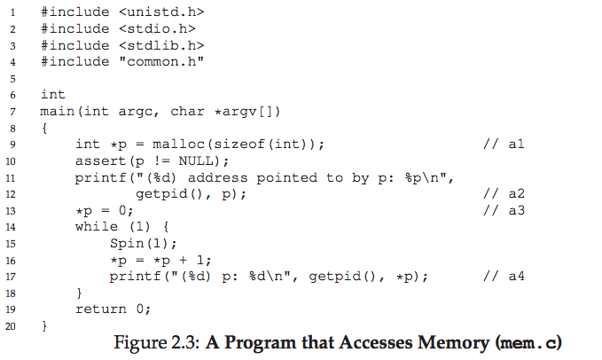
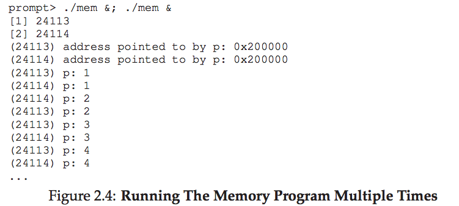
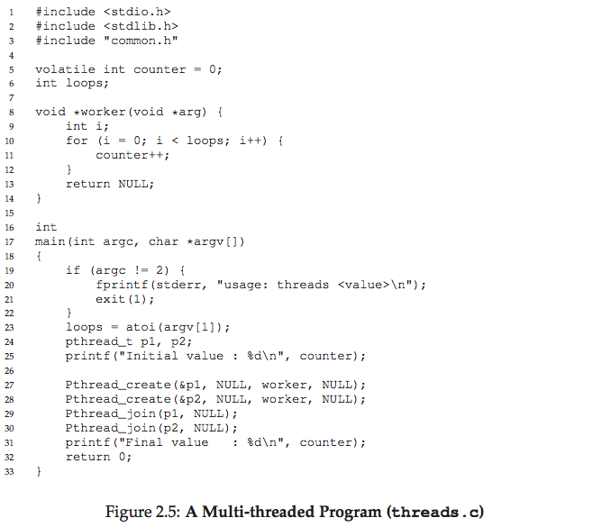
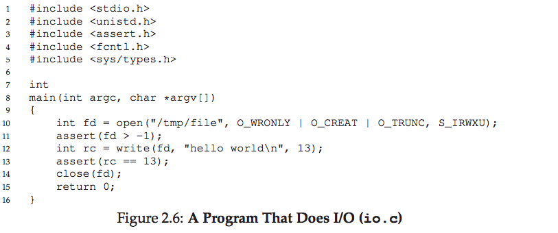

# 2.オペレーティングシステムの概要
学部のオペレーティングシステムコースを受講している場合は、コンピュータプログラムが実行されたときに何が行われているかについてのある程度の知識が既にきっとあることでしょう。 そうでなければこの本（と対応するコース）を読むことは困難です。（Patt / Patel [PP03]と特にBryant / O'Hallaron [BOH10]の両方がかなり素晴らしい本です。）そのため、わからない場合はこの文書を読んだり、最寄りの書店に行ったりしてください。  
さっそく質問です。プログラムを実行するとどうなりますか？  
実行中のプログラムは非常に簡単なことをしています。命令を実行します。それは毎秒何百万という（そして最近では数十億もの）何百もの時間にプロセッサはメモリから命令をフェッチし、それをデコードし（すなわち、これがどの命令であるかを調べる）、それを実行する（すなわち、2つの数値を加算する、メモリにアクセスする、条件をチェックする、関数にジャンプする、など）。この命令で処理が完了すると、プロセッサは次の命令に進みます。以下同様に、プログラムが最後に完了するまで続きます[1]。  
　このように、我々はちょうどコンピュータのフォンノイマンモデルの基礎を述べた[2]。シンプルに聞こえるでしょう？しかし、このクラスでは、プログラムの実行中に、システムを使いやすくすることを第一の目標として進めていきます。

[1] もちろん、現代のプロセッサは、プログラムをより速く実行させるために、たとえば複数の命令を一度に実行したり、順序どおりに発行したり、完了したりするなど、多くの不思議なことを行います。ほとんどのプログラムがシンプルなモデルを想定しています。その命令は、一度に1つずつ、順序どおりに、連続的に実行されるようです。  
[2] フォンノイマンは、コンピューティングシステムの初期のパイオニアの一人でした。彼はまた、ゲーム理論と原爆に関する先駆的な仕事をし、NBAで6年間プレーしました。OK、そのうちの1つは真実ではありません。  

>> 問題：リソースを仮想化する方法  
>> この本で答える中心的な質問の1つは、オペレーティングシステムがリソースをどのように仮想化するのかという単純なものです。これが問題の要点です。OSはなぜ仮想化をするのでしょうか？答えはシステムを使いやすくするためです。したがって、これらを理解するために、どのようにメカニズムに焦点を当てていますか？OSはどのように効率的に機能しますか？どのハードウェアサポートが必要ですか？  

　実際には、プログラムを実行しやすく（一度に多くのことを実行できるようにしても）、プログラムがメモリを共有できるようにし、プログラムとデバイスとのやりとりや他の作業を可能にする責任があります。ソフトウェアの本体は、システムが使いやすく簡単かつ正確に動作することを確認する責任を負っているため、オペレーティングシステム（OS）[3]と呼ばれています。  
OSが主に行う主な方法は、仮想化と呼ばれる一般的な手法です。つまり、OSは物理リソース（プロセッサ、メモリ、ディスクなど）を取り出し、より一般的で強力で使いやすい仮想形式に変換します。したがって、オペレーティングシステムを仮想マシンと呼ぶことがあります。  
　もちろん、ユーザーがOSに何をすべきかを伝え、仮想マシンの機能（プログラムの実行、メモリの割り当て、ファイルへのアクセスなど）を利用できるようにするため、OSはいくつかのインタフェースも提供します（API）。また呼び出すことができます。実際、典型的なOSは、アプリケーションで利用できる数百のシステムコールをエクスポートします。OSはプログラムを実行したり、メモリやデバイスにアクセスしたり、その他の関連するアクションを呼び出すため、OSはアプリケーションに標準ライブラリを提供することもあります。  
　最後に、仮想化は多くのプログラムを実行し（CPUを共有する）、多くのプログラムが同時に自分の命令とデータ（つまり共有メモリ）にアクセスし、デバイスにアクセスするための多くのプログラム（したがってディスクなどを共有する）では、リソースマネージャーと呼ばれることもあります。CPU、メモリ、およびディスクはそれぞれ、システムのリソースです。したがって、これらのリソースを管理するオペレーティングシステムの役割は、効率的に、公正に、または他の多くの可能な目標を念頭に置きながら行うことです。OSの役割を少しずつ理解するために、いくつかの例を見てみましょう。

[3] OSの初期の別の名前は、スーパーバイザーまたはマスターコントロールプログラムでした。どうやら、後者はちょっと過激に聞こえました（詳細はTronの映画を見てください）。だから、ありがたいことに、"オペレーティングシステム"が代わりました。

## 2.1 CPUの仮想化
図2.1に最初のプログラムを示します。それはあまりできません。実際には、Spin（）は、一度実行されると時間と戻り値を繰り返しチェックする関数です。次に、ユーザーがコマンドラインで渡した文字列を出力し、永遠に繰り返します。  
　このファイルをcpu.cとして保存し、シングルプロセッサ（または時にはCPUと呼ぶこともある）を持つシステム上でコンパイルして実行することにします。

　それほど興味深いことではありません。システムはプログラムの実行を開始し、1秒が経過するまで時間を繰り返し確認します。1秒が経過すると、コードはユーザーが渡した入力文字列（この例では文字"A"）を出力し、処理を続けます。プログラムは永遠に実行されることに注意してください。"Control-c"（UNIXベースのシステムではフォアグラウンドで実行中のプログラムを終了させる）を押すだけでプログラムを停止できます。  
　さて、同じことをやろうが、今度はこの同じプログラムの多くの異なるインスタンスを実行しましょう。図2.2に、このやや複雑な例の結果を示します。  

　さて、物事はもう少し面白いです。たとえ1つのプロセッサしか持っていなくても、これらのプログラムの4つすべてが同時に実行されているようです。この魔法はどうやって起こるのでしょうか？[4]  
　オペレーティングシステムは、ハードウェアの助けを借りて、この錯覚、すなわち、システムに非常に多数の仮想CPUがあるという錯覚を担当していることが分かります。単一のCPU（またはそれらの小さなセット）を無限のCPU数に変換することで、多くのプログラムを見かけ上一度に実行できるようにすることが、本書の最初の主要部分であるCPUを仮想化することです。  
　もちろん、プログラムを実行して停止させたり、実行するプログラムをOSに指示するには、OSに希望を伝えるために使用できるインタフェース（API）が必要です。この本では、これらのAPIについて説明します。実際には、ほとんどのユーザーがオペレーティングシステムと対話する主な方法です  
　また、一度に複数のプログラムを実行できることにより、あらゆる種類の新しい質問が生まれます。たとえば、2つのプログラムを特定の時間に実行したい場合、実行する必要がありますか？この質問は、OSのポリシーによって解決されます。ポリシーはこれらのタイプの質問に答えるためにOS内の多くの異なる場所で使用されるため、オペレーティングシステムが実装する基本的なメカニズム（複数のプログラムを一度に実行する能力など）について学びます。  

[4] ＆記号を使用して、同時に4つのプロセスをどのように実行したかに注意してください。そうすることで、tcshシェルのバックグラウンドでジョブが実行されます。つまり、ユーザーは次のコマンドをすぐに発行できます。この場合、実行する別のプログラムです。コマンド間のセミコロンで、tcshで同時に複数のプログラムを実行することができます。別のシェル（bashなど）を使用している場合は、動作が少し異なります。詳細については、オンラインでドキュメントを参照してください。

## 2.2 メモリの仮想化
さあ、メモリを考えましょう。現代の機械によって提示される物理的記憶のモデルは非常に簡単です。メモリは単なるバイト配列です。メモリを読み取るには、そこに格納されているデータにアクセスできるようにアドレスを指定する必要があります。メモリを書き込む（または更新する）ためには、与えられたアドレスに書き込まれるデータも指定しなければなりません。  
　メモリは、プログラムが実行されているときは常にアクセスされます。プログラムは、すべてのデータ構造をメモリに保持し、ロードやストアなどのさまざまな命令や、作業中にメモリにアクセスする他の明示的な命令によってアクセスします。プログラムの各命令もメモリに記憶されていることを忘れないでください。したがって、メモリは各命令フェッチでアクセスされます。  
　malloc（）を呼び出してメモリを割り当てるプログラム（図2.3）を見てみましょう。このプログラムの出力はここにあります：

　プログラムはいくつかのことを行います。まず、いくつかのメモリを割り当てます（行a1）。次に、メモリ（a2）のアドレスをプリントアウトした後、新たに割り当てられたメモリ（a3）の最初のスロットに番号0を入れます。最後に、ループし、1秒間遅延し、pに保持されているアドレスに格納されている値をインクリメントします。print文ごとに、実行中のプログラムのプロセス識別子（PID）と呼ばれるものも表示されます。このPIDは、実行中のプロセスごとに一意です。  

　ここでも、この最初の結果はそれほど興味深いものではありません。新しく割り当てられたメモリはアドレス0x200000にあります。プログラムが実行されると、値がゆっくりと更新され、結果が出力されます。  
　今度は、同じプログラムの複数のインスタンスを再度実行して、何が起こるかを確認します（図2.4）。この例では、実行中の各プログラムが同じアドレス（0x200000）にメモリを割り当てていますが、それぞれが独立して0x200000の値を更新しているようです。これは、実行中の各プログラムが、他の実行中のプログラム[5]と同じ物理メモリを共有するのではなく、独自のプライベートメモリを持つかのようです。  
　確かに、OSがメモリを仮想化しているので、これがまさにここで起こっていることです。各プロセスは、独自のプライベート仮想アドレス空間（アドレス空間と呼ばれることもある）にアクセスし、OSは何らかの形でマシンの物理メモリにマップします。実行中のプログラム内のメモリ参照は、他のプロセス（またはOS自体）のアドレス空間には影響しません。実行中のプログラムに関する限り、それ自身に物理的な記憶があります。しかし、実際には、物理メモリはオペレーティングシステムによって管理される共有リソースです。まさしくこのすべてがどのように達成されたかは、本書の最初の部分の主題であり、仮想化の話題です。

## 2.3 同時実行
この本の別の主なテーマは並行性です。この概念的な用語は、同じプログラム内で同時に（すなわち、同時に）多くのことを処理する際に発生する多数の問題を指すために使用され、対処されなければいけません。並行性の問題は、オペレーティングシステム自体の中で最初に生じました。上記の仮想化の例でもわかるように、OSは多くのことを一度に処理しています。最初に1つのプロセスを実行し、次に別のプロセスなどを実行しています。

[5] この例が機能するには、アドレス空間のランダム化が無効になっていることを確認する必要があります。ランダム化は、特定の種類のセキュリティ上の欠陥に対する優れた防御となり得ることが判明しました。スタックストーミング攻撃を介してコンピュータシステムに侵入する方法を学びたい場合は、特に自分自身でそれについて詳しく読むことができます。

残念ながら、並行性の問題はもはやOS自体に制限されなくなりました。実際、現代のマルチスレッドプログラムは同じ問題を抱えています。マルチスレッドプログラムの例を示してみましょう（図2.5）。  
この例を今は完全に理解していないかもしれません（そして、後の章、同時実行の本の節でそれについてもっと学びます）、基本的な考え方は簡単です。メインプログラムは、Pthread_create（）[6]を使用して2つのスレッドを作成します。スレッドは、他の関数と同じメモリ空間内で実行される関数と考えることができます。複数のスレッドを同時にアクティブにすることができます。この例では、各スレッドはworker（）というルーチンで実行を開始します。このルーチンでは、ループ内のカウンタをループ回数だけインクリメントします。  

[6] 実際の呼び出しは小文字にする必要があります。pthread create（）大文字のバージョンは独自のラッパーで、pthread create（）を呼び出し、戻りコードが呼び出しが成功したことを示します。詳細については、コードを参照してください。

>> 問題のクラウド：正しい並行プログラムを作る方法  
>> 同じメモリ空間内に複数のスレッドを同時に実行すると、どうすれば正しく動作するプログラムを構築できますか？どのプリミティブがOSから必要ですか？どのような仕組みがハードウェアによって提供されるべきですか？どのようにそれらを使用して並行性の問題を解決できますか？

　以下は、変数ループの入力値を1000に設定してこのプログラムを実行すると何が起こるかを示すものです。ループの値によって、2人の作業者のそれぞれがループ内の共有カウンタを増分する回数が決まります。ループの値を1000に設定してプログラムを実行すると、カウンタの最終値はどのようになるでしょうか？  

　おそらく推測したように、2つのスレッドが終了すると、カウンタの最終値は2000になり、各スレッドはカウンタを1000回インクリメントします。実際、ループの入力値をNに設定すると、プログラムの最終出力は2Nになると予想されます。しかし、実際はそれほど単純ではありません。同じプログラムを実行しますが、ループの値が高いほど、何が起こるか見てみましょう。

　この実行では、100,000の入力値を与えたときに最終値200,000を取得する代わりに、最初に143,012を取得します。次に、プログラムを2回実行すると、間違った値を取得するだけでなく、前回とは異なる値を取得します。実際には、高い値のループで繰り返しプログラムを実行すると、正しい答えが得られることがあります。それでなぜこれが起こっているのですか？  
　判明したように、これらの奇妙で珍しい結果の理由は、命令がどのように実行されるかに関連しており、これは一度に1つです。残念ながら、共有カウンタがインクリメントされる上記のプログラムの重要な部分は、カウンタの値をメモリからレジスタにロードする命令と、レジスタをインクリメントする命令と、メモリに格納する命令の3つの命令です。これらの3つの命令は原子的に（一度に）実行されないため、奇妙なことが起こる可能性があります。並行性のこの問題は、この本の第2部で詳しく説明します。  

## 2.4 永続性
　コースの3番目の主要テーマは持続性です。システムメモリでは、DRAMのようなデバイスが値を揮発性の方法で格納するため、データを簡単に失う可能性があります。電源が切れるかシステムがクラッシュすると、メモリ内のデータは失われます。したがって、データを永続的に保存できるようにするためには、ハードウェアとソフトウェアが必要です。このようなストレージは、ユーザーがデータを大事にしているため、あらゆるシステムにとって重要です。  
　ハードウェアは、ある種の入力/出力またはI/Oデバイスの形で提供されます。現代のシステムでは、ハードドライブは長寿命の情報のための共通リポジトリですが、ソリッドステートドライブ（SSD）もこの分野で進んでいます。  
　通常、ディスクを管理するオペレーティングシステムのソフトウェアは、ファイルシステムと呼ばれます。したがって、ユーザがシステムのディスク上に信頼できる効率的な方法で作成したファイルを格納する責任があります。  
　CPUとメモリ用にOSが提供する抽象化とは異なり、OSはアプリケーションごとにプライベートの仮想化ディスクを作成しません。むしろ、ユーザーはよく、ファイル内の情報を共有したいと考えられています。例えば、Cプログラムを書くときは、最初にEmacs[7]などのエディタを使ってCファイル（emacs -nw main.c）を作成し編集することができます。いったん完了したら、コンパイラを使用してソースコードを実行可能ファイルにすることができます（gcc -o main main.cなど）。作業が終了したら、新しい実行可能ファイル（./mainなど）を実行することができます。したがって、異なるプロセス間でファイルがどのように共有されているかを見ることができます。まず、Emacsはコンパイラへの入力として機能するファイルを作成します。コンパイラはその入力ファイルを使用して新しい実行可能ファイルを作成します（多くの手順で、詳細についてはコンパイラコースを参照してください）。最後に、新しい実行可能ファイルが実行されます。そして、新しいプログラムが生まれました！  
　これをよりよく理解するために、いくつかのコードを見てみましょう。図2.6に、文字列"hello world"を含むファイル（/tmp/file）を作成するためのコードを示します。

[7] Emacsを使うべきです。viを使用している場合、おそらく何か問題があります。実際のコードエディタではないものを使用している場合、それはさらに悪化します。

# 問題のクラウド：データを永続的に保存する方法
　ファイルシステムは、永続データの管理を担当するOSの一部です。そうするためにはどのような技術が必要ですか？高性能でこれを実現するためにはどのような仕組みとポリシーが必要ですか？ハードウェアとソフトウェアの不具合に直面して、信頼性はどのように達成されましたか？
　このタスクを達成するために、プログラムはオペレーティングシステムに3回の呼び出しを行います。最初に、open（）の呼び出しがファイルを開き、それを作成します。2番目のwrite（）はファイルに何らかのデータを書き込みます。3番目のclose（）は、ファイルを閉じて、プログラムがこれ以上データを書き込んでいないことを示します。これらのシステムコールは、オペレーティングシステムのファイルシステムと呼ばれる部分にルーティングされます。ファイルシステムは要求を処理し、ユーザーに何らかのエラーコードを返します。  
　実際にディスクに書き込むためにOSが何をしているのか疑問に思うかもしれません。私たちはあなたを見せてくれるでしょうが、まず目を閉じることを約束しなければなりません。ファイルシステムはかなりの作業をしなければなりません。まず、ディスク上のどこにこの新しいデータが存在するかを把握し、ファイルシステムが維持しているさまざまな構造でそれを追跡します。そうするためには、基盤となるストレージデバイスにI/O要求を発行し、既存の構造を読み込んだり、更新（書き込み）する必要があります。デバイスドライバ[8]を書いた人なら誰もが知っているように、デバイスをあなたのために何かすることは、複雑で詳細なプロセスです。低レベルのデバイスインタフェースとその正確な意味についての深い知識が必要です。幸いにも、OSは、システムコールを通じてデバイスにアクセスする標準的でシンプルな方法を提供します。したがって、OSは標準ライブラリと見なされることがあります。  
　もちろん、デバイスがどのようにアクセスされるか、ファイルシステムがそのデバイス上でデータを永続的に管理する方法については、より多くの詳細があります。パフォーマンス上の理由から、ほとんどのファイルシステムでは、最初にそのような書き込みをしばらくの間遅延させて、より大きなグループにバッチすることを望んでいます。書き込み中のシステムクラッシュの問題を処理するために、ほとんどのファイルシステムには、ジャーナリングやコピーオンライトなどの複雑な書き込みプロトコルが組み込まれています。書き込みシーケンス中にエラーが発生した場合、後で合理的な状態に回復することができます。異なる一般的な操作を効率的にするために、ファイルシステムは、単純なリストから複雑なツリーに至るまで、多くの異なるデータ構造とアクセス方法を採用しています。この本の第3部では、デバイスとI/O、ディスク、RAID、ファイルシステムについて詳しく説明します。

[8] デバイスドライバは、特定のデバイスをどう扱うかを知っているオペレーティングシステムのコードです。デバイスとデバイスドライバについては後で詳しく説明します。

## 2.5 デザイン目標
　OSはCPU、メモリ、ディスクなどの物理的なリソースを取り、それらを仮想化するという考えを持っています。これは、並行性に関連する難しくて厄介な問題を処理します。また、ファイルを永続的に保存するため、長期的に安全になります。このようなシステムを構築したいと考えているので、設計と実装に集中し、必要に応じてトレードオフを行うためにいくつかの目標を念頭に置いていきたいと考えています。適切なトレードオフのセットを見つけることは、システム構築の鍵です。  
最も基本的な目標の1つは、システムを便利で使いやすいものにするために、いくつかの抽象化を構築することです。抽象は、私たちがコンピュータサイエンスでやるすべてにとって基本的なものです。抽象化は、大規模なプログラムを小さく分かりやすく分け、アセンブリなどを考えずにC[9]のような高級言語で記述したり、論理ゲートを考えずにコードを書いたり、構築したりすることができますトランジスタについてあまり考えずにゲートから外に出るプロセッサー。抽象化は非常に基本的なので、時にはその重要性を忘れることもありますが、ここでは取り上げません。したがって、各セクションでは、時間の経過とともに発展した主要な抽象化についていくつか議論し、OSの部分について考える方法を説明します。  
　オペレーティングシステムの設計と実装の1つの目標は、高性能を提供することです。これを言うもう1つの方法は、OSのオーバーヘッドを最小限に抑えることです。仮想化とシステムを使いやすくすることは価値がありますが、コストはかかりません。したがって、我々は過度のオーバーヘッドなしに仮想化やその他のOS機能を提供するよう努めなければなりません。これらのオーバーヘッドは、余分な時間（より多くの命令）と余分なスペース（メモリ内またはディスク上）といういくつかの形式で発生します。可能であれば、どちらか一方または両方、または両方を最小化するソリューションを探します。しかし、完璧さは必ずしも達成可能なわけではなく、私たちが気づくことを学び、（適切な場合には）容認するものです。  
　もう1つの目標は、アプリケーション間、およびOSとアプリケーション間の保護を提供することです。同時に多くのプログラムを実行できるようにしたいので、悪意のある、または偶発的な悪い行為が、他の行為に悪影響を及ぼさないようにしたいです。私たちは確かに、アプリケーションが（それがシステム上で動いているすべてのプログラムに影響するように）OSそのものを傷つけることはできないようにしたい。保護は、オペレーティングシステムの根底にある主な原則の1つ、つまり隔離の原則の中心にあります。プロセスを互いに隔離することは、保護の鍵であり、したがってOSが何をしなければならないかの根底にあります。  
　オペレーティングシステムもノンストップで実行する必要があります。それが失敗すると、システム上で実行されているすべてのアプリケーションも失敗します。この依存性のために、オペレーティングシステムはしばしば高い信頼性を提供するように努めています。オペレーティングシステムがますます複雑になり（時には何百万行ものコードを含む）、信頼性の高いオペレーティングシステムを構築することは非常に難しい課題です。実際には、現場で行われている多くの研究（BS + 09 、SS + 10]）は、この正確な問題に焦点を当てています。  
　他の目標は理にかなっています。エネルギー効率はますます緑の世界で重要です。悪意のあるアプリケーションに対するセキュリティ（実際には保護の拡張）は、特に高度にネットワーク化されたこれらの時期には重要です。OSは小型で小型のデバイス上で動作するため、モビリティはますます重要になっています。システムの使用方法によっては、OSの目標が異なるため、少なくともわずかに異なる方法で実装される可能性があります。しかし、わかるように、OSを構築する方法について私たちが提示する多くの原則は、さまざまなデバイスに役立ちます。  

[9] C言語を高級言語と呼ぶことに反対する人もいます。これはOSのコースであることを覚えておいてください。ここでは、いつもアセンブリでコードを書く必要がないのがうれしいです！

## 2.5 いくつかの歴史
　この紹介を終える前に、オペレーティングシステムがどのように開発されたかを簡単に説明しましょう。人間によって構築されたシステムのように、エンジニアは設計上重要なことを学んだので、時間の経過とともにオペレーティングシステムに良いアイデアが蓄積されました。ここでは、いくつかの主要な開発について説明します。 開発方法については、Brinch Hansenの優れたオペレーティングシステムの歴史をご覧ください[BH00]。

### 初期のオペレーティングシステム：ジャストライブラリ
　当初は、オペレーティングシステムはあまり働きませんでした。基本的には、一般的に使用される関数の単なるライブラリのセットでした。例えば、システムの各プログラマーに低レベルのI/O処理コードを書き込ませる代わりに、「OS」はそのようなAPIを提供し、したがって開発をより容易にします。  
　通常、これらの古いメインフレームシステムでは、人間のオペレータによって制御されるように、1つのプログラムが一度に1つずつ実行されました。現代のOSが何をすると思いますか（たとえば、ジョブを実行する順序を決めるなど）は、このオペレータによって実行されました。あなたがスマートな開発者だったなら、あなたはこのオペレータに親切であり、あなたの仕事をキューの前に移動させるかもしれません。  
　この計算モードはバッチ処理と呼ばれ、多数のジョブが設定され、オペレータによって「バッチ」で実行されるためです。その時点では、コンピュータはコストのためにインタラクティブな方法で使用されていませんでした。コンピュータの前に座って使用することは、あまりにも高価でした。ほとんどの場合、1時間に数十万ドルの費用がかかりました[BH00]。  
### ライブラリを超えて：保護
　オペレーティングシステムは、一般的に使用されるサービスの単純なライブラリではなく、マシンを管理する上でより中心的な役割を果たしました。これの重要な側面の1つは、OSに代わって実行されるコードが特別であることの認識でした。デバイスの制御を持っていたので、通常のアプリケーションコードとは異なった扱いをするべきです。どうしてでしょうか？別の方法としてディスク上のどこからでもアプリケーションを読み込めるようにしたらどうでしょうか？任意のプログラムがファイルを読み取ることができるように、プライバシーの概念が窓から出てきます。したがって、ライブラリとしてファイルシステムを実装することは意味がありません。代わりに、何かが必要でした。  
　したがって、Atlasコンピューティングシステム[K + 61、L78]によって開発されたシステムコールのアイデアが発明されました。OSルーチンをライブラリとして提供する代わりに（ここでは、アクセスするためのプロシージャコールを行うだけです）、ハードウェア命令とハードウェアの特別なペアを追加して、OSへの移行をより正式で制御されたプロセスにすることでした。  
　システムコールとプロシージャコールとの間の主な相違点は、システムコールがハードウェア特権レベルを上げると同時にOSに制御（すなわち、ジャンプ）を転送することです。ユーザーアプリケーションは、ユーザーモードと呼ばれるもので実行されます。つまり、ハードウェアによってアプリケーションが実行できる処理が制限されます。

たとえば、ユーザーモードで実行されているアプリケーションは、ディスクへのI/O要求を開始したり、物理メモリページにアクセスしたり、ネットワーク上でパケットを送信したりすることはできません。システムコールが開始されると（通常はトラップと呼ばれる特別なハードウェア命令によって）、ハードウェアは事前に指定されたトラップハンドラ（以前に設定したOS）に制御を移し、同時にカーネルモードに特権レベルを上げます。

カーネルモードでは、OSはシステムのハードウェアに完全にアクセスできるため、I/O要求の開始やプログラムで使用可能なメモリの増加などが可能です。OSが要求を処理すると、特別なreturn-from-trap命令を介してユーザーに制御が戻され、ユーザーモードに戻ります。同時に、アプリケーションが中断した場所に制御を戻します。

### マルチプログラミングの時代
　オペレーティングシステムが本当に始まったのは、メインフレームを超えたコンピューティングの時代、ミニコンピュータの時代でした。デジタル機器のPDPファミリのような古典的なマシンは、コンピュータを非常に手頃な価格にしました。したがって、大規模組織ごとに1つのメインフレームを持つ代わりに、組織内の少数の人が自分のコンピュータを持つ可能性があります。驚くことではないが、このコスト低下の大きな影響の1つは、開発者の活動の増加であった。よりスマートな人々はコンピュータを手に入れ、コンピュータシステムをより面白く美しいものにしました。  
　特に、マルチプログラミングは、マシンリソースをより有効に利用したいという要望のために普及しました。一度に1つのジョブを実行するのではなく、複数のジョブをメモリにロードし、それらのジョブ間で迅速に切り替えてCPU使用率を向上させます。I/Oデバイスが遅いため、この切り替えは特に重要でした。そのI/Oが処理されている間にCPU上でプログラムが待機するのは、CPU時間の無駄でした。代わりに、別の仕事に切り替えてしばらく運転してみてはどうですか？  
　I/Oと割り込みの存在下でマルチプログラミングとオーバーラップをサポートしたいという要望は、多くの方向性に沿ったオペレーティングシステムの概念開発における革新を強いられました。メモリ保護などの問題が重要になりました。あるプログラムが別のプログラムのメモリにアクセスすることはできません。マルチプログラミングによって導入された並行性の問題に対処する方法を理解することも重要でした。割り込みがあってもOSが正しく動作していることを確認することは大きな課題です。本書の後半で、これらの問題と関連するトピックを検討します。  
　その実用的な進歩の1つは、UNIXオペレーティングシステムの導入でした。これは主にベル研究所のKen Thompson（およびDennis Ritchie）（電話会社）のおかげです。UNIXは、さまざまなオペレーティングシステム（特にMultics [O72]、TENEX [B + 72]やBerkeley TimeSharing System [S + 68]など）から多くの優れたアイデアを得ましたが、まもなく、このチームは世界中の人々にUNIXのソースコードを含むテープを出荷していました。多くの人が関与してシステムに追加されました。詳細はAside（次のページ）を参照してください。  

### 現代
　ミニコンピュータの向こうには、新しいタイプのマシンが安くて速く、そして大衆にとって、今日のパーソナル・コンピュータまたはPCが登場しました。ワークグループごとにミニコンピュータを共有するのではなく、低コストでデスクトップごとに1台のマシンを使用できるようになり、アップルの初期のマシン（Apple IIなど）とIBM PCを中心に、新しいタイプのマシンがすぐにコンピューティングの支配的な役割を果たすようになりました。  
　残念なことに、オペレーティングシステムでは、初期のシステムがミニコンピュータの時代に学んだ教訓を忘れてしまった（または知らなかった）ので、最初はPCが大きく飛躍しました。例えば、DOSのような初期のオペレーティングシステム（マイクロソフトのディスクオペレーティングシステム）は、メモリ保護が重要ではないと考えていました。したがって、悪意のある（または、あまりにもプログラムの悪い）アプリケーションは、メモリ全体を書くことができます。Mac OSの第1世代（v9以前）は、ジョブスケジューリングに協力的なアプローチを取りました。したがって、偶発的に無限ループに突き当たったスレッドがシステム全体を引き継ぎ、再起動を強制する可能性があります。この世代のシステムに欠けているOS機能の痛ましいリストは長いですが、ここでの議論のためには長すぎます。  
　幸運なことに、何年もの苦しみの後、ミニコンピュータのオペレーティングシステムの古い機能がデスクトップに乗り始めました。たとえば、Mac OS X/macOSには、そのような成熟したシステムから期待されるすべての機能を含む、UNIXが中心です。Windowsは、特にWindows NTを始めとして、Microsoft OSテクノロジの飛躍的な飛躍を踏まえて、コンピューティングの歴史において多くの素晴らしいアイデアを採用しています。今日の携帯電話でも、Linuxなどのオペレーティングシステムが稼動していますが、これは1980年代にPCを走らせたもの（1970年代のミニコンピュータに似ています）に似ています。OS開発の全盛期に開発された優れたアイデアが現代の世界に浸透していることがわかりました。さらに優れた点は、これらのアイデアが引き続き発展し、より多くの機能を提供し、ユーザーやアプリケーションにとって現代のシステムをより良くすることです。  

>> ASIDE：UNIXの重要性  
>>　オペレーティングシステムの歴史においてUNIXの重要性を誇張することは困難です。以前のシステム（特に、MITの有名なMulticsシステム）の影響を受けて、UNIXは多くの素晴らしいアイデアを集め、シンプルで強力なシステムを作りました。オリジナルの"Bell Labs"の基盤となったUNIXは、より強力なワークフローを形成するために一緒に接続できる、強力で強力なプログラムを構築する統一的な原則でした。コマンドを入力するシェルは、このようなメタレベルプログラミングを可能にするパイプなどのプリミティブを提供しました。したがって、より大きなタスクを達成するためにプログラムをまとめるのが容易になりました。たとえば、単語"foo"を含むテキストファイルの行を見つけて、そのような行がいくつ存在するかを調べるには、grep foo file.txt | wc -lと入力して、grepとwcを使用します。  
　UNIX環境はプログラマや開発者にとってもフレンドリーで、新しいCプログラミング言語のコンパイラも提供していました。プログラマーが自分のプログラムを書いたり共有したりすることが容易になり、UNIXは非常に人気がありました。そして、おそらく、著者たちは、初期の形式のオープンソースソフトウェアである、誰かに尋ねた人に無料でコピーを寄贈したことを多分助けてくれたでしょう。  
また、コードのアクセシビリティと可読性も非常に重要でした。Cで書かれた美しく小さなカーネルを持っている人は、カーネルで遊ぶように他の人を招き、新しくてクールな機能を追加しました。たとえば、Bill Joyが率いるBerkeleyの企業グループは、高度な仮想メモリ、ファイルシステム、およびネットワークサブシステムを備えた素晴らしいディストリビューション（Berkeley Systems Distribution、またはBSD）を作りました。Joyは後にSun Microsystemsを共同設立しました。  
　残念ながら、UNIXの普及は、企業が所有権と利益を主張しようとするにつれて少し遅くなりました。しかし、弁護士の不幸な（しかし共通の）結果が関与しています。多くの企業にはSun MicrosystemsのSunOS、IBMのAIX、HPのHPUX、SGIのIRIXなどの独自の変種がありました。AT＆T/Bell Labsと他のプレイヤーの間の法的争いは、UNIX上で暗い雲を投げかけ、Windowsが導入されPC市場の多くを占めるように生き残るかどうか、多くの人が疑問に思っていました。

>> ASIDE：そしてその後のLinux  
>>　幸運なことに、UNIXの場合、Linus Torvaldsという若いフィンランドのハッカーは、元のシステムの背後にある原則とアイデアに大いに借りて、コードベースではなく、合法性の問題を避けて独自のUNIXバージョンを作成することに決めました。彼は世界中の多くの人たちの助けを得て、まもなくLinuxが生まれました（そして現代のオープンソースソフトウェアの動き）インターネット時代が到来すると、Google、Amazon、Facebookなどの大部分の企業は無料で、ニーズに合わせて簡単に変更できるように、Linuxを実行することを選択しました。確かに、これらの新会社の成功がそのようなシステムが存在しなかったと想像するのは難しいです。  
　スマートフォンが支配的なユーザー向けプラットフォームになるにつれて、Linuxは同じ理由の多くのために（Android経由で）そこにも拠点を見つけました。そしてSteve Jobsは彼のUNIXベースのNeXTStepオペレーティング環境をAppleに任せ、デスクトップ上でUNIXを普及させました（Appleの技術の多くのユーザーはおそらくこの事実を知らないでしょう）。そして、UNIXは今まで以上に重要な存在です。コンピューティングの神は、あなたがそれらを信じているならば、この素晴らしい結果に感謝しなければなりません。

## 2.7 概要
　したがって、私たちはOSについて紹介しています。今日のオペレーティングシステムでは、システムを比較的使いやすくし、今日使用しているほとんどすべてのオペレーティングシステムは、本書で説明する開発の影響を受けています。  
　残念なことに、時間的な制約のため、本書でカバーしていないOSのいくつかの部分があります。たとえば、オペレーティングシステムには多くのネットワーキングコードがあります。私たちはそれについてもっと学ぶためにあなたにネットワーキングクラスを取ることを任せます。同様に、グラフィックスデバイスは特に重要です。最後に、オペレーティングシステムの書籍の中には、セキュリティに関する大きな話題があります。OSは実行中のプログラム間で保護を提供し、ユーザーにファイルを保護する能力を与えなければならないという意味でそうするでしょうが、セキュリティコースで見つかる、より深刻なセキュリティ問題を掘り下げません。  
　しかし、CPUとメモリの仮想化の基本、並行性、デバイスやファイルシステムによる永続性など、重要なトピックがたくさんあります。心配しないでください！カバーすべき多くの土地がありますが、そのほとんどは非常に涼しく、道路の終わりには、コンピュータシステムが実際にどのように機能するかについて考えます。

#参考文献

[BS+09] “Tolerating File-System Mistakes with EnvyFS”  
Lakshmi N. Bairavasundaram, Swaminathan Sundararaman, Andrea C. Arpaci-Dusseau, RemziH. Arpaci-Dusseau  
USENIX ’09, San Diego, CA, June 2009  
A fun paper about using multiple file systems at once to tolerate a mistake in any one of them.  

[BH00] “The Evolution of Operating Systems”  
P. Brinch Hansen  
In Classic Operating Systems: From Batch Processing to Distributed Systems Springer-Verlag, New York, 2000  
This essay provides an intro to a wonderful collection of papers about historically significant systems.  

[B+72] “TENEX, A Paged Time Sharing System for the PDP-10”  
Daniel G. Bobrow, Jerry D. Burchfiel, Daniel L. Murphy, Raymond S. Tomlinson  
CACM, Volume 15, Number 3, March 1972  
TENEX has much of the machinery found in modern operating systems; read more about it to see how much innovation was already in place in the early 1970’s.

[B75] “The Mythical Man-Month”  
Fred Brooks  
Addison-Wesley, 1975  
A classic text on software engineering; well worth the read.  

[BOH10] “Computer Systems: A Programmer’s Perspective”  
Randal E. Bryant and David R. O’Hallaron  
Addison-Wesley, 2010  
Another great intro to how computer systems work. Has a little bit of overlap with this book — so if you’d like, you can skip the last few chapters of that book, or simply read them to get a different perspective on some of the same material. After all, one good way to build up your own knowledge is to hear as many other perspectives as possible, and then develop your own opinion and thoughts on the matter. You know, by thinking!

[G85] “The GNU Manifesto”  
Richard Stallman, 1985  
Available: https://www.gnu.org/gnu/manifesto.html  
A huge part of Linux’s success was no doubt the presence of an excellent compiler, gcc, and other relevant pieces of open software, all thanks to the GNU effort headed by Richard Stallman. Stallman is quite a visionary when it comes to open source, and this manifesto lays out his thoughts as to why; well worth the read.

[K+61] “One-Level Storage System”  
T. Kilburn, D.B.G. Edwards, M.J. Lanigan, F.H. Sumner  
IRE Transactions on Electronic Computers, April 1962  
The Atlas pioneered much of what you see in modern systems. However, this paper is not the best read. If you were to only read one, you might try the historical perspective below [L78].

[L78] “The Manchester Mark I and Atlas: A Historical Perspective”  
S. H. Lavington  
Communications of the ACM archive  
Volume 21, Issue 1 (January 1978), pages 4-12  
A nice piece of history on the early development of computer systems and the pioneering efforts of the Atlas. Of course, one could go back and read the Atlas papers themselves, but this paper provides a great overview and adds some historical perspective.

[O72] “The Multics System: An Examination of its Structure”  
Elliott Organick, 1972  
A great overview of Multics. So many good ideas, and yet it was an over-designed system, shooting for too much, and thus never really worked as expected. A classic example of what Fred Brooks would call the “second-system effect” [B75].

[PP03] “Introduction to Computing Systems:  
From Bits and Gates to C and Beyond”  
Yale N. Patt and Sanjay J. Patel  
McGraw-Hill, 2003  
One of our favorite intro to computing systems books. Starts at transistors and gets you all the way up to C; the early material is particularly great.

[RT74] “The UNIX Time-Sharing System”  
Dennis M. Ritchie and Ken Thompson  
CACM, Volume 17, Number 7, July 1974, pages 365-375  
A great summary of UNIX written as it was taking over the world of computing, by the people who wrote it.

[S68] “SDS 940 Time-Sharing System”  
Scientific Data Systems Inc.  
TECHNICAL MANUAL, SDS 90 11168 August 1968  
Available: http://goo.gl/EN0Zrn  
Yes, a technical manual was the best we could find. But it is fascinating to read these old system documents, and see how much was already in place in the late 1960’s. One of the minds behind the Berkeley Time-Sharing System (which eventually became the SDS system) was Butler Lampson, who later won a Turing award for his contributions in systems.

[SS+10] “Membrane: Operating System Support for Restartable File Systems”  
Swaminathan Sundararaman, Sriram Subramanian, Abhishek Rajimwale, Andrea C. Arpaci-Dusseau, Remzi H. Arpaci-Dusseau, Michael M. Swift  
FAST ’10, San Jose, CA, February 2010  
The great thing about writing your own class notes: you can advertise your own research. But this paper is actually pretty neat — when a file system hits a bug and crashes, Membrane auto-magically restarts it, all without applications or the rest of the system being affected.  
