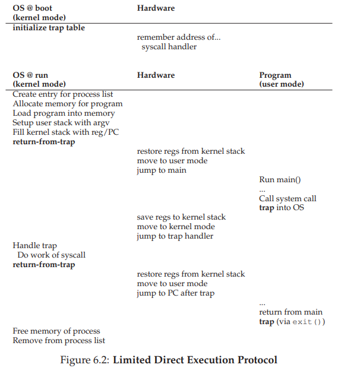
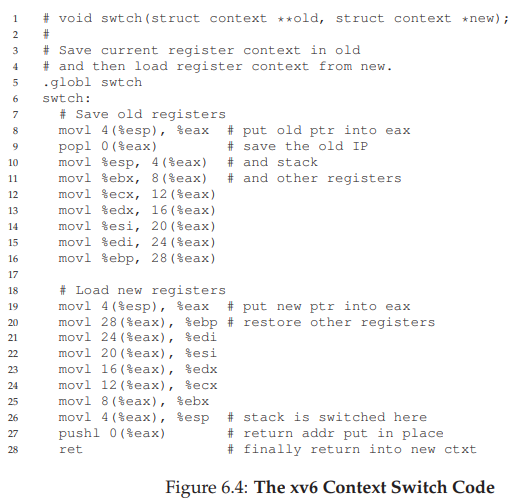

# 6. Mechanism: Limited Direct Execution

CPUを仮想化するためには、オペレーティングシステムは、一見同時に実行している多くのジョブの中で何らかの形で物理CPUを共有する必要があります。基本的なアイデアは簡単です。プロセスを1つ実行してから別のプロセスを実行するなどです。このようにCPUをtime sliceで共有することにより、仮想化が実現されます。

しかし、そのような仮想化機構を構築するには、いくつかの課題があります。1つはパフォーマンスです。システムに過度のオーバーヘッドを加えずに、どのように仮想化を実装できるでしょうか？もう1つは制御です。CPUを制御しながらプロセスを効率的に実行するにはどうすればよいでしょうか？OSを制御する場合は、リソースを割いてしまいます。OSを制御しない場合では、プロセスは単に永遠に実行して、マシンを引き継ぐことできず、アクセスを許可したくない情報にアクセスすることもできてしまいます。したがって、制御を維持しながら高いパフォーマンスを得ることは、オペレーティングシステムを構築する上での中心的な課題の1つです。

>> THE CRUX:HOW TO EFFICIENTLY VIRTUALIZE THE CPU WITH CONTROL(CPUをコントロールと効率的に仮想化する方法)  
OSは、システムの制御を維持しながら効率的にCPUを仮想化する必要があります。そのためには、ハードウェアとオペレーティングシステムの両方のサポートが必要になります。OSは、その作業を効果的に達成するために、しばしば賢明なハードウェアサポートを使用します。(優れているハードウェアサポートであるほど効率が上がる。OSサポートも同様)

## 6.1 Basic Technique: Limited Direct Execution
プログラムが期待どおりの速さで動作するようにするために、OS開発者は限定されたdirect executionと呼ばれる技術を思いついたわけではありません。アイデアの「direct executin」の部分は単純です。プログラムをCPU上で直接実行するだけです。したがって、OSがプログラムの実行を開始したいときには、プロセスリストにプロセスエントリを作成し、プロセスリストにいくつかのメモリを割り当て、プログラムコードをメモリにロードし(ディスクから)、エントリポイントを見つけます(`main()`ルーチンやそれに似たもの)、ジャンプしてユーザーのコードの実行を開始します。図6.1は、この基本的なdirect executionプロトコルを示しています(まだ制限はありません)。通常の呼び出しを使用して、戻り先である、プログラムの`main()`にジャンプし、後でカーネルに戻ります。

シンプルに聞こえるでしょう？しかし、このアプローチでは、CPUを仮想化するためのいくつかの問題が生じます。最初はの問題は簡単です。プログラムを実行するだけの場合、OSはプログラムを効率的に実行しながら、プログラムで実行したくないことをOSがどのように判断することができますか？2つ目は、プロセスを実行しているときに、オペレーティングシステムが実行を停止して別のプロセスに切り替える方法です。つまり、CPUを仮想化するために必要なtime sliceを実装しますか？

これらの質問に答えるにあたって、CPUを仮想化するために必要なことをもっとよく理解していきます。これらの技術を開発する際には、名前の「限定された」部分がどこから生じているのかもわかります。OSを実行しているプログラムに制限を加えることなく、OSは何の制御もされないまるで「単なるライブラリ」です。夢のあるオペレーティングシステム実現するための非常に悲しい現状のOSの状態です！

## 6.2 Problem #1: Restricted Operations
直接実行には高速という明白な利点があります。プログラムはハードウェアCPU上でネイティブに実行されるため、期待どおりの速さで実行されます。しかし、CPU上で実行すると、ある問題が生じてしまいます。例えば、ディスクにI/O要求を発行したり、CPUやメモリなどのより多くのシステムリソースにアクセスするなど、何らかの制限された操作を実行したい場合はどうなるでしょうか？

>> THE CRUX: HOW TO PERFORM RESTRICTED OPERATIONS(制限付き操作を実行する方法)  
>> プロセスはI/Oなどの制限付きの操作を実行できる必要がありますが、プロセスがシステム全体を完全に制御することはできません。OSとハードウェアはどのように連携して動作するのでしょうか？

>> ASIDE: WHY SYSTEM CALLS LOOK LIKE PROCEDURE CALLS(システムコールがプロシージャコールのように見える理由)  
>> `open()`や`read()`のようなシステムコールへの呼び出しがC言語の典型的な手続き呼び出しとまったく同じように見えるのはなぜかと思うでしょう。つまり、プロシージャコールのように見える場合、システムはシステムコールであるとはどのように判断できるでしょうか？実は、プロシージャコールですが、そのプロシージャコールの中に隠されているのは有名なトラップ命令なのです。  
>> 具体的には、`open()`(たとえば)を呼び出すと、Cライブラリにプロシージャコールを実行しています。そこでは、`open()`やその他のシステムコールのいずれにしても、ライブラリは、カーネルとの間で合意した呼び出し規約を使用して、引数を既知の場所(スタックや特定のレジスタ)、システムコール番号をよく知られた場所に(スタックまたはレジスタ上に)入れ、前述のトラップ命令を実行します。  
>> トラップ後のライブラリのコードは、戻り値をアンパックし、システムコールを発行したプログラムに制御を返します。したがって、システムコールを実行するCライブラリの部分は、引数を正しく処理して値を正しく返し、ハードウェア固有のトラップ命令を実行するために慣習に注意深く従う必要があるため、アセンブリで手作業でコーディングされます。では、なぜあなたが個人的にOSにトラップするアセンブリコードを書く必要がないのでしょうか？それは、誰かがすでにあなたのためにそのアセンブリを書いてくれているからです。

1つのアプローチは、I/Oやその他の関連する操作の観点から、任意のプロセスに必要なものを実行させることです。しかしそうすることは、望ましい多くの種類のシステムの構築を妨げるでしょう。たとえば、ファイルへのアクセスを許可する前に、アクセス権をチェックするファイルシステムを構築するとしましょう。(アノニマスユーザの権限でアクセス権をチェックをするものを構築する)そうすると、ディスク全体の読み書きができなくなり、すべての保護が失われしまいます。

したがって、我々が取るアプローチは、ユーザモードとして知られる新しいプロセッサモードを導入することです。ユーザーモードで実行されるコードは、できることで制限されています。たとえば、ユーザーモードで実行している場合、プロセスはI/O要求を発行できません。そのようにすると、プロセッサは例外を発生させます。OSはプロセスを終了させる可能性があります。

ユーザーモードとは対照的に、オペレーティングシステム(またはカーネル)が実行されるカーネルモードは、I/O要求の発行やすべてのタイプの制限付き命令の実行などの特権操作を含む実行可能なコードです。

ただし、ディスクからの読み取りなど、何らかの特権操作を実行する場合、ユーザーの処理はどうすればよいでしょうか？これを可能にするために、ほぼすべての現代のハードウェアは、ユーザープログラムがシステムコールを実行する能力を提供します。Atlas [K + 61、L78]のような古代のマシンで開発されたシステムコールでは、カーネルは、ファイルシステムへのアクセス、プロセスの作成と破棄、他のプロセスとの通信など、特定の重要な機能をユーザープログラムに慎重に公開することができます。より多くのメモリを割り当てることができます。ほとんどのオペレーティングシステムは数百個の呼び出しを提供します(詳細はPOSIX標準を参照してください)[P10]。初期のUnixシステムでは、約20コールのより簡潔なサブセットが公開されていました。

>> TIP: USE PROTECTED CONTROL TRANSFER(保護された制御転送を使用する)  
>> ハードウェアは、異なる実行モードを提供することによってOSを支援する。ユーザーモードでは、アプリケーションはハードウェアリソースに完全にアクセスできません。カーネルモードでは、OSはマシンの全リソースにアクセスできます。カーネルやトラップからユーザーモードのプログラムに戻すための特別な指示や、OSがトラップテーブルがメモリ上にあるハードウェアに指示するための指示も提供されています。

システムコールを実行するには、プログラムが特別なトラップ命令を実行する必要があります。この命令は同時にカーネルにジャンプし、特権レベルをカーネルモードに上げます。一度カーネル内で実行されると、システムは必要な特権操作(許可されている場合)を実行できるようになり、呼び出しプロセスに必要な作業を行うことができます。終了すると、OSは特別なreturn from trap命令(トラップ帰還命令)を呼び出します。これは、呼び出し元のユーザープログラムに戻り、同時に特権レベルをユーザーモードに戻します命令です。

トラップを実行するときは、OSがreturn from trap命令を発行したときに正しく戻るために、呼び出し元のレジスタを十分に保存する必要があるという点で、ハードウェアは少し注意する必要があります。たとえばx86では、プロセッサはプログラムカウンタ、フラグ、その他のいくつかのレジスタをプロセスごとのカーネルスタックにプッシュします。return from trapはこれらの値をスタックからポップし、ユーザー・モード・プログラムの実行を再開します(詳細については、インテルのシステム・マニュアル[I11]を参照してください)。他のハードウェアシステムでは異なる表記法が使用されていますが、基本コンセプトはプラットフォーム間で似ています。

ここで、詳細な説明を飛ばしていた重要なものが1つあります。トラップはどのコードをOS内部でどのように実行するのかを知っているでしょうか？ということです。答えは明白で、呼び出し元のプロセスはジャンプするアドレスを指定できません(プロシージャを呼び出すときと同じように)。もし、呼び出し元のプロセスがアドレスを指定できたとしましょう。そうすると、プログラムがカーネル内のどこにでもジャンプすることができるといった、非常に悪い考えになってしまうのです。したがって、カーネルは、トラップで実行されるコードを慎重に制御する必要があります。

カーネルは、起動時にトラップテーブルを設定することで、そのようにします。マシンが起動すると、特権(カーネル)モードで実行されるので、必要に応じてマシンのハードウェアを自由に設定することができます。OSが最初に行うことの1つは、例外的なイベントが発生したときに実行するコードをハードウェアに伝えることです。たとえば、ハードディスク割り込みが発生したとき、キーボード割り込みが発生したとき、またはプログラムがシステムコールを行うときに、どのコードを実行すべきでしょうか？OSは、これらのトラップハンドラの場所をハードウェアに通知します。通常、何らかの特別な指示があります。ハードウェアに通知されると、マシンが次にリブートされるまで、これらのハンドラの位置が記憶されます、これにより、システムコールおよび他の例外的なイベントが発生したときに何をするか(すなわち、ジャンプするコード)を知ります。

正確なシステムコールを指定するには、通常、各システムコールにシステムコール番号が割り当てられます。したがって、ユーザコードは、呼び出したいのシステムコール番号をレジスタまたはスタック上の指定された位置に配置する役割を担います。OSはトラップハンドラ内でシステムコールを処理するときにこの番号を調べ、有効であることを確認し、有効であれば対応するコードを実行します。このレベルの間接指定は、保護の一種として機能します。ユーザーコードは、ジャンプ先の正確なアドレスを指定することはできず、numberを介して特定のサービスを要求する必要があります。

最後に、トラップテーブルがどこにあるかをハードウェアに伝える命令を実行できることは、非常に強力な機能です。つまり、特権操作でもあります。この命令をユーザモードで実行しようとすると、ハードウェアはこれを許可しません。(ヒント：adios、問題のプログラム)。もし、あなた自身のトラップテーブルをインストールすることができたら、システムはどんな恐ろしいことができるでしょうか？そんなマシンをあなたは引き継ぎたいですか？

タイムライン(図6.2の時間が下がるにつれて)は、プロトコルをまとめたものです。各プロセスには、カーネルに出入りする際にレジスタ(汎用レジスタとプログラムカウンタを含む)が(ハードウェアによって)保存され、そこから復元されるカーネルスタックがあると仮定します。

LDEプロトコルには2つのフェーズがあります。最初の(ブート時に)カーネルはトラップテーブルを初期化し、CPUはその後の使用のためにその場所を覚えています。カーネルは特権命令(すべての特権命令は太字で強調表示されています)を介して行います。

2番目のプロセス(プロセス実行時)では、カーネルは、プロセスの実行を開始するためにreturn from trap命令を使用する前に、いくつかのことを設定します(たとえば、プロセスリストにノードを割り当て、メモリを割り当てる)。CPUをユーザーモードに切り替え、プロセスの実行を開始します。プロセスがシステムコールを発行することを望む場合、プロセスはそれを処理するOSに再びトラップし、再びトラップからプロセスへの戻り値を介して制御を返します。プロセスはその作業を完了し、`main()`から戻ります。これは通常、プログラムを適切に終了するスタブコードに戻ります(たとえば、OSにトラップする`exit()`システムコールを呼び出して)。この時点で、OSはクリーンアップされ、実行されます。

## 6.3 Problem #2: Switching Between Processes
次のdirect executionの問題は、プロセス間の切り替えを実現することです。プロセス間の切り替えは簡単ですね。OSは1つのプロセスを停止し、別のプロセスを開始するだけで済むはずです。ではいったい何が大きな問題だろうか？しかし、実際にはややこしいことです。具体的には、プロセスがCPU上で実行されている場合、これは定義上、OSが実行されていないことを意味します。OSが稼働していない場合、どうすれば何ができるのですか？(ヒント：できない)これは哲学的に聞こえますが、実際の問題です。つまり、CPUで実行されていない場合、OSがアクションを実行する方法がないです。

>> THE CRUX: HOW TO REGAIN CONTROL OF THE CPU(CPUの制御を元に戻す方法)
>> どのようにして、オペレーティングシステムはCPUを制御してプロセス間を切り替えることができますか？

### A Cooperative Approach: Wait For System Calls
過去にいくつかのシステムが採用してきたアプローチ(例えば、Macintoshオペレーティングシステムの旧バージョン[M11]や古いXerox Altoシステム[A79])は、協調的アプローチとして知られています。このスタイルでは、OSはシステムのプロセスが合理的に動作することを信頼します。長時間実行されるプロセスは、CPUが定期的にCPUを放棄して、OSが他のタスクを実行することを決定できると想定されます。

したがって、このユートピアの世界で友好的なプロセスがCPUを放棄するのはどのようなものでしょうか？ほとんどのプロセスは、例えば、ファイルを開いて読み込んだり、別のマシンにメッセージを送信したり、新しいプロセスを作成したりするなど、システムコールを頻繁に行うことによって、CPUのOSへの制御をかなり頻繁に転送します。このようなシステムには、明示的なシステムコールが含まれていることが多く、OSに制御を渡す以外は何もしないので、他のプロセスを実行できます。

アプリケーションは、何か違法行為をした場合にも、OSに制御を移します。たとえば、アプリケーションがゼロで割るか、アクセスできないメモリにアクセスしようとすると、OSにトラップが生成されます。その後、OSはCPUの制御を再度行います(問題のプロセスを終了させる可能性があります)。

したがって、協調スケジューリングシステムでは、システムコールや何らかの不正な操作が行われるのを待って、OSがCPUの制御を取り戻します。また、あなたはこの受動的なアプローチが理想よりも劣っているのではないかと考えているかもしれません。たとえば、プロセス(悪意のあるバグや完全なバグなど)が無限ループで終了し、システムコールを実行しない場合などはどうなりますか？OSは何をすることができますか？

>> TIP: DEALING WITH APPLICATION MISBEHAVIOR(誤った動きをするアプリケーションの処理の仕方)
>> オペレーティングシステムは、設計(悪意のある)または事故(バグ)のいずれかを行うべきでない何かをしようとするプロセスに対処しなければならないことがよくあります。最新のシステムでは、OSがこのような不正行為を処理しようとする方法は、単に犯人を終了させることです。ワンストライク！バッターアウト！やり方としては残酷かもしれませんが…。ところで、違法にメモリにアクセスしたり、違法な命令を実行しようとすると、OSは何をすべきでしょうか？

### A Non-Cooperative Approach: The OS Takes Control
ハードウェアの追加の助けがなければ、プロセスがシステムコール(またはミス)を拒否してOSに制御を戻すことができない場合、OSはまったく何もできません。実際、協調的なアプローチでは、プロセスが無限ループに陥ってしまったときの唯一の手段は、コンピュータシステムのすべての問題に対する古くからの解決策であるマシンを再起動することです。

>> THE CRUX: HOW TO GAIN CONTROL WITHOUT COOPERATION(協力なしに制御を得る方法)
>> プロセスが協調的でなくても、OSはどのようにしてCPUを制御できますか？不正なプロセスがマシンを占有しないようにするには、OSは何ができますか？

>> TIP: USE THE TIMER INTERRUPT TO REGAIN CONTROL(制御装置をリセットするためにタイマ割り込みを使用する)
>> タイマー割込みを追加することで、プロセスが非協調的な方法で動作しても、CPU上でOSを再実行することができます。したがって、このハードウェア機能は、OSがマシンの制御を維持するのを助ける上で不可欠です。

その答えは単純です。何年も前にコンピュータシステムを構築している多くの人々によって発見されました。それは、timer interrupt[M + 63]を使うことです。タイマー装置は非常に多くのミリ秒ごとに割り込みを発生させるようにプログラムすることができます。割り込みが発生すると、現在実行中のプロセスが停止し、OS内の事前設定された割り込みハンドラが実行されます。この時点で、OSはCPUの制御を取り戻しました。したがって、現在のプロセスを停止し、別のプロセスを開始することができます。

以前にシステムコールで説明したように、OSはタイマ割り込みが発生したときに実行するコードをハードウェアに通知する必要があります。したがって、ブート時には、OSはまさに実行するコードをハードウェアに通知することを行います。第2に、ブートシーケンス中にも、OSはタイマーを開始しなければいけません。これはもちろん特権操作です。タイマーが開始されると、OSは制御が最終的に特権操作で戻されるという点、OSが自由にユーザープログラムを実行できるという点で安全です。タイマーは、(特権操作でもある)電源をオフにすることができます。これについては、同時実行性のところでより詳しく説明します。

割り込みが発生したとき、特に割り込みが発生したときに実行されていたプログラムの状態を十分に保存して、その後のreturn from trap命令が実行中のプログラムを正常に再開できるようにするには、ハードウェアに若干の責任があることに注意してください。この一連のアクションは、カーネルへの明示的なシステムコールトラップ中のハードウェアの振る舞いと非常によく似ています。具体的には、return from trap命令を用いて、さまざまなレジスタが(カーネルスタックに)簡単に保存と復元が行われます。

### Saving and Restoring Context
OSが制御を取り戻したので、システムコールを介して、またはタイマー割り込みを介してより強力に、現在実行中のプロセスを継続して実行するか、別のプロセスに切り替えるかを決定する必要があります。この決定はスケジューラと呼ばれるオペレーティングシステムの一部によって行われます。次のいくつかの章でスケジューリング方針について詳しく説明します。

切り替えが決定された場合、OSはコンテキストスイッチと呼ばれる低レベルのコードを実行します。コンテキストスイッチは概念的に単純です。すべてのOSが実行する必要があるのは、現在実行中のプロセス(例えば、カーネルスタック上にある)にいくつかのレジスタ値を保存し、すぐに実行するプロセスのいくつかを復元することです(そのカーネルスタックから)。そうすることにより、OSは、return from trap命令が最終的に実行されたときに、実行中のプロセスに戻るのではなく、別のプロセスの実行を再開するようにします。

現在実行中のプロセスのコンテキストを保存するために、OSは、汎用レジスタ、PC、および現在実行中のプロセスのカーネルスタックポインタを保存するために、いくつかの低レベルのアセンブリコードを実行し、PCを起動し、すぐに実行されるプロセスのためにカーネルスタックに切り替えます。スタックを切り替えることによって、カーネルは1つのプロセス(中断されたプロセス)のコンテキストでスイッチコードへの呼び出しに入り、別のプロセス(直ちに実行されるもの)のコンテキストで戻ります。そして、OSが最終的にreturn from trap命令を実行すると、直ちに実行されるプロセスが現在実行中のプロセスになります。したがって、コンテキストスイッチは完了です。

プロセス全体のタイムラインを図6.3に示します。この例では、プロセスAが実行されていて、タイマー割り込みによって中断されています。ハードウェアはレジスタをカーネルスタックに保存し、カーネルに入ります(カーネルモードに切り替える)。タイマ割込みハンドラでは、OSは実行中のプロセスAからプロセスBに切り替えることを決定します。その時点で、現在のレジスタ値を(Aのプロセス構造に)慎重に保存する`switch()`ルーチンを呼び出し、(そのプロセス構造体のエントリから)Bを処理し、具体的にはBのカーネルスタックを使用するようにスタックポインタを変更することによってコンテキストを切り替えます。最後に、OSはreturn from trap命令を使用して、Bのレジスタを復元して実行します。

このプロトコル中に起こるレジスタセーブ/リストアには2種類のタイプがあることに注意してください。1つは、タイマ割り込みが発生したときです。この場合、実行中のプロセスのユーザー・レジスタは、そのプロセスのカーネル・スタックを使用して、ハードウェアによって暗黙的に保管されます。2つめは、OSがAからBに切り替えることを決定したときです。この場合、カーネルレジスタはソフトウェア(すなわちOS)によって明示的に保存されますが、今回はプロセスのプロセス構造内のメモリに保存されます。後者の動作では、Aがカーネルにトラップされた後、Bがカーネルにトラップされ、システムが実行します。

そのようなスイッチがどのように制定されているかを理解するために、図6.4にxv6のコンテキストスイッチコードを示します。あなたがそれを理解できるかどうかを確認してください(そうするためには、xv6といくつかのxv6について知っておく必要があります)。コンテキスト構造oldとnewは、それぞれ古いプロセスのプロセス構造と新しいプロセスのプロセス構造にあります。  

## 6.4 Worried About Concurrency?
「システムコール中にタイマー割り込みが発生するとどうなるのですか？」または「1つの割り込みを処理して別のものが起きたときにどうなりますか？」と思っている人もいます。カーネルで扱うのが難しくないのですか？

答えはYES!です。OSは、割り込みやトラップの処理中に別の割り込みが発生した場合に何が起こるかについて、実際に懸念する必要があります。これは、実際にはこの本の第2部全体の正確な話題であり、並行性に関するものです。それまでは詳細な議論を延期する予定です。

あなたの知識欲求を掻き立てるために、OSがどのようにこれらのトリッキーな状況を処理するかの基本をいくつか紹介します。OSが行う簡単なことの1つは、割り込み処理中に割り込みを無効にすることです。これにより、1つの割り込みが処理されるときに、他の割り込みがCPUに渡されることはありません。もちろん、OSはそうすることに注意する必要があります。なぜなら、割り込みを長時間無効にすると割り込みが失われる可能性があるからです(つまり、技術的には悪い)。

また、オペレーティングシステムは、内部データ構造への同時アクセスを保護するために、多くの洗練されたロック方式を開発しています。これにより、複数のアクティビティをカーネル内で同時に実行することができます。特に、マルチプロセッサで便利です。しかし、この本の次の記事では並行性について説明しますが、このようなロックは複雑になり、さまざまな興味深い見つけにくいバグにつながります。

>> ASIDE: HOW LONG CONTEXT SWITCHES TAKE(コンテクストスイッチにどのくらい時間がかかるか)  
>> とある好奇心がある人が質問をしたとしましょう。たとえば、「コンテキストスイッチのようなものがどれくらい時間がかかりますか？」または、「あるいはシステムコールはどのくらい時間がかかりますか？」という質問のために、lmbench [MS96]というツールがあります。  
上記の質問のことを正確に測定するだけでなく、関連性のあるいくつかのパフォーマンス指標も測定します。結果は、時間の経過と共にかなり改善され、プロセッサの性能を大まかに追跡しています。たとえば、1996年にLinux 1.3.37を200 MHz P6 CPU上で実行すると、システムコールは約4マイクロ秒かかり、コンテキストスイッチは約6マイクロ秒でした[MS96]  
現代のシステムは、1〜2GHzまたは3GHzのプロセッサを搭載したシステムでは、1マイクロ秒未満の結果でほぼ一桁の性能を発揮します。すべてのオペレーティングシステムの動作がCPUのパフォーマンスを追跡するわけではないことに注意してください。Ousterhoutが観察しているように、多くのOS操作はメモリを大量に消費しており、メモリ帯域幅はプロセッサ速度のように大幅に向上していません[O90]。  
したがって、あなたの仕事量によっては、最新かつ最高のプロセッサーを購入しても、希望通りの速度でOSが動作するわけではありません。

## 6.5 Summary
我々は、限定されたdirect executionと総称するCPU仮想化を実装するためのいくつかの重要な低レベルのメカニズムについて説明しました。基本的な考え方は簡単です。CPU上で実行したいプログラムを実行するだけですが、ハードウェアをセットアップして、OSの支援なしにプロセスができることを制限するようにしてください。この一般的なアプローチは実生活でも行われます。たとえば、子供がいると考えてみましょう。危険なものを入れたキャビネットをロックし、電気ソケットをカバーします。このように部屋が準備されたら、部屋の最も危険な面が制限されていることを知って、赤ちゃんは自由に歩き回ること(ベビープルーフ)ができます。

同様の方法で、OSも考えることができます。OSは最初に(ブート時に)トラップハンドラを設定し、割り込みタイマーを起動し、制限されたモードでプロセスを実行するだけで、CPUを「ベビープルーフ」します。そうすることで、OSがプロセスを効率的に実行でき、特権操作を実行するためにOSの介入を必要とするだけでなく、CPUを長時間独占してスイッチアウトする必要がある場合もあります。

したがって、CPUを仮想化するための基本的なメカニズムがあります。しかし、重要な質問は答えられていません。それは、「どのプロセスが所定の時間に実行すべきですか？」という質問です。これは、スケジューラが答えなければならない質問です。したがって、私たちの次の調査トピックはスケジューラになります。

>> TIP: REBOOT IS USEFUL  
>> 以前は、協調的なプリエンプションのもとでの無限ループ(および類似の動作)に対する唯一の解決策は、マシンを再起動することでした。このハックを嘲笑するかもしれませんが、研究者は再起動(または一般的にソフトウェアの一部を起動)は堅牢なシステムを構築する上で非常に有用なツールになることを示しています[C+04]  
具体的には、再起動はソフトウェアを既知のテスト済みの状態に戻すので便利です。また、再起動すると、そうでなければ扱いにくい古いまたは漏れたリソース(例えば、メモリ)を再利用する。最後に、再起動は簡単に自動化できます。これらの理由から、システム管理ソフトウェアの大規模クラスタ・インターネット・サービスでは、マシンをリセットして上記の利点を得るために、一連のマシンを定期的に再起動することは珍しいことではありません。  
したがって、次に再起動すると、ちょっと醜いハックを制定するだけではありません。むしろ、コンピュータシステムの動作を改善するために時間をかけてテストされたアプローチを使用しています。やったぜ！

# 参考文献

[A79] “Alto User’s Handbook”  
Xerox Palo Alto Research Center, September 1979  
Available: http://history-computer.com/Library/AltoUsersHandbook.pdf  
An amazing system, way ahead of its time. Became famous because Steve Jobs visited, took notes, and built Lisa and eventually Mac.

[C+04] “Microreboot — A Technique for Cheap Recovery”  
George Candea, Shinichi Kawamoto, Yuichi Fujiki, Greg Friedman, Armando Fox  
OSDI ’04, San Francisco, CA, December 2004  
An excellent paper pointing out how far one can go with reboot in building more robust systems.

[I11] “Intel 64 and IA-32 Architectures Software Developer’s Manual”  
Volume 3A and 3B: System Programming Guide  
Intel Corporation, January 2011  

[K+61] “One-Level Storage System”  
T. Kilburn, D.B.G. Edwards, M.J. Lanigan, F.H. Sumner  
IRE Transactions on Electronic Computers, April 1962  
The Atlas pioneered much of what you see in modern systems. However, this paper is not the best one to read. If you were to only read one, you might try the historical perspective below [L78].

[L78] “The Manchester Mark I and Atlas: A Historical Perspective”  
S. H. Lavington  
Communications of the ACM, 21:1, January 1978  
A history of the early development of computers and the pioneering efforts of Atlas.

[M+63] “A Time-Sharing Debugging System for a Small Computer”  
J. McCarthy, S. Boilen, E. Fredkin, J. C. R. Licklider  
AFIPS ’63 (Spring), May, 1963, New York, USA  
An early paper about time-sharing that refers to using a timer interrupt; the quote that discusses it: “The basic task of the channel 17 clock routine is to decide whether to remove the current user from core and if so to decide which user program to swap in as he goes out.”

[MS96] “lmbench: Portable tools for performance analysis”  
Larry McVoy and Carl Staelin  
USENIX Annual Technical Conference, January 1996  
A fun paper about how to measure a number of different things about your OS and its performance. Download lmbench and give it a try.

[M11] “Mac OS 9”  
January 2011  
Available: http://en.wikipedia.org/wiki/Mac OS 9  

[O90] “Why Aren’t Operating Systems Getting Faster as Fast as Hardware?”  
J. Ousterhout  
USENIX Summer Conference, June 1990  
A classic paper on the nature of operating system performance.  

[P10] “The Single UNIX Specification, Version 3”  
The Open Group, May 2010  
Available: http://www.unix.org/version3/  
This is hard and painful to read, so probably avoid it if you can.  

[S07] “The Geometry of Innocent Flesh on the Bone:  
Return-into-libc without Function Calls (on the x86)”  
Hovav Shacham  
CCS ’07, October 2007  
One of those awesome, mind-blowing ideas that you’ll see in research from time to time. The author shows that if you can jump into code arbitrarily, you can essentially stitch together any code sequence you like (given a large code base); read the paper for the details. The technique makes it even harder to defend against malicious attacks, alas.