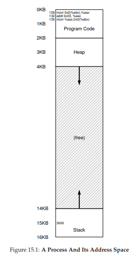
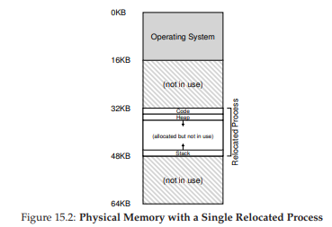
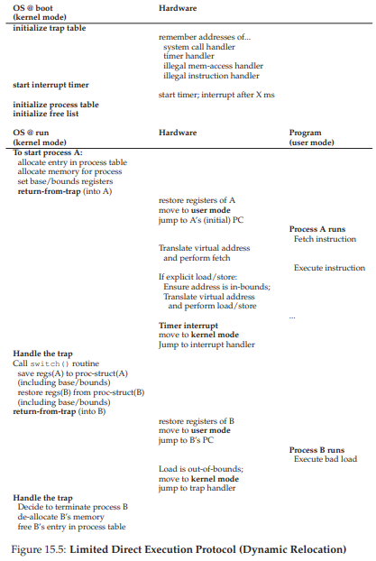

# 15 Mechanism: Address Translation
CPUの仮想化の開発では、限定直接実行（LDE）と呼ばれる一般的なメカニズムに焦点を当てました。LDEの背後にある考え方は単純です。ほとんどの場合、プログラムをハードウェア上で直接実行させたいです。しかし、特定のキーポイント（プロセスがシステムコールを発行するときやタイマー割り込みが発生したときなど）では、OSが関与し、「正しい」ことが起こるように調整します。したがって、OSは、少しハードウェアをサポートして、効率的な仮想化を実現するために、実行中のプログラムから抜け出すために最善を尽くします。しかし、これらの重要な時点で介在することにより、OSはハードウェアの制御を確実に維持します。効率性と制御性は、最新のオペレーティングシステムの主な目標の2つです。

メモリの仮想化では、同様の戦略を追求し、効率と制御の両面を達成しながら、望ましい仮想化を実現します。効率性は、最初は非常に初歩的である（例えば、ほんの数個のレジスタ）ハードウェアサポートを利用しますが、かなり複雑になっています（例えば、TLB、ページテーブルサポートなど）制御は、OSがアプリケーションがメモリにアクセスすることを許可されていないことを保証することを意味します。したがって、アプリケーションをお互いから保護し、アプリケーションからOSを保護するために、ここでもハードウェアの助けが必要です。最後に、柔軟性の点で、VMシステムからもう少し必要なものがあります。具体的には、プログラムがアドレス空間をどのような方法でも使用できるようにしたいので、システムのプログラミングを容易にしたいと考えています。それで、私たちはとある要点にたどり着きます。

>> THE CRUX:HOW TO EFFICIENTLY AND FLEXIBLY VIRTUALIZE MEMORY  
>> どのように効率的な仮想化を構築できますか？アプリケーションに必要な柔軟性はどのように提供しますか？アプリケーションがアクセスできるメモリの場所をどのように制御し、アプリケーションのメモリアクセスが適切に制限されているかを確実に管理するにはどうすればよいですか？どのようにしてこのすべてを効率的に行うのですか？

限定直接実行の一般的なアプローチに加えて、使用する一般的な手法は、ハードウェアベースのアドレス変換、または単にアドレス変換と呼ばれるものです。アドレス変換では、ハードウェアは、各メモリアクセス（命令フェッチ、ロード、またはストア）を変換し、命令によって提供される仮想アドレスを、必要な情報が実際に位置する物理アドレスに変更します。したがって、各メモリ参照ごとに、ハードウェアによってアドレス変換が実行され、アプリケーションメモリ参照がメモリ内の実際の位置にリダイレクトされます。

もちろん、ハードウェアだけでは、メモリを仮想化することはできません。効率的に行うための低レベルのメカニズムを提供するだけです。正しい変換が行われるように、ハードウェアをセットアップするためには、OSが重要なポイントに関わる必要があります。したがって、メモリを管理し、空き領域と使用中の領域を追跡し、メモリの使用方法を制御するために適切に介入する必要があります。

もう一度この仕事の目標は、美しい錯覚を作り出すことです。プログラムには、独自のコードとデータが存在する独自のプライベートメモリがあります。その仮想現実の背後には醜い物理的真理があります。つまり、CPU（またはCPU達）が1つのプログラムと次のプログラムを実行する間に、多くのプログラムが実際に同時にメモリを共有しています。仮想化を通じて、OSは（ハードウェアの助けを借りて）醜いマシンの現実を、有用で、強力で、使いやすい抽象であるものに変えます。

## 15.1 Assumptions
メモリを仮想化しようとする私たちの最初の試みは、非常に簡単です。TLB、マルチレベルのページテーブル、その他の技術的な不思議な点を理解しようとすると、すぐにOSがあなたを馬鹿にするでしょう。ここではOSがどのように動くかをお話しするだけです。

具体的には、ユーザーのアドレス空間を物理メモリに連続して配置する必要があると想定します。わかりやすくするために、アドレス空間のサイズがそれほど大きくないと仮定します。具体的には、物理メモリのサイズよりも小さいことを示します。最後に、各アドレス空間がまったく同じサイズであると仮定します。これらの前提が非現実的であるとは心配しないでください。そのようにして現実的な仮想化を実現します。

## 15.2 An Example
アドレス変換を実装するために必要なことと、そのようなメカニズムが必要な理由を理解するために、簡単な例を見てみましょう。アドレス空間が図15.1のようなプロセスがあるとします。ここで検討するのは、メモリから値をロードし、3ずつインクリメントした後、その値をメモリに戻す短いコードシーケンスです。このコードのC言語表現では次のようになるかもしれません。
```c
void func() {
int x = 3000; // thanks, Perry.
x = x + 3; // this is the line of code we are interested in
```

>> TIP: INTERPOSITION IS POWERFUL  
>> Interpositionは、コンピュータシステムにおいて大きな効果を発揮するためによく使用される一般的かつ強力な技術です。仮想化メモリでは、ハードウェアが各メモリアクセスに介入し、プロセスによって発行された各仮想アドレスを、必要な情報が実際に格納されている物理アドレスに変換します。しかしながら、Interpositionの一般的な技術は、より広範に適用可能です。実際には、ほとんどすべての明確なインタフェースをInterpositionさせたり、新しい機能を追加したり、システムの他の側面を改善したりすることができます。このようなアプローチの通常のメリットの1つは透明性です。インタフェースのクライアントを変更する必要がなくInterpositionが行われることが多いです。

コンパイラは、このコード行をアセンブリに変換します。これは、（x86アセンブリ内で）このように見えます。Linuxの場合はobjdump、Macの場合はotoolを使って逆アセンブルしてください：
```c
128: movl 0x0(%ebx), %eax ;load 0+ebx into eax
132: addl $0x03, %eax ;add 3 to eax register
135: movl %eax, 0x0(%ebx) ;store eax back to mem
```
このコードスニペットは比較的簡単です。xのアドレスがレジスタebxに置かれていると想定し、movl命令（"ロングワード"移動の場合）を使用してそのアドレスの値を汎用レジスタeaxにロードします。次の命令はeaxに3を加え、最後の命令はその同じ位置のメモリにeaxの値を戻します。



図15.1（137ページ）では、コードとデータの両方がプロセスのアドレス空間にどのように配置されているかを見ることができます。3命令コードシーケンスは128番地（最上部付近のコードセクション）に配置され、変数xの値はアドレス15KBに配置されます（最下部にスタックされる）。図では、xの初期値はスタック上の位置に示されているように3000です。

これらの命令が実行されると、プロセスの観点から、次のメモリアクセスが行われます。
- 128番地の命令をフェッチする
- この命令を実行する（アドレス15 K​​Bからロードする）
- アドレス132で命令をフェッチする
- この命令を実行する（メモリ参照なし）
- 135番地に命令をフェッチする
- この命令を実行する（15KBのアドレスにストアする）

プログラムの観点からは、アドレス空間はアドレス0から始まり、最大16 KBまで増加します。それが生成するすべてのメモリ参照は、これらの範囲内になければなりません。しかし、メモリを仮想化するために、OSは必ずしもアドレス0でなくても、物理メモリのどこかにプロセスを配置する必要があります。したがって、プロセスに透過的な方法でこのプロセスをどのようにメモリ内に再配置できますか？実際にはアドレス空間が他の物理アドレスに位置しているときに、0から始まる仮想アドレス空間の錯覚をどのように提供することができますか？



このプロセスのアドレス空間がメモリに配置された後の物理メモリの例を図15.2に示します。この図では、物理メモリの最初のスロットを使用してOSを認識し、上の例のプロセスを物理メモリアドレス32 KBから始まるスロットに再配置しました。他の2つのスロットは空いています（16 KB-32 KBと48 KB-64 KB）

## 15.3 Dynamic (Hardware-based) Relocation
ハードウェアベースのアドレス変換の理解を得るために、まず最初のアプローチについて説明します。1950年代後半の初めてのタイムシェアリングマシンでは、基本(base)と境界(bounds)と呼ばれる簡単なアイデアが導入されました。この技術は動的再配置(dynamic relocation)とも呼ばれます。両方の用語を同じ意味で使用します[SS74]。

具体的には、各CPU内に2つのハードウェアレジスタが必要です。1つは基本レジスタ、もう1つは境界レジスタです（制限レジスタとも呼ばれます）。この基本と境界のペアは、私たちが物理メモリ内のどこにでもアドレス空間を置くことを可能にし、プロセスがそれ自身のアドレス空間にしかアクセスできないようにします。

この設定では、各プログラムはアドレスゼロでロードされているかのように記述され、コンパイルされます。しかし、プログラムが実行を開始すると、OSは物理メモリ内のどこにロードすべきかを決定し、基本レジスタをその値に設定する。上記の例では、OSは物理アドレス32 KBにプロセスをロードすることを決定し、基本レジスタをこの値に設定します。

プロセスが実行されているときに面白いことが起こります。ここで、プロセスによってメモリ参照が生成されると、プロセッサによって次のように変換されます。

physical address = virtual address + base

>> ASIDE: SOFTWARE-BASED RELOCATION  
>>ハードウェアサポートが始まる前の初期の段階では、純粋にソフトウェアメソッドを使用して粗い形式の再配置を実行したシステムもありました。基本的な手法は静的再配置(static relocation)と呼ばれ、ローダーと呼ばれるソフトウェアが実行しようとしている実行ファイルを取り込み、そのアドレスを物理メモリの望ましいオフセットに書き換えます。  
>>例えば、命令がアドレス1000からレジスタ（例えば、movl 1000、％eax）へのロードであり、プログラムのアドレス空間が3000番地から読み込まれた場合（プログラムが考えるように0ではなく）ローダは、各アドレスを3000でオフセットするように命令を書き換えます（たとえば、movl 4000、％eax）。このようにして、プロセスのアドレス空間の単純な静的再配置がされます。  
>>しかし、静的再配置には多くの問題があります。プロセスが不正なアドレスを生成し、他のプロセスやOSメモリに不正にアクセスする可能性があります。そして最も重要なのは、保護を提供しないことです。真の保護[WL+93]のためには、一般的にハードウェアのサポートが必要になります。別の否定的な点は、いったん配置されると、後でアドレス空間を別の場所に再配置することが難しいことです[M65]。

プロセスによって生成された各メモリ参照は仮想アドレスです。ハードウェアはベースレジスタの内容をこのアドレスに加算し、結果はメモリシステムに発行できる物理アドレスです。これをよりよく理解するために、1つの命令が実行されたときの動作をトレースしてみましょう。具体的には、前のシーケンスからの1つの命令を見てみましょう：
```
128: movl 0x0(%ebx), %eax
```
プログラムカウンタ（PC）は128に設定されています。ハードウェアがこの命令をフェッチする必要があるときには、最初に32KBの基本レジスタ値（32768）に値を加算して32896の物理アドレスを取得します。ハードウェアはその物理アドレスから命令をフェッチします。次に、プロセッサは命令の実行を開始します。ある時点で、プロセスは仮想アドレス15 K​​Bからプロセッサに命令を発行し、再び基本レジスタ（32 KB）に加算して、最終物理アドレス47 KBを取得し、その結果、必要な内容を取得します。

仮想アドレスを物理アドレスに変換することは、まさにアドレス変換と呼ばれる手法です。すなわち、ハードウェアは、プロセスが参照していると考える仮想アドレスを取り、データが実際に存在する物理アドレスに変換します。このアドレスの再配置は実行時に行われるため、プロセスの実行が開始された後でもアドレス空間を移動できるため、技術はよく動的再配置(dynamic relocation)[M65]と呼ばれます。

>> TIP: HARDWARE-BASED DYNAMIC RELOCATION  
>> 動的再配置では、少しハードウェアが大きくなります。具体的には、ベースレジスタは、（プログラムによって生成された）仮想アドレスを物理アドレスに変換するために使用されます。境界（または制限）レジスタは、そのようなアドレスがアドレス空間の範囲内にあることを保証します。これらは一緒になって、シンプルで効率的なメモリの仮想化を実現します。

今あなたは疑問に思っているかもしれません。その境界（限界）登録はどうなりましたか？ということです。結局のところ、これはベースと境界アプローチではありませんか？確かにそうです。あなたが推測したように、境界レジスタは保護を助けるためのものです。具体的には、プロセッサはまずメモリ参照が境界内にあることを確認して、メモリ参照が合法であることを確認する。上記の単純な例では、境界レジスタは常に16 KBに設定されます。プロセスが境界よりも大きい仮想アドレスまたは負のアドレスを生成した場合、CPUは例外を発生させ、プロセスは終了する可能性があります。境界のポイントは、プロセスによって生成されたすべてのアドレスが合法でプロセスの「境界」内にあることを確認することです。

基本レジスタと境界レジスタは、チップ上に保持されているハードウェア構造（CPUごとに1組）であることに注意してください。メモリ管理ユニット（MMU）のアドレス変換に役立つプロセッサの一部を人々が呼ぶこともあります。より洗練されたメモリ管理技術を開発するにつれて、MMUにさらに多くの回路を追加するはずです。

バインドされたレジスタについての小さなもので、2つの方法のいずれかで定義できます。上記のように、アドレス空間のサイズを保持するため、ハードウェアは、ベース値を加算する前に、仮想アドレスを最初にチェックします。2番目の方法では、アドレス空間の最後の物理アドレスが保持されます。したがって、ハードウェアはまずベース値を加算し、アドレスが境界内にあることを確認します。どちらの方法も論理的に同等です。簡単にするために、通常は前者の方法を仮定します。

### Example Translations
ベースとバウンドによるアドレス変換をより詳細に理解するために、例を見てみましょう。物理アドレス16 KBにサイズ4 KB（非現実的で小さいです）のアドレス空間がロードされたプロセスを想像してください。以下に、いくつかのアドレス変換の結果を示します。


この例からわかるように、仮想アドレス（アドレス空間へのオフセットと見なすことができます）に基本アドレスを加算するだけで簡単に物理アドレスを取得できます。仮想アドレスが「大きすぎる」または負の場合にのみ、結果がフォルトとなり、例外が発生します。

>> ASIDE: DATA STRUCTURE — THE FREE LIST  
>> OSは、空きメモリのどの部分が使用されていないかを追跡して、プロセスにメモリを割り当てることができるようにする必要があります。もちろん、このようなタスクには多くの異なるデータ構造を使用できます。最も単純なもの（ここではこれを仮定します）は、現在使用されていない物理メモリの範囲のリストであるフリーリストです。


## 15.4 Hardware Support: A Summary
ハードウェアから必要なサポートを要約しましょう（図15.3参照）まず、CPU仮想化の章で説明したように、2つの異なるCPUモードが必要です。OSは特権モード（またはカーネルモード）で実行され、マシン全体にアクセスできます。アプリケーションはユーザーモードで実行されます。ユーザーモードでは、ユーザーの操作が制限されています。ある種のプロセッサステータスワードに格納されている単一のビットは、CPUが現在どのモードで動作しているかを示します。特定の特別な機会（例えば、システムコールまたは他の種類の例外または割り込み）が発生すると、CPUはモードを切り替えます。

ハードウェアは、ベースレジスタと境界レジスタ自体も提供する必要があります。したがって、各CPUは、CPUのメモリ管理ユニット（MMU）の一部である一組のレジスタを追加します。ユーザープログラムが実行されると、ハードウェアは、ユーザープログラムによって生成された仮想アドレスにベース値を加算することによって、各アドレスを変換します。また、ハードウェアは、アドレスが有効であるかどうかを確認することができなければなりません。これは、境界レジスタとCPU内のいくつかの回路を使用して行います。

ハードウェアは、ベースレジスタと境界レジスタを変更するための特別な命令を提供し、異なるプロセスが実行されたときにOSがそれらを変更できるようにする必要があります。これらの命令には特権があります。カーネル（または特権）モードでのみ、レジスタを変更できます。実行中にベースレジスタを任意に変更することができれば、ユーザプロセスが壊れる可能性があると想像してください。

最後に、CPUは、ユーザプログラムが不法にメモリにアクセスしようとする状況（「範囲外」のアドレス）で例外を生成できなければないけません。この場合、CPUはユーザプログラムの実行を停止し、OSの「境界外」例外ハンドラを実行するように調整する必要があります。OSハンドラは、どのように反応するかを知ることができます。この場合、プロセスを終了する可能性があります。同様に、ユーザプログラムが（特権の）基本レジスタと境界レジスタの値を変更しようとすると、CPUは例外を発生させ、"ユーザモードで特権動作を実行しようとしました"というハンドラを実行する必要があります。CPUは、これらのハンドラの位置を通知する方法も提供する必要があります。このようにして特権命令をいくつか追加する必要があります。


## 15.5 Operating System Issues
ハードウェアが動的再配置をサポートするための新しい機能を提供するのと同じように、OSには新たな問題があります。ハードウェアサポートとOS管理の組み合わせにより、シンプルな仮想メモリの実装が可能になります。具体的には、仮想メモリのベース・バウンド・バージョンを実装するためにOSが関与しなければならないいくつかの重要な接合点があります。

まず、OSは、プロセスが作成されたときにアクションを実行し、メモリ内のアドレス空間のための領域を見つけなければなりません。幸いにも、各アドレス空間が（a）物理メモリのサイズより小さく、（b）同じサイズであるという前提を考えると、これはOSにとって非常に簡単です。物理メモリーをスロットの配列として表示し、各スロットがフリーであるか使用中であるかを追跡できます。新しいプロセスが作成されると、OSはデータ構造（フリーリストと呼ばれることが多い）を検索して、新しいアドレス空間のためのスペースを見つけて使用することをマークする必要があります。可変サイズのアドレス空間では、より複雑になりますが、今後の章ではその懸念を残していきます。

例を見てみましょう。図15.2（139ページ）では、OS自体が物理メモリの最初のスロットを使用していること、および上記の例のプロセスを物理メモリアドレス32 KBから始まるスロットに再配置したことがわかります。他の2つのスロットは空いています（16 KB-32 KBと48 KB-64 KB）。したがって、空きリストはこれらの2つのエントリで構成されます。

第2に、OSは、プロセスが終了したとき（すなわち、正常に終了したとき、または誤って実行されたために強制終了したとき）、他のプロセスまたはOSで使用するためにすべてのメモリを再利用するときに何らかの作業を行わなければいけません。プロセスが終了すると、OSはそのメモリを空きリストに戻し、必要に応じて関連するデータ構造をクリーンアップします。

第3に、コンテキストスイッチが発生した場合、OSはさらにいくつかのステップを実行する必要があります。実際には、各プログラムはメモリ内の異なる物理アドレスにロードされるため、実行中のプログラムごとにその値が異なります。したがって、OSは、プロセス間で切り替えるときに、ベースと境界のペアを保存して復元する必要があります。具体的には、OSがプロセスの実行を停止すると決定した場合、プロセスストラクチャやプロセス制御ブロック（PCB）などのプロセスごとの構造によって、ベースレジスタと境界レジスタの値をメモリに保存する必要があります。同様に、OSが実行中のプロセスを再開する（または最初に実行する）場合、CPU上のベースと境界の値をこのプロセスの正しい値に設定する必要があります。


プロセスが停止された（すなわち、実行されていない）ときに、OSはメモリ内のある場所から別の場所へアドレス空間を移動させることができます。プロセスのアドレス空間を移動するために、OSは最初にプロセスをディスケジューリングします。つまり、OSは現在の場所から新しい場所にアドレス空間をコピーします。最後にOSは、（プロセス構造内の）保存されたベースレジスタを更新して、新しい位置を指すようにします。プロセスが再開されると、その（新しい）ベースレジスタが復元され、命令とデータがメモリ内の全く新しい場所にあることを知らずに、再び実行を開始します。

第4に、OSは上記のように例外ハンドラまたは呼び出される関数を提供しなければいけません。OSはブート時に（特権命令によって）これらのハンドラをインストールします。たとえば、プロセスが境界外のメモリにアクセスしようとすると、CPUは例外を送出します。そのような例外が発生した場合、OSは対応する必要があります。OSの一般的な反応は敵意の1つとして、攻撃プロセスを終了させる可能性があります。OSは実行中のマシンを高度に保護する必要があるため、メモリアクセス違反をするプロセスは実行させない必要があります。



図15.5（145ページ）は、タイムライン内のハードウェア/OSの相互作用の大部分を示しています。この図は、起動時にOSを使用してマシンを使用できる状態にしてから、プロセス（プロセスA）の実行が開始されたときの状態を示しています。OSの介入なしにハードウェアによってメモリ変換がどのように処理されるかを注意してください。ある時点でタイマ割り込みが発生し、OSはプロセスBに切り替わり、プロセスBは（不正なメモリアドレスに対して）「不良ロード」を実行します。その時点で、OSは関与し、プロセスの終了とBのメモリを解放し、プロセステーブルからそのエントリを削除することによってクリーンアップする必要があります。この図からわかるように、我々は依然として制限付き直接実行という基本的なアプローチに従っています。ほとんどの場合、OSはハードウェアを適切に設定し、プロセスをCPU上で直接実行させます。プロセスが誤動作した場合にのみOSが関与しなければいけません。

## 15.6 Summary
この章では、アドレス変換と呼ばれる仮想メモリで使用される特定のメカニズムを使用した限定直接実行の概念を拡張しました。アドレス変換により、OSはプロセスからのすべてのメモリアクセスを制御し、アクセスがアドレス空間の範囲内に収まるようにします。この手法の効率性の鍵はハードウェアのサポートであり、仮想アドレス（プロセスのメモリビュー）を物理的なもの（実際のビュー）に変換するアクセスごとに迅速に変換を実行します。このすべては、再配置されたプロセスに対して透過的な方法で実行されます。そのプロセスはメモリ参照が変換されているということを知らず、素晴らしい錯覚を作り出します。

また、ベースと境界または動的再配置と呼ばれる1つの特定の仮想化形態も見てきました。仮想アドレスにベース・レジスタを加算し、プロセスによって生成されたアドレスが境界内にあるかどうかをチェックするには、少しだけハードウェア・ロジックを必要とするため、ベースと境界の仮想化は非常に効率的です。ベースと境界は保護も提供します。OSとハードウェアが組み合わさって、プロセスが独自のアドレス空間外でメモリ参照を生成できないようにします。確かに保護はOSの最も重要な目標の1つです。それがなければ、OSはマシンを制御することができません（プロセスがメモリを上書きすることができれば、トラップテーブルを上書きしてシステムを引き継ぐような厄介なことを簡単に行うことができます）

残念なことに、動的再配置のこの単純な手法は非効率的です。たとえば、図15.2（139ページ）に示されているように、再配置されたプロセスは32KBから48KBの物理メモリを使用しています。ただし、プロセススタックとヒープがあまりにも大きくないので、2つの間のスペースのすべてが単に無駄になります。このタイプの廃棄物は、通常、内部断片化と呼ばれ、割り当てられた単位内の空間がすべて使用されていない（すなわち、断片化されている）ので、空いている部分は無駄になります。現在のアプローチでは、より多くのプロセスに十分な物理メモリがあるかもしれませんが、現在は固定サイズのスロットにアドレス空間を配置することに制限されているため、内部断片化が発生する可能性があります。したがって、物理メモリをより有効に活用し、内部断片化を回避するために、より洗練されたメカニズムが必要になります。私たちの最初の試みは、セグメント化と呼ばれるベースと境界のわずかな一般化です。次にこれについて説明します。

# 参考文献

[M65] “On Dynamic Program Relocation”  
W.C. McGee  
IBM Systems Journal  
Volume 4, Number 3, 1965, pages 184–199  
This paper is a nice summary of early work on dynamic relocation, as well as some basics on static relocation.

[P90] “Relocating loader for MS-DOS .EXE executable files”  
Kenneth D. A. Pillay  
Microprocessors & Microsystems archive  
Volume 14, Issue 7 (September 1990)  
An example of a relocating loader for MS-DOS. Not the first one, but just a relatively modern example of how such a system works.

[SS74] “The Protection of Information in Computer Systems”  
J. Saltzer and M. Schroeder  
CACM, July 1974  
From this paper: “The concepts of base-and-bound register and hardware-interpreted descriptors appeared, apparently independently, between 1957 and 1959 on three projects with diverse goals. At M.I.T., McCarthy suggested the base-and-bound idea as part of the memory protection system necessary to make time-sharing feasible. IBM independently developed the base-and-bound register as a mechanism to permit reliable multiprogramming of the Stretch (7030) computer system. At Burroughs, R. Barton suggested that hardware-interpreted descriptors would provide direct support for the naming scope rules of higher level languages in the B5000 computer system.” We found this quote on Mark Smotherman’s cool history pages [S04]; see them for more information.

[S04] “System Call Support”  
Mark Smotherman, May 2004  
http://people.cs.clemson.edu/˜mark/syscall.html  
A neat history of system call support. Smotherman has also collected some early history on items like interrupts and other fun aspects of computing history. See his web pages for more details.

[WL+93] “Efficient Software-based Fault Isolation”  
Robert Wahbe, Steven Lucco, Thomas E. Anderson, Susan L. Graham  
SOSP ’93  
A terrific paper about how you can use compiler support to bound memory references from a program, without hardware support. The paper sparked renewed interest in software techniques for isolation of memory references.

[W17] Answer to footnote: “Is there anything other than havoc that can be wreaked?”  
Waciuma Wanjohi, October 2017  
Amazingly, this enterprising reader found the answer via google’s Ngram viewing tool (available at the following URL: http://books.google.com/ngrams). The answer, thanks to Mr. Wanjohi: “It’s only since about 1970 that ’wreak havoc’ has been more popular than ’wreak vengeance’. In the 1800s, the word wreak was almost always followed by ’his/their vengeance’.” Apparently, when you wreak, you are up to no good, but at least wreakers have some options now.  