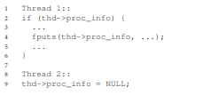
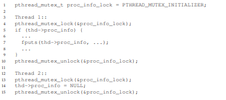
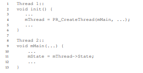
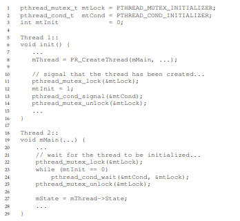

## 32 Common Concurrency Problems
研究者は長年にわたり並行性のバグを探すために多大な時間と労力を費やしてきました。初期の作業の多くは、デッドロックに焦点を絞っていました。これは過去の章で触れたことのあるトピックですが、深く[C + 71]に浸透します。最近の研究は、他のタイプの共通の並行性バグ（非デッドロックバグ）の研究に重点を置いています。この章では、実際のコードベースに見られるいくつかの並行処理の問題の例を簡単に見て、どのような問題を把握するかをより深く理解します。したがって、この章の中心的な問題は次のとおりです。

>> CRUX: HOW TO HANDLE COMMON CONCURRENCY BUGS  
>> 並行性のバグは、さまざまな共通パターンになる傾向があります。より堅牢で正確な並行コードを作成するための第一歩です。

## 32.1 What Types Of Bugs Exist?
最初の、そして最も明白な問題は、複雑な並行プログラムでどのような並行性バグが現れるかということです。この質問は一般的には答えにくいですが、幸いなことに他の人たちが私たちの仕事をしてくれました。具体的には、我々はLuらの研究に頼っています。[L + 08]は、実用上どのような種類のバグが発生しているのかを把握するために、多数の一般的な並列アプリケーションを詳細に分析しています。

この研究では、MySQL（人気の高いデータベース管理システム）、Apache（よく知られているWebサーバー）、Mozilla（有名なWebブラウザ）、OpenOffice（MS Officeスイートの無料版で一部の人々が実際に使用しています）の4つの主要で重要なオープンソースアプリケーションに焦点を当てています。。この調査では、開発者の作業を定量的なバグ分析に変えながら、これらのコードベースで検出され、修正された並行性のバグを調べました。これらの結果を理解することで、成熟したコードベースで実際に発生する問題の種類を理解するのに役立ちます。

図32.1に、Lu氏と同僚が研究したバグの概要を示します。図から、合計105個のバグがあり、そのほとんどはデッドロックではなかったことが分かります（74）。残りの31個はデッドロックバグでした。さらに、各アプリケーションから調査されたバグの数を確認できます。OpenOfficeには8つの同時実行性のバグしかありませんでしたが、Mozillaは約60個のバグがありました。


これらの異なるクラスのバグ（非デッドロック、デッドロック）にもう少し深く入り込むようになりました。非デッドロックバグの最初のクラスでは、この調査の例を使って議論を進めています。デッドロックバグの2番目のクラスについては、デッドロックの防止、回避、または処理のいずれかで行われた長い作業について説明します。

## 32.2 Non-Deadlock Bugs
Luの研究によると、デッドロックのないバグが同時性バグの大部分を占めています。しかし、どのタイプのバグですか？彼らはどのように起きますか？どうすれば修正できますか？我々は今から、Luらによって発見された2種類の非デッドロックバグについて議論します。それは原子性違反バグと順序違反バグです。

### Atomicity-Violation Bugs
遭遇する第1のタイプの問題は、原子性違反と呼ばれます。ここでは、MySQLにある簡単な例を示します。説明を読む前に、バグが何であるかを調べてみてください。



この例では、2つの異なるスレッドが構造体thcのproc_infoフィールドにアクセスします。最初のスレッドは、値がNULLでないかどうかをチェックし、その値を出力します。2番目のスレッドはNULLに設定します。明らかに、最初のスレッドがチェックを実行したがfputsの呼び出しの前に中断された場合、2番目のスレッドが中間で実行され、ポインタがNULLに設定される可能性があります。最初のスレッドが再開すると、NULLポインタがfputsによって参照解除されるため、クラッシュします。

Lu他によれば、「複数のメモリアクセスの間の望んだ直列化可能性が侵害されている（すなわち、コード領域はアトミックであることが意図されているが、実行中にアトミック性は強制されない）」という原則違反のより正式な定義です。上記の例では、コードは、proc_infoのNULLでないことのチェックとfputs（）呼び出しでのproc_infoの使用について原子性の仮定（Luの言葉で）を持っています。前提が正しくない場合、コードは必要に応じて機能しません。

このタイプの問題に対する修正を見つけることは、（必ずしもそうではないが）簡単です。上記のコードを修正する方法を考えてみませんか？この解決策では、共有変数参照をロックするだけで、いずれかのスレッドがproc_infoフィールドにアクセスするときにロックが保持されるようになります（proc_info_lock）。もちろん、構造体にアクセスする他のコードでも、このロックを取得してからロックを取得する必要があります。



### Order-Violation Bugs
Luらによって発見された別の一般的なタイプの非デッドロックバグは順序違反（order violation）として知られています。ここに別の簡単な例があります。もう一度、以下のコードにバグがある理由を理解できるかどうかを確認してください。



図からわかるとおり、スレッド2のコードは、変数mThreadがすでに初期化されている（NULLではない）と仮定しているようです。ただし、スレッド2が一度作成されるとすぐに、スレッド2のmMain（）内でmThreadの値がアクセスされたときに値が設定されず、NULLポインタの逆参照でクラッシュする可能性があります。注意としてはmThreadの値は最初はNULLであると仮定しています。もしそうでなければ、任意のメモリ位置がスレッド2の逆参照によってアクセスされるので、よく分からないことが起こってしまうかもしれません。

より正式な定義の順序違反（order violation）は、「2つの（グループの）メモリアクセスの間の望んだ順序は反転します」です。（すなわち、Aは常にBの前に実行されなければならないが、実行中はその順序は強制されない）[L + 08 ]。

この種のバグを修正するには、一般に順序付けが必要です。前に詳細に説明したように、条件変数を使用すると、このスタイルの同期を最新のコードベースに追加するのは簡単で堅牢な方法です。上記の例では、次のようにコードを書き直すことができます：



この固定コードシーケンスでは、ロック（mtLock）と対応する条件変数（mtCond）と状態変数（mtInit）を追加しました。初期化コードが実行されると、mtInitの状態が1に設定され、完了したことを通知します。この時点より前にスレッド2が実行された場合、スレッド2はこの信号および対応する状態の変更を待機します。それが後で実行されると、状態をチェックし、初期化が既に行われている（すなわち、mtInitが1にセットされている）ことを確認し、したがって適切なまま続行します。状態変数自体としてmThreadを使用する可能性がありますが、ここでは簡略化のためにそうしないことに注意してください。スレッド間で問題を発注する際には、条件変数（またはセマフォ）が助ける可能性があります。

### Non-Deadlock Bugs: Summary
Luらが研究した非デッドロックバグの大部分（97％）原子性または順序違反のいずれかです。したがって、これらのタイプのバグパターンについて注意深く考えることによって、プログラマーはそれらを避けるより良い仕事をする可能性があります。さらに、より自動化されたコードチェックツールが開発されるにつれて、デプロイメントで見つかった非デッドロックバグの大部分を構成するため、これらの2種類のバグに重点を置くべきです。

残念ながら、すべてのバグが上記の例と同じように簡単に解決できるわけではありません。あるものは、プログラムが何をしているのか、コードやデータ構造の再編成をより多く理解する必要があります。詳細は、Luらの優れた（そして判読可能な）論文を読んでください。

## 32.3 Deadlock Bugs
上記で説明した並行性のバグ以外にも、複雑なロックプロトコルを持つ多くの同時システムで発生する古典的な問題は、デッドロックと呼ばれています。例えば、スレッド（スレッド1）がロック（L1）を保持し、ロック（L2）を保持しているスレッドを待っています。残念ながら、ロックL2を保持するスレッド（スレッド2）は、L1が解放されるのを待っています。このような潜在的なデッドロックを示すコードスニペットは次のとおりです。
```c
Thread 1:               Thread 2:
pthread_mutex_lock(L1); pthread_mutex_lock(L2);
pthread_mutex_lock(L2); pthread_mutex_lock(L1);
```
このコードが実行されると、デッドロックが必ずしも発生しないことに注意してください。一方で起こる可能性があるとしたら、たとえば、スレッド1がL1をロックしてからスレッド2にコンテキストスイッチが発生した場合、スレッド2はL2を取得してL1を取得しようとします。したがって、各スレッドはもう一方を待っており、どちらも実行できないため、デッドロックが発生します。図32.2を参照してください。グラフ内のサイクルの存在は、デッドロックを示す。

図は問題をはっきりさせるはずです。デッドロックを何らかの方法で処理するために、プログラマーはどのようにコードを書くべきですか？


>> CRUX: HOW TO DEAL WITH DEADLOCK  
>> どのようにしてデッドロックを防止、回避、または少なくとも検出して回復するためのシステムを構築する必要がありますか？これは今日のシステムで本当の問題ですか？

### Why Do Deadlocks Occur?
あなたが思っているように、上記のような単純なデッドロックは容易に避けることができます。たとえば、スレッド1と2の両方が同じ順序でロックを取得することを確実にした場合、デッドロックは決して発生しません。なぜデッドロックが起こるのですか？

1つの理由は、大きなコードベースでは、複雑な依存関係がコンポーネント間で発生するということです。たとえば、オペレーティングシステムを起動します。仮想メモリシステムは、ディスクからブロックをページするためにファイルシステムにアクセスする必要があります。ファイルシステムはその後、ブロックを読み込んで仮想メモリシステムに接続するためにメモリのページを要求することがあります。したがって、コード内で自然に発生する可能性のある循環依存関係の場合、デッドロックを回避するために、大規模システムでのロック戦略の設計を慎重に行う必要があります。

別の理由はカプセル化の性質によるものです。ソフトウェア開発者として、実装の詳細を隠し、ソフトウェアをモジュール化しやすくするように教えています。残念なことに、このようなモジュール化はロックとうまく合致しません。Julaらは、 [J + 08]を指摘すると、いくつかの一見無害なインターフェースは、ほとんどあなたをデッドロックに招待します。たとえば、Java VectorクラスとメソッドAddAll（）を使用します。このルーチンは次のように呼び出されます。
```c
Vector v1, v2;
v1.AddAll(v2);
```
内部的には、メソッドがマルチスレッドセーフである必要があるため、（v1）に追加されるベクトルとパラメータ（v2）の両方のロックが取得される必要があります。ルーチンは、v2の内容をv1に追加するために、任意の順序（例えばv1、v2）で前記ロックを獲得します。しかし、もし、他のスレッドがv2.AddAll（v1）をほぼ同時に呼び出すと、呼び出し元アプリケーションからは隠されたデッドロックの可能性があります。

### Conditions for Deadlock
デッドロックが発生するには4つの条件が必要です[C + 71]。
- 相互排除：スレッドは、必要なリソースの排他制御を要求します（スレッドはロックを取得します）。

- ホールド・アンド・ウェイト：スレッドは、追加のリソース（例えば、取得したいロック）を待つ間に、スレッドに割り当てられたリソース（例えば、既に獲得したロック）を保持します。

- プリエンプションなし：リソース（ロックなど）は、リソースを保持しているスレッドから強制的に削除することはできません。

- 循環待ち：各スレッドが、チェーン内の次のスレッドによって要求されている1つ以上のリソース（例えば、ロック）を保持するように、スレッドの循環チェーンが存在する。

これらの4つの条件のいずれかが満たされない場合、デッドロックは発生しません。そこで、まず、デッドロックを防止するための手法を探る。これから説明するそれぞれの戦略は、上記の条件の1つが発生するのを防ぎ、デッドロック問題を処理する1つのアプローチです。

### Prevention
### Circular Wait
おそらく最も実用的な予防技術（そして確かに頻繁に採用されているもの）は、あなたが循環待ちを誘発しないようにあなたのロッキングコードを書くことでしょう。これを実行する最も簡単な方法は、ロック取得のトータルオーダーを行うことです。たとえば、システムに2つのロック（L1とL2）しかない場合、L2の前に常にL1を取得することでデッドロックを防ぐことができます。このような厳密な順序付けによって、循環待ちが発生しないことが保証されます。したがって、デッドロックは発生しません。

もちろん、より複雑なシステムでは、2つ以上のロックが存在するため、完全なロック順序を達成するのが難しい場合があります（そして、おそらく完全なロック順序付けは不要です）。したがって、部分順序付けは、デッドロックを回避するためにロック獲得を構造化するための有用な方法となり得ます。部分ロック順序の優れた実際の例は、Linux [T + 94]のメモリマッピングコードで見ることができます。ソースコードの先頭にあるコメントは、「i_mutex before i_mmap_mutex」などの単純なロック取得命令と、「i_mmap_mutex before private_lock before swap_lock before mapping->tree_lock」のような複雑な命令を含む10種類のロック取得オーダーを示しています。

あなたが想像することができるように、全部と部分的な順序付けはロック戦略の慎重な設計を必要とし、細心の注意を払って構築しなければなりません。さらに、順序付けは単に規約に過ぎず、誤ったプログラマーは簡単にロックプロトコルを無視し、デッドロックを引き起こす可能性があります。最後に、ロックの順序付けには、コードベースの深い理解と、さまざまなルーチンの呼び出し方法が必要です。たった1つの間違いが「D」という言葉になる可能性があります。

>> TIP: ENFORCE LOCK ORDERING BY LOCK ADDRESS
>> 場合によっては、関数が2つ（またはそれ以上）のロックを取得する必要があります。したがって、我々は注意または、デッドロックが発生する可能性があることを知っています。do_something（mutex t * m1、mutex t * m2）と呼ばれる関数を想像してみてください。もし、常にm2より前にm1（または常にm1より前にm2）を取得してしまうとデッドロックを発生する可能性があります。なぜなら、一つのスレッドがdo_something（L1、L2）を呼び出すことができるため、別のスレッドがdo_something（L2、L1）を呼び出すことができるからです。  
この特別な問題を回避するために、巧妙なプログラマはロックの取得を順序付けする方法として各ロックのアドレスを使用することができます。high-to-lowまたはlow-to-highのどちらかのアドレス順でロックを取得することで、どの順序でも関係なく同じ順序（決まった順序）でロックを取得することが保証されます。このような例です：  
  
この単純な技術を使用することにより、プログラマは、マルチロック取得のシンプルで効率的なデッドロックフリー実装を保証することができます。

### Hold-and-wait
デッドロックのホールド・アンド・ウェイトの要件は、すべてのロックを一度に取得することで回避できます。実際には、これは以下のように達成します。  
  
最初にロック防止を取得することにより、このコードは、ロック取得の途中でスレッド交換が行われないこと、そのようなデッドロックを再び回避できることを保証します。もちろん、スレッドがロックを取得するたびに、グローバル防御ロックを取得する必要があります。たとえば、別のスレッドがロックL1とL2を別の順序で取得しようとしていた場合は、その間にロック防止を保持しているのでOKです。

解決策にはいくつかの理由で問題があることに注意してください。以前のように、カプセル化は私たちに対して働いています。ルーチンを呼び出すときに、このアプローチでは、ロックを保持する必要があることを正確に把握し、事前に取得する必要があります。この技術はまた、すべてのロックを真に必要とされるのではなく、早めに（一度に）取得する必要があるため、並行性を低下させる可能性があります。

### No Preemption
ロック解除が呼び出されるまで、一般にロックを保持しているとみなすので、複数のロックを取得すると、ロックを待っているときに別のロックを持っているので、問題が発生することがあります。多くのスレッドライブラリは、このような状況を回避するために、より柔軟なインタフェースを提供します。具体的には、ルーチンpthread_mutex_trylock（）はロックを取得して（利用可能な場合）、成功を返します。ロックが保持されていることを示すエラーコードを返します。後者の場合、そのロックを取得したい場合は、後で再試行できます。このようなインタフェースは、次のように使用して、デッドロックのない、順序付けが可能なロック取得プロトコルを構築することができます。  
  
別のスレッドは同じプロトコルに従うことができますが、他の順序（L2からL1）でロックを取得し、プログラムはデッドロックフリーであることに注意してください。しかし、新たな問題が生まれます。それは。ライブロックです。2つのスレッドがこのシーケンスを繰り返し試行し、両方のロックを繰り返し取得できない可能性があります（おそらくありえません）この場合、両方のシステムはこのコードシーケンスを何度も繰り返し実行しています（したがって、デッドロックではありません）が進行中ではありません。したがって、ライブロックという名前があります。ライブロックの問題に対する解決策もあります。たとえば、ループバックする前にランダムな遅延を追加し、全体をもう一度試すことで、競合するスレッド間の干渉が繰り返される可能性を減らすことができます。

この解決策についての最後の1つのポイントは、それはtrylockアプローチを使用するという困難な部分を取り巻いています。再度存在する可能性のある第1の問題は、カプセル化です。これらのロックのうちの1つが呼び出されているルーチンに埋め込まれていると、先頭に戻ってジャンプするというより複雑な実装になります。コードが途中でいくつかのリソース（L1以外）を取得していた場合は、それらも注意深く解放する必要があります。たとえば、L1を取得した後でコードにメモリが割り当てられていた場合、L2を取得できなかった場合にそのメモリを解放してから、先頭に戻ってシーケンス全体をやり直す必要があります。しかしながら、限定された状況（例えば、前述のJavaベクトル法）では、このタイプのアプローチはうまくいく可能性があります。

### Mutual Exclusion
最終的な防止手法は、相互排除の必要性を全く避けることです。一般的に、実行したいコードには本当に重要な部分があるので、これは困難です。だから私たちは何をすることができますか？Herlihyは、ロックなしで様々なデータ構造を設計できるという考え方を持っていました[H91、H93]。これらのロックフリー（および関連する待機フリー）アプローチのアイデアは簡単です。強力なハードウェア命令を使用すると、明示的なロックを必要としない方法でデータ構造を構築することができます。  
簡単な例として、compare-and-swap命令があるとしましょう。これは、ハードウェアが提供する以下のようなアトミック命令です。  
  
ある量だけ値を原子的に増やしたかったとします。私たちは以下のようにそれを行うことができました。  
  
ある特定の値をアトミックにインクリメントしたいとしたら、その値を新しい量に更新しようと繰り返し試み、比較とスワップを使用してアプローチを構築したとします。この方法では、ロックは取得されず、デッドロックは発生しません（ライブロックはまだ可能ですが）。もう少し複雑な例を考えてみましょう。それはリストの挿入です。リストの先頭に挿入するコードを次に示します。  
  
このコードは簡単な挿入を行いますが、"同時に"複数のスレッドから呼び出された場合、競合状態になります（理由を調べることができるかどうかを確認してください）。もちろん、このコードをロックの獲得と解放で囲むことで、これを解決できます。  
  
このソリューションでは、従来の方法でロックを使用しています。代わりに、単純にcompare-and-swap命令を使用してこの挿入をロックフリーの方法で実行しようとします。可能なアプローチは次のとおりです。  
  
ここのコードは、現在のヘッドを指し示す次のポインタを更新し、新しく作成されたノードをリストの新しいヘッドとしてスワップしようとします。しかし、一方で他のスレッドが新しいヘッドでスワップを成功させ、このスレッドを新しいヘッドで再試行すると、これは失敗します。

もちろん、有用なリストを作成するには単なるリストの挿入以上のものが必要であり、意外なことに、ロックフリーの方法で挿入、削除、および検索を実行できるリストを構築することは簡単ではありません。ロックフリーと待ち時間のない同期に関する豊富な文献を読んで詳細[H01、H91、H93]を参照してください。

### Deadlock Avoidance via Scheduling
デッドロック防止の代わりに、デッドロック回避が望ましい場合もあります。回避は、様々なスレッドが実行中にどのロックを獲得するかについてのグローバルなロックに関する知識を必要とし、その後デッドロックが発生しないことを保証するように前記スレッドをスケジュールします。

たとえば、2つのプロセッサと4つのスレッドをスケジューリングする必要があるとします。 さらに、スレッド1（T1）がL1とL2をロックしていることを知っているとします（T2は実行中のある時点で何らかの順序でロックします）、L1とL2も同様に把持し、T3はL2だけを捕捉し、T4はロックをまったく持ちません。 これらのスレッドのロック獲得要求を表形式で示すことができます。  
  
したがって、スマートスケジューラは、T1とT2が同時に実行されない限り、デッドロックは発生しない可能性があると計算できます。そのようなスケジュールの1つがあります  
  
（T3とT1）または（T3とT2）が重なってもかまいません。T3はL2をロックしますが、1つのロックしか持たないため、他のスレッドと並行してデッドロックを引き起こすことはありません。もう1つの例を見てみましょう。この場合、次の競合テーブルで示されるように、同じリソース（再びL1およびL2のロック）に対してより多くの競合が発生します。  
  
特に、スレッドT1、T2、およびT3は、実行中のある時点で両方のロックL1およびL2を取得する必要があります。デッドロックが発生しないことを保証するスケジュールがあります  
  
ご覧のように、静的スケジューリングは、T1、T2、T3がすべて同じプロセッサ上で実行されるという控えめなアプローチにつながります。したがって、ジョブを完了するための合計時間が大幅に長くなります。これらのタスクを同時に実行することは可能かもしれませんが、デッドロックの恐れが私たちを妨げ、コストとして支払うのはパフォーマンスです。

このようなアプローチの有名な例として、DijkstraのBanker's Algorithm [D64]があり、多くの同様のアプローチが文献に記載されています。残念ながら、非常に限られた環境、例えば、実行する必要のある一連のタスクと必要なロックを完全に把握している組み込みシステムの場合にのみ役立ちます。さらに、このようなアプローチは、上記の2番目の例で見たように、並行性を制限する可能性があります。したがって、スケジューリングによるデッドロックの回避は、汎用的なソリューションではありません。

### Detect and Recover
最終的な一般的な戦略の1つは、デッドロックが頻繁に発生するようにし、そのようなデッドロックが検出されたら何らかのアクションをとることです。たとえば、OSが1年に1回凍結した場合、OSを再起動して作業で喜んで（またはうんざりして）取得します。デッドロックがまれである場合、そのような非解決策は確かにかなり実用的です。

>> TIP: DON’T ALWAYS DO IT PERFECTLY (TOM WEST’S LAW)  
>> 古典的なコンピュータ業界の書籍「Soul of a New Machine [K81]」の主題で有名なTom Westは、「価値あることは何もかもうまくいくわけではない」という著名な技術的格言である。悪いことがまれにしか起こらない場合は、特に、悪いことが発生するコストが小さい場合には、そのことを防ぐために多大な努力を費やすべきではありません。一方、スペースシャトルを建設していて、間違ったことのコストがスペースシャトルが爆発している場合は、このアドバイスを無視してください。

多くのデータベースシステムは、デッドロックの検出と回復のテクニックを採用しています。デッドロック検出器は定期的に実行され、リソースグラフを作成し、サイクルごとにチェックします。サイクル（デッドロック）が発生した場合は、システムを再起動する必要があります。より複雑なデータ構造の修復が最初に必要とされる場合、プロセスを容易にするために人間が関与するかもしれません。データベースの並行性、デッドロック、および関連する問題の詳細は、他の場所で確認できます[B + 87、K87]。これらの作品を読んだり、データベースを使ってこの豊富で興味深いトピックについて学んでください。

## 32.4 Summary
この章では、並行プログラムで発生するバグの種類について検討しました。最初のタイプの非デッドロックバグは、驚くほど一般的ですが、そのほとんどは修正するのが簡単です。これらには、一緒に実行されるべき一連の命令ではなく、2つのスレッド間で必要な順序が強制されていない違反を命令する、原子性違反が含まれます。

デッドロックについても簡単に説明しました。デッドロックはなぜ発生するのか、それについて何ができるのですか。この問題は並行処理自体と同じくらい古いものであり、このトピックについて何百もの論文が書かれています。実際の最善の解決策は、慎重に、ロック獲得命令を開発し、最初にデッドロックが発生するのを防ぐことです。待ち受けのないデータ構造は、Linuxを含む一般的なライブラリやクリティカルなシステムへの道を切り開いているため、待ち時間のないアプローチも有望です。しかし、一般性の欠如と新しい待ち時間のないデータ構造を開発する複雑さが、このアプローチの全体的な有用性を制限する可能性があります。おそらく、最良のソリューションは、新しい並行プログラミングモデルを開発することです。例えば、MapReduce（Googleから）[GD02]のようなシステムでは、プログラマはロックなしで特定のタイプの並列計算を記述することができます。ロックはその性質上問題があります。おそらく、私たちが本当に必要でない限り、それらを使用しないようにするべきです。

## 参考文献
[B+87] “Concurrency Control and Recovery in Database Systems”  
Philip A. Bernstein, Vassos Hadzilacos, Nathan Goodman  
Addison-Wesley, 1987  
The classic text on concurrency in database management systems. As you can tell, understanding concurrency, deadlock, and other topics in the world of databases is a world unto itself. Study it and find out for yourself.

[C+71] “System Deadlocks”  
E.G. Coffman, M.J. Elphick, A. Shoshani  
ACM Computing Surveys, 3:2, June 1971  
The classic paper outlining the conditions for deadlock and how you might go about dealing with it. There are certainly some earlier papers on this topic; see the references within this paper for details.

[D64] “Een algorithme ter voorkoming van de dodelijke omarming”  
Edsger Dijkstra  
Circulated privately, around 1964  
Available: http://www.cs.utexas.edu/users/EWD/ewd01xx/EWD108.PDF  
Indeed, not only did Dijkstra come up with a number of solutions to the deadlock problem, he was the first to note its existence, at least in written form. However, he called it the “deadly embrace”, which (thankfully) did not catch on.

[GD02] “MapReduce: Simplified Data Processing on Large Clusters”  
Sanjay Ghemawhat and Jeff Dean  
OSDI ’04, San Francisco, CA, October 2004  
The MapReduce paper ushered in the era of large-scale data processing, and proposes a framework for performing such computations on clusters of generally unreliable machines.

[H01] “A Pragmatic Implementation of Non-blocking Linked-lists”  
Tim Harris  
International Conference on Distributed Computing (DISC), 2001  
A relatively modern example of the difficulties of building something as simple as a concurrent linked list without locks.

[H91] “Wait-free Synchronization”  
Maurice Herlihy  
ACM TOPLAS, 13:1, January 1991  
Herlihy’s work pioneers the ideas behind wait-free approaches to writing concurrent programs. These approaches tend to be complex and hard, often more difficult than using locks correctly, probably limiting their success in the real world.

[H93] “A Methodology for Implementing Highly Concurrent Data Objects”  
Maurice Herlihy  
ACM TOPLAS, 15:5, November 1993  
A nice overview of lock-free and wait-free structures. Both approaches eschew locks, but wait-free approaches are harder to realize, as they try to ensure than any operation on a concurrent structure will terminate in a finite number of steps (e.g., no unbounded looping).

[J+08] “Deadlock Immunity: Enabling Systems To Defend Against Deadlocks”  
Horatiu Jula, Daniel Tralamazza, Cristian Zamfir, George Candea  
OSDI ’08, San Diego, CA, December 2008  
An excellent recent paper on deadlocks and how to avoid getting caught in the same ones over and over again in a particular system.

[K81] “Soul of a New Machine”  
Tracy Kidder, 1980  
A must-read for any systems builder or engineer, detailing the early days of how a team inside Data General (DG), led by Tom West, worked to produce a “new machine.” Kidder’s other books are also excellent, including Mountains beyond Mountains. Or maybe you don’t agree with us, comma?

[K87] “Deadlock Detection in Distributed Databases”  
Edgar Knapp  
ACM Computing Surveys, 19:4, December 1987  
An excellent overview of deadlock detection in distributed database systems. Also points to a number of other related works, and thus is a good place to start your reading.

[L+08] “Learning from Mistakes — A Comprehensive Study on Real World Concurrency Bug Characteristics”  
Shan Lu, Soyeon Park, Eunsoo Seo, Yuanyuan Zhou  
ASPLOS ’08, March 2008, Seattle, Washington  
The first in-depth study of concurrency bugs in real software, and the basis for this chapter. Look at Y.Y. Zhou’s or Shan Lu’s web pages for many more interesting papers on bugs.

[T+94] “Linux File Memory Map Code”  
Linus Torvalds and many others  
Available: http://lxr.free-electrons.com/source/mm/filemap.c  
Thanks to Michael Walfish (NYU) for pointing out this precious example. The real world, as you can see in this file, can be a bit more complex than the simple clarity found in textbooks...
