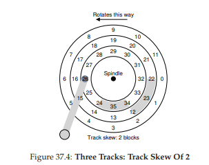
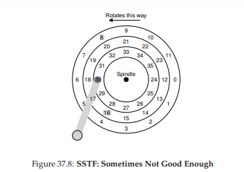

# 37 Hard Disk Drives
最後の章では、I/Oデバイスの一般的な概念を紹介し、OSがそのような獣とどのように相互作用するかを示しました。この章では、特に1つのデバイス、ハードディスクドライブについて詳しく説明します。これらのドライブは、何十年もの間、コンピュータシステムにおける永続的なデータストレージの主要な形態であり、ファイルシステム技術の開発の多くは、その動作を前提としています。したがって、それを管理するファイルシステムソフトウェアを構築する前に、ディスク操作の詳細を理解することは価値があります。これらの詳細の多くは、RuemmlerとWilkes [RW92]とAnderson、Dykes、Riedel [ADR03]の優れた論文で利用できます。

>> CRUX: HOW TO STORE AND ACCESS DATA ON DISK  
>> 最新のハードディスクドライブはどのようにデータを保存しますか？インターフェイスとは何ですか？データは実際にどのように割り当てられ、アクセスされますか？ディスクスケジューリングはどのようにパフォーマンスを改善しますか？

# 37.1 The Interface
現代のディスクドライブとのインターフェースを理解することから始めましょう。現代のすべてのドライブの基本的なインターフェースは簡単です。ドライブは、多数のセクタ（512バイトごとのブロック）で構成され、それぞれのセクタは読み書き可能です。セクタは、nセクタのディスク上で0からn-1まで番号が付けられます。したがって、ディスクをセクタの配列として見ることができます。0〜n-1はドライブのアドレス空間です。

マルチセクタ操作が可能です。確かに、多くのファイルシステムは一度に4KBを読み書きします。しかし、ディスクを更新するとき、ドライブ製造業者が行う唯一の保証は、単一の512バイト書き込みがアトミックである（すなわち、その全体が完了するか、または完了しない）ことである。したがって、不意の電力損失が発生した場合、より大きな書込みの一部のみが完了することがある（時には、torn write(破れた書込み)と呼ばれる）。

ディスクドライブのほとんどのクライアントはいくつかの前提がありますが、それはインターフェイスに直接指定されていません。SchlosserとGangerはこれをディスクドライブの「未書き込み契約」と呼んでいます[SG04]。具体的には、通常、ドライブのアドレス空間内で互いに隣接する2つのブロックにアクセスすることは、離れている2つのブロックにアクセスするよりも高速であると想定することができます。連続したチャンク（すなわち、順序読み込みまたは書き込み）内のブロックにアクセスすることが最速のアクセスモードであり、通常はそれ以上のランダムアクセスパターンよりもはるかに高速であると通常仮定してもよいです。

# 37.2 Basic Geometry
現代のディスクのいくつかのコンポーネントを理解してみましょう。まずは、磁気的な変化を誘発することによってデータが永続的に保存される円形の硬い表面であるプラッターから始めます。ディスクには1つまたは複数のプラッタがあります。各プラッターは2面を持ち、それぞれの面はサーフェスと呼ばれます。これらのプラッタは、通常、アルミニウムなどの硬い材料で作られ、薄い磁性層でコーティングされているため、ドライブの電源を切ってもドライブがビットを永続的に保存できます。

プラッタはスピンドルの周りに一緒に拘束されています。スピンドルは、一定の速度で（ドライブの電源がオンの状態で）プラッタを回転させるモータに接続されています。回転速度はRPM（回転数/分）で測定されることが多く、典型的な現代的な値は7,200 RPM〜15,000 RPMの範囲です。1回転の時間に興味があることが多いことに注意してください。たとえば、10,000 RPMで回転するドライブは、1回転に約6ミリ秒（6 ms）かかることを意味します。

データはセクタの同心円内の各サーフェスでエンコードされます。そのような同心円を1つのトラックと呼びます。単一のサーフェスには、数千、数千のトラックが含まれています。これらのトラックはしっかりと詰め込まれており、人間の髪の毛の幅に収まる数百のトラックがあります。

表面から読み書きするためには、ディスク上の磁気パターンを感知（すなわち、読み取る）するか、またはそれらに変化を誘発（すなわち書き込む）することができる機構が必要です。この読み書きのプロセスは、ディスクヘッドによって解決されます。ドライブの表面に1つのそのようなヘッドがあります。ディスクヘッドは単一のディスクアームに取り付けられ、ディスクアームは表面を横切って移動し、ヘッドを望んだトラック上に位置決めします。

# 37.3 A Simple Disk Drive
一度に1つのモデルを1つのトラックにまとめることで、ディスクの仕組みを理解してみましょう。1つのトラックを持つシンプルなディスクがあるとします（図37.1）。このトラックには12のセクタがあり、それぞれのセクタのサイズは512バイト（通常のセクタサイズ、リコール）であり、したがって0〜11の数字で表されます。ここにある単一のプラッタは、モータが取り付けられたスピンドルを中心に回転します。もちろん、トラック自体は興味深いものではありません。これらのセクタを読み書きできるようにしたいので、今見ているようにディスクアームにディスクヘッドが必要です（図37.2）。図では、アームの端部に取り付けられたディスクヘッドがセクター6の上に配置され、表面が反時計回りに回転しています。

### Single-track Latency: The Rotational Delay
単純なonetrackディスク上でリクエストがどのように処理されるかを理解するために、今ブロック0の読み込み要求を受け取ったとします。ディスクサービスはどのようにこの要求を処理する必要がありますか？

私たちのシンプルなディスクでは、ディスクはそれほど多くする必要はありません。特に、ディスクヘッドの下で望んだセクタが回転するのを待たなければならない。この待ち時間は、現代のドライブではよく起こりますが、I/Oサービス時間の重要な要素です。rotational delay（回転遅延）（ときどき回転遅延、それは奇妙に聞こえるかもしれませんが）という特殊な名前があります。この例では、完全回転遅延がRである場合、ディスクは、読み書きヘッドがセクタ0で待っていた場合（もしセクタ6で開始すると）、平均でR/2の回転遅延を生じます。この単一のトラックに対する最悪の場合の要求は、セクタ5へのものであり、そのような要求に対応するためにほぼ完全回転遅延を引き起こします。

### Multiple Tracks: Seek Time
これまでのところ、私たちのディスクには単一のトラックしかありません。これはあまり現実的ではありません。現代のディスクには数百万ものものがあります。このようにして、少しだけ現実的なディスク面を見てみましょう。このディスク面は3つのトラックで構成されています（図37.3）

図では、ヘッドは現在、最も内側のトラック（セクタ24〜35を含む）上に配置されている。次のトラックは次のセクタセット（12〜23）を含み、最外トラックは第1のセクタ（0〜11）を含みます。

ドライブがどのセクタにアクセスする可能性があるかを理解するために、セクタ11への読み込みなど、離れたセクタへの要求で何が起きるかを追跡します。この読み込みを処理するには、まずドライブをディスクアームを正しいトラック（この場合、最外側のトラック）に移動させるプロセスを行います。このプロセスシーク（seek）と呼びます。シークは回転と一緒に、最もコストのかかるディスク操作の1つです。

シークは注目すべきですが、多くのフェーズがあります。最初にディスクアームが動くように加速フェーズを行います。腕が最高速度で動いているときに惰性走行し、次に腕が減速すると減速します。最終的にはヘッドは正しいトラック上に慎重に配置されるとsettling（沈む）します。ドライブが正しいトラックを見つけることが確実でなければならないので、settling time（沈む時間）は非常に重要であり、例えば、0.5~2msとなることが多いです。

シークの後、ディスクアームはヘッドを正しいトラックの上に配置します。シークの描写は図37.3にあります。

見てわかるように、シーク中にアームが所望のトラックに移動し、プラッタが回転しています。この場合は約3セクタである。したがって、セクタ9はディスクヘッドの下をちょうど通過しようとしており、転送を完了するために短い回転遅延に耐える必要があります。

セクタ11がディスクヘッドの下を通過すると、転送と呼ばれるI/Oの最終フェーズが実行され、データの読み書きが行われます。したがって、I/O時間の完全な図が得られます。最初にシークし、次に回転遅延を待ってから最後に転送します。

### Some Other Details
あまり時間を費やすことはありませんが、ハードドライブの動作に関する他の面白い詳細があります。多くのドライブでは、トラックの境界を越えても順次読み込みが適切に処理できるように、何らかのトラックスキューを使用しています。私たちの単純な例のディスクでは、これは図37.4のように見えるかもしれません。

あるトラックから別のトラックに切り替えると、ディスクはヘッドを再配置する時間が必要となるため（隣接するトラックまで）、セクタはこのように歪んでいることがよくあります。このようなスキュー（歪み）がなければ、ヘッドは次のトラックに移動されるが、望んだセクタの次のブロックはヘッドの下で既に回転しているため、ドライブは次のブロックにアクセスするためにほぼ全回転遅延を待たなければいけません。

もう一つの現実は、アウタートラックは、ジオメトリの結果であるインナートラックより多くのセクタを持つ傾向があります。そこには単に余裕があります。これらのトラックは、ディスクが複数のゾーンに編成され、ゾーンがサーフェス上のトラックの連続したセットであるマルチゾーンのディスクドライブとしてよく使用されます。各ゾーンは1トラックあたりのセクタ数が同じであり、外側ゾーンは内側ゾーンよりも多くのセクタを持ちます。

最後に、最近のディスクドライブの重要な部分は、歴史的な理由からトラックバッファと呼ばれるキャッシュです。このキャッシュは、ドライブがディスクから読み書きするデータを保持するために使用できるわずかな量のメモリ（通常は約8または16 MB）です。たとえば、ディスクからセクタを読み取る場合、ドライブはそのトラックのすべてのセクタを読み込み、そのセクタをそのメモリにキャッシュすることになります。これにより、ドライブは、同じトラックへの後続の要求にすばやく応答することができます。

書き込みの場合、ドライブには選択肢があります。データがメモリに格納されたとき、または書き込みが実際にディスクに書き込まれた後に、書き込みが完了したことを確認する必要がありますか？前者はライトバックキャッシング（または時には即時報告）と呼ばれ、後者はライトスルーと呼ばれています。ライトバックキャッシングを行うと、ドライブが「高速」に見えることがありますが、危険です。ファイルシステムまたはアプリケーションで、正しい順序でデータをディスクに書き込む必要がある場合は、ライトバックキャッシュで問題が発生する可能性があります（詳細は、ファイルシステムのジャーナリングに関する章を参照してください）。

>> ASIDE: DIMENSIONAL ANALYSIS  
>> 化学の授業では、単位を単純に設定し打ち消しあい、結果として何か答えをだしました。どのようにしたかを覚えていますか？その化学的な魔法は、高次元ファクター解析の名で知られており、それはコンピュータシステム分析にも有用であることが判明しています。  
次元分析がどのように機能するのか、なぜそれが有用なのかを見てみましょう。この場合、ディスクの1回転にかかる時間（ミリ秒）を把握しておく必要があると仮定します。残念ながら、ディスクのRPM、または1分あたりの回転のみが与えられます。10K RPMディスク（つまり、1分間に10,000回回転するディスク）を想定しているとします。1回転あたりの時間をミリ秒単位で取得できるようにしますか？  
これを行うには、まず、目的のユニットを左に置きます。この場合、1回転あたりの時間（ミリ秒）を取得したいので、正確には（Time（ms））/（1 Rotation）を書きます。私たちが知っているすべてを書き、できるだけユニットを取り消してください。最初に、（1分）/（10,000回転）（回転を下にし、それが左にあるように）、分を（60秒/1分）秒に変換し、最後に（1000 ms）/（1秒）でミリ秒単位の秒数に変換します。最終的な結果は以下の通りです（ユニットは素早くキャンセルされています）。  
  
この例からわかるように、次元分析は、直感的に見えるものを単純で反復可能なプロセスにします。上記のRPM計算以外にも、定期的にI/O分析を行うことができます。たとえば、ディスクの転送速度（100 MB/秒など）が与えられることがよくあります。次に、512 KBブロック（ミリ秒単位）の転送にはどのくらいの時間がかかりますか？次元分析を使用すると簡単です。  
  

## 37.4 I/O Time: Doing The Math
ディスクの抽象モデルが完成したので、ディスクのパフォーマンスをよりよく理解するために、少し分析することができます。特に、I/O時間を3つの主要コンポーネントの合計として表すことができるようになりました。  
  
ドライブ間の比較のためにしばしばより容易に使用されるI/O（R_I/O）の割合（以下で説明する）は、時間から容易に計算されることを覚えておいてください。単純に転送のサイズをそれにかかる時間で割ってください：  
  
I/O時間をより良く感じるには、次の計算を実行してみましょう。私たちが興味を持っている2つの仕事量があると仮定します。最初のものは、ランダム仕事量として知られ、ディスク上のランダムな場所に小さな（たとえば4KB）読み取りを発行します。ランダム仕事量は、データベース管理システムを含む多くの重要なアプリケーションで一般的です。順次仕事量と呼ばれる第2のものは、ジャンプすることなく、ディスクから連続して多数のセクタを読み取るだけです。順次アクセスパターンは非常に一般的であり、したがって同様に重要です。

ランダム仕事量と順次仕事量のパフォーマンスの違いを理解するには、まずディスクドライブについていくつかの仮定を立てる必要があります。Seagateの最新のディスクをいくつか見てみましょう。Cheetah 15K.5 [S09b]と呼ばれる最初のものは、高性能SCSIドライブです。2番目のバラクーダ[S09a]は、容量のために作られたドライブです。両方の詳細は図37.5にあります。

ご覧のように、ドライブは全く異なる特性を持ち、多くの点でディスクドライブ市場の2つの重要なコンポーネントを素早く要約しています。1つは、ドライブができるだけ速く回転し、シーク時間が短く、データをすばやく転送できるように設計された「高性能」ドライブ市場です。2番目は「容量」市場で、1バイトあたりのコストが最も重要な側面です。したがって、ドライブはより低速ですが、使用可能なスペースにできるだけ多くのビットをパックします。

これらの数字から、上に概説した2つの仕事量でドライブがどれくらいうまくいくかを計算することができます。ランダムな仕事量を見てみましょう。ディスク上のランダムな位置で各4 KBの読み取りが発生すると仮定して、このような読み取りがどれぐらいかかるかを計算することができます。  
  

>> TIP: USE DISKS SEQUENTIALLY  
>> 可能な限り、シーケンシャルな方法でディスクとの間でデータを転送します。シーケンシャルが不可能な場合は、少なくとも大量のチャンクでデータを転送することを検討してください。I/Oがランダムではない場合、I/Oパフォーマンスは劇的に低下します。また、ユーザーは苦しみます。また、不注意なランダムI/Oで何が苦しんでいるのかを知ることで、苦しみます。

平均シーク時間（4ミリ秒）は、製造元によって報告された平均時間とみなされます。表面の一方の端から他方への完全なシークは2〜3倍長くかかる可能性があることに注意してください。平均回転遅延はRPMから直接計算されます。15000 RPMは250 RPS（1秒あたりの回転数）に等しい。従って、各回転は4msを要する。平均して、ディスクは半回転するため、平均時間は2msです。最後に、転送時間は、ピーク転送レートでの転送サイズにすぎません。ここではそれほど小さくはありません（30マイクロ秒です、1ミリ秒は1000マイクロ秒です）。

したがって、上記の方程式から、チーターのT_I/Oはおおよそ6ミリ秒に等しい。I/Oの速度を計算するには、転送のサイズを平均時間で除算するだけで、約0.66 MB/sのランダムな仕事量でチーターのR_I/Oに到着します。バラクーダと同じ計算では、T_I/Oは約13.2ミリ秒、2倍以上の遅さ、したがって約0.31 MB/sの速度をもたらします。

次に、順次仕事量を見てみましょう。ここでは、非常に長い転送の前に単一のシークとローテーションがあると仮定できます。簡単にするために、転送のサイズが100 MBであると仮定します。したがって、BarracudaとCheetahのT_I/Oはそれぞれ約800 msと950 msです。従って、I/Oのレートは、それぞれ125 MB/s及び105 MB/sのピーク転送速度に非常に近い。図37.6にこれらの数値をまとめました。

図は私たちに多くの重要なことを示しています。まず第一に、最も重要なのは、ランダムとシーケンシャルの仕事量の間には、チーターの場合はほぼ200倍、バラクーダの場合は300倍以上の差があることです。そして、我々はコンピューティングの歴史の中で最も明白なデザインのヒントに到達します。

もう1つ、より微妙な点であるハイエンドの「パフォーマンス」ドライブとローエンドの「容量」ドライブのパフォーマンスには大きな違いがあります。この理由（およびその他）のために、人々は後者をできるだけ安く手に入れようとしながら、よく前者のようなパフォーマンスを望んでいます。

>> ASIDE: COMPUTING THE “AVERAGE” SEEK  
>> 多くの書籍や論文では、平均シーク時間の約3分の1のディスクシーク時間が表示されます。これはどこから来たのですか？  
それは、時間ではなく平均シーク距離に基づく単純な計算から生じることが分かります。ディスクを0からNまでのトラックのセットとして想像してください。したがって、任意の2つのトラックxとyの間のシーク距離は、| x - y |の差の絶対値として計算されます。  
平均シーク距離を計算するには、まずシーク距離をすべて加算するだけです。  
  
次に、これを可能なシークの数N^2で割ります。合計を計算するには、整数型を使用します  
  
内部積分を計算するには、絶対値を分解しましょう  
  
これを解決すると、に簡略化でき、が生成されます。今度は、外積分を計算しなければなりません  
  
which results in:  
  
平均シーク距離を計算するには、シークの総数（N^2）で除算する必要があります：。したがって、ディスク上の平均シーク距離は、すべての可能なシークにわたって、全距離の3分の1でです。そして今、平均的なシークが完全なシークの3分の1であると聞くと、それはどこから来たのかを知るでしょう。

## 37.5 Disk Scheduling
I / Oのコストが高いため、OSは歴史的にディスクに発行されたI/Oの順序を決定する役割を果たしました。より具体的には、ディスクスケジューラは、一連のI/O要求があれば、その要求を検査し、次にスケジューリングするものを決定します[SCO90、JW91]。

ジョブスケジューリングとは異なり、各ジョブの長さは通常不明ですが、ディスクスケジューリングでは、「ジョブ」（ディスク要求）の所要時間を推測することができます。要求のシークと可能な回転遅延を見積もることにより、ディスクスケジューラは、各要求がどれくらいの時間かかるかを知ることができ、最初にサービスする時間が最も短いものを選びます（貪欲に）。したがって、ディスクスケジューラは、その操作においてSJF（shortest job first）の原則に従おうとします。

### SSTF: Shortest Seek Time First
早期ディスクスケジューリングアプローチの1つは、最短シークタイムファースト（SSTF）（最短シークファーストまたはSSFとも呼ばれる）として知られている。SSTFは、I/O要求のキューをトラックごとに順序付けし、最寄りのトラックで要求をピックして最初に完了します。例えば、ヘッドの現在位置が内側トラック上にあり、セクタ21（ミドルトラック）と2（外側トラック）に対する要求があると仮定すると、最初に21へリクエストを発行し、その完了を待ってから2を要求するように発行します（図37.7）。

SSTFはこの例ではうまく機能し、最初はミドルトラック、次にアウタートラックを探します。しかし、SSTFは万能ではないです。まず、ドライブのジオメトリはホストOSで使用できません。むしろ、それはブロックの配列を見ます。幸いにも、この問題はかなり簡単に修正されています。OSは、SSTFの代わりに、次の最も近いブロックアドレスを持つ要求をスケジューリングするnearest-block-first（NBF）を実装するだけで済みます。

第2の問題はより根本的です。上記の例では、ヘッドが現在位置している内側のトラックへの要求が安定しているとします。他のトラックへのリクエストは、純粋なSSTFアプローチによって完全に無視されます。したがって、問題の要点は次のとおりです。

>> CRUX: HOW TO HANDLE DISK STARVATION  
>> どのようにしてSSTFのような、しかし、飢餓を避けるようなスケジューリングを実装できますか？

### Elevator (a.k.a. SCAN or C-SCAN)
このクエリーへの答えは、しばらく前に開発されました（たとえば[CKR72]を参照）。これは比較的簡単です。もともとSCANと呼ばれていたこのアルゴリズムは、トラックを横切って順番に要求を処理するディスクを横切って前後に移動するだけです。ディスクを横切る単一のパス（外側から内側トラック、または内側から外側）をスイープと呼ぶことにしましょう。したがって、ディスクのこのスイープですでに処理されているトラックのブロックに対する要求が発生すると、すぐには処理されず、次のスイープまで（他の方向の）キューに入れられます。

SCANには多数の変種があり、そのすべてがほぼ同じことをしています。例えば、Coffman et al。スイープを実行しているときに処理されるキューをフリーズするF-SCANが導入されました[CKR72]。このアクションによって、スイープ中に入った要求がキューに入れられ、後で処理されます。そうすることで、遅く到着する（しかしより近い）要求のサービスを遅らせることによって、遠く離れた要求の枯渇を回避することができます。

C-SCANはCircular SCANの略語でもあります。ディスク上の両方向にスイープするのではなく、アルゴリズムは外側から内側へのみスイープし、外側のトラックでリセットして再び開始します。これは、純粋なバック・アンド・フォワード・スキャンは中間トラックに有利です、すなわち外側トラックを処理した後、SCANが再び外側トラックに戻る前に2回真ん中を通過するので、内側トラックおよび外側トラックに対して少し公平である。

SCANアルゴリズム（およびその従兄弟）は、エレベータアルゴリズムと呼ばれることがあります。エレベータは、エレベータのように動作します。エレベータは、上または下に移動し、どちらのフロアが近いかというベースでは動きません。ここで、フロアのどちらが近いかというアルゴリズムで動いていると想像してみてください。あなたがもし10階からエレベータに載って1階へ行っているとき、途中で誰かが3階から乗って4階へ行くためにボタンを押したとき、エレベーターは現時点で1階より4階が近いので、エレベーターが4階にあがります。どれほど迷惑なことでしょう。ご覧のように、エレベーターのアルゴリズムは実際に使用すると、さきほどのような迷惑な行為を防ぎます。ディスクでは、単に飢餓を防ぎます。

残念なことに、SCANとその従兄弟は最良のスケジューリング技術ではありません。特に、SCAN（またはSSTF even）は、実際にはSJFの原理に厳密に準拠していません。特に、それらは回転を無視します。

>> CRUX: HOW TO ACCOUNT FOR DISK ROTATION COSTS  
シークと回転の両方を考慮に入れて、SJFにさらに近似したアルゴリズムを実装するにはどうすればよいですか？

### SPTF: Shortest Positioning Time First
shortest positioning time first（最短の位置時間）、問題の解決策であるSPTFスケジューリング（時にはshortest access time first(最短アクセス時間)とも呼ばれる）を検討する前に、問題をより詳細に理解してください。図37.8に例を示します。

この例では、ヘッドは、現在、内側トラック上のセクタ30上に配置されています。したがって、スケジューラは、次の要求に対してセクタ16（中間トラック上）またはセクタ8（外側トラック上）をスケジューリングすべきかどうかを決定しなければいけません。そのため、どのサービスを次にすればよいでしょうか？

答えは、もちろん、「それは依存している」です。エンジニアリングでは、「それは依存している」ことがほとんど常に答えです。トレードオフはエンジニアの生活の一部です。そのような格言は、ピンチでも良いです。たとえば、あなたの上司の質問に対する答えがわからないときは、この宝石を試してみてください。しかし、なぜそれが依存するのかを知ることは、ほとんどいつもより良いことです。それはここで議論するものです。

ここに依存するのは、回転と比較したシークの相対的な時間です。この例では、シーク時間が回転遅延よりもはるかに高い場合、SSTF（およびバリアント）は正常です。しかし、シークがローテーションよりかなり速いと想像してください。次に、この例では、外側のトラックでサービス要求8を求めるよりも、サービス16の中間トラックをシークするのがより短くなります。これは、ディスクヘッドの下を通過する前に全周にわたって回転しなければいけないからです。

現代のドライブでは、上記のように、シークとローテーションの両方がほぼ同等です（もちろん、正確な要求にもよるが）。したがって、SPTFは有用であり、パフォーマンスを向上させます。しかし、OSで実装することはさらに難しく、ディスク境界がどこにあるか、またはディスクヘッドが現在（回転の意味で）どこにあるかはよく分かっていません。したがって、SPTFは通常、以下で説明するドライブ内で実行されます。

>> TIP: IT ALWAYS DEPENDS (LIVNY’S LAW)  
>> 私たちの同僚であるMiron Livnyはいつも言っているように、ほとんどの質問は「それは依存している」と答えることができます。しかし、あまりにも多くの質問にこのように答えると、人々はあなたに質問をするのをやめます。たとえば、誰かが「昼食に行きたいですか？」と尋ねると、あなたは「それは、あなたがくるのかによる」というでしょう。

### Other Scheduling Issues
この基本的なディスク操作、スケジューリング、および関連するトピックのこの簡単な説明では、他にも多くの問題がありますが、議論しませんでした。そのような問題の1つは、最新のシステムでディスクスケジューリングを実行する場所はどこですか？ということです。古いシステムでは、オペレーティングシステムはすべてスケジューリングを行いました。保留中の要求のセットを調べた後、OSは最良のものを選択し、ディスクに発行します。その要求が完了すると、次の要求が選択されます。ディスクは単純でした。

現代のシステムでは、ディスクは複数の未解決の要求に対応でき、高度な内部スケジューラ自体を持っています（SPTFを正確に実装できる、ディスクコントローラ内では正確なヘッド位置を含む関連するすべての詳細が利用可能です）。したがって、OSスケジューラは、通常、いくつかの要求が最良であると思うもの（たとえば16）を選択し、すべてをディスクに発行します。ディスクは、詳細な内部情報のヘッド位置および詳細なトラックレイアウト情報を使用して、可能な限り最善の順序（SPTF）で前記要求を処理します。

ディスクスケジューラによって実行されるもう1つの重要な関連タスクは、I/Oマージです。たとえば、図37.8のように、ブロック33、次に8、そして34を読み込む一連の要求を想像してみてください。この場合、スケジューラは、ブロック33および34の要求を単一の2ブロック要求にマージする必要があります。スケジューラが行うリオーダリングは、マージされた要求に対して実行されます。マージは、ディスクに送信される要求の数を減らし、オーバーヘッドを減らすため、OSレベルで特に重要です。

現代のスケジューラが直面する最後の問題の1つは、システムがディスクへのI/Oを発行するまでにどれくらいの時間待つべきかということです。ディスクが一度I/Oがあっても、すぐにドライブに要求を発行する必要があると考えるかもしれません。このアプローチは、work-conserving（作業を保存する）と呼ばれます。これは、処理する必要がある場合、ディスクは決してアイドル状態にならないためです。しかし、先行ディスクスケジューリングに関する研究[ID01]では、非作業保存アプローチと呼ばれるもので、待つためのビットがある方が良いことが示されています。

待つことによって、新しい"より良い"要求がディスクに到着する可能性があるため、全体的な効率が向上します。もちろん、いつ待つか、どのくらい長くするかを決めるのは難しいことです。詳細については研究論文を参照するか、Linuxカーネルの実装をチェックして、そのようなアイディアがどのように実践されているかを見てみましょう（あなたが野心的な場合）

## 37.6 Summary
ディスクの仕組みの概要を示しました。要約は実際には詳細な機能モデルです。それは実際のドライブ設計に入る驚くべき物理学、エレクトロニクス、物質科学を記述するものではありません。しかし、その性質の詳細についてもっと興味を持っている人には、別のメジャー（またはマイナーな）な分野を提案します。これらの別のメジャーの分野のモデルに興味を持っているのであればそれは良かったです。このモデルを使用して、これらの素晴らしいデバイスの上にさらに興味深いシステムを構築することができます。

## 参考文献
[ADR03] “More Than an Interface: SCSI vs. ATA”  
Dave Anderson, Jim Dykes, Erik Riedel  
FAST ’03, 2003  
One of the best recent-ish references on how modern disk drives really work; a must read for anyone interested in knowing more.

[CKR72] “Analysis of Scanning Policies for Reducing Disk Seek Times”  
E.G. Coffman, L.A. Klimko, B. Ryan  
SIAM Journal of Computing, September 1972, Vol 1. No 3.  
Some of the early work in the field of disk scheduling.  

[ID01] “Anticipatory Scheduling: A Disk-scheduling Framework To Overcome Deceptive Idleness In Synchronous I/O”  
Sitaram Iyer, Peter Druschel  
SOSP ’01, October 2001  
A cool paper showing how waiting can improve disk scheduling: better requests may be on their way!  

[JW91] “Disk Scheduling Algorithms Based On Rotational Position”  
D. Jacobson, J. Wilkes  
Technical Report HPL-CSP-91-7rev1, Hewlett-Packard (February 1991)  
A more modern take on disk scheduling. It remains a technical report (and not a published paper) because the authors were scooped by Seltzer et al. [SCO90].

[RW92] “An Introduction to Disk Drive Modeling”  
C. Ruemmler, J. Wilkes  
IEEE Computer, 27:3, pp. 17-28, March 1994  
A terrific introduction to the basics of disk operation. Some pieces are out of date, but most of the basics remain.

[SCO90] “Disk Scheduling Revisited”  
Margo Seltzer, Peter Chen, John Ousterhout  
USENIX 1990  
A paper that talks about how rotation matters too in the world of disk scheduling.  

[SG04] “MEMS-based storage devices and standard disk interfaces:A square peg in a round hole?”  
Steven W. Schlosser, Gregory R. Ganger  
FAST ’04, pp. 87-100, 2004  
While the MEMS aspect of this paper hasn’t yet made an impact, the discussion of the contract between file systems and disks is wonderful and a lasting contribution.

[S09a] “Barracuda ES.2 data sheet”  
http://www.seagate.com/docs/pdf/datasheet/disc/ds_barracuda_es.pdf  
A data sheet; read at your own risk. Risk of what? Boredom.  

[S09b] “Cheetah 15K.5”  
http://www.seagate.com/docs/pdf/datasheet/disc/ds-cheetah-15k-5-us.pdf  
See above commentary on data sheets.  
