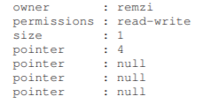
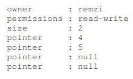

# 42 Crash Consistency: FSCK and Journaling
これまで見てきたように、ファイルシステムは、ファイルシステムから期待される基本的な抽象化をサポートするために必要なファイル、ディレクトリ、その他すべてのメタデータなど、一連のデータ構造を管理します。ほとんどのデータ構造(例えば、実行中のプログラムのメモリ内にあるもの)とは異なり、ファイルシステムのデータ構造は永続的でなければならず、長時間に渡って生き残り、電力損失があってもデータを保持しなければいけません(ハードディスクやデバイスフラッシュベースのSSDのように)

ファイルシステムが直面する大きな課題の1つは、停電やシステムクラッシュがあっても永続的なデータ構造を更新する方法です。具体的には、ディスク上の構造を更新する途中で、誰かが電源コード上を移動してマシンの電源が失われたらどうなりますか？または、オペレーティングシステムにバグが発生し、クラッシュしたらどうなりますか？停電やクラッシュのため、永続的なデータ構造を更新するのは非常に難しく、クラッシュ一貫性の問題として知られているファイルシステムの実装において新しい興味深い問題につながります。

この問題は非常に理解しやすいです。特定の操作を完了するために、2つのオンディスク構造AとBを更新する必要があるとします。ディスクは一度に1つの要求のみを処理するため、これらの要求の1つが最初にディスクに到達します(AまたはB)。1回の書き込みが完了してからシステムがクラッシュしたり電源が切れた場合、ディスク上の構造は矛盾した状態になります。したがって、すべてのファイルシステムを解決する必要があるという問題があります。

>> THE CRUX: HOW TO UPDATE THE DISK DESPITE CRASHES  
>> システムは、2つの書き込みの間でクラッシュまたは電力を失う可能性があり、したがって、ディスク上の状態が部分的にしか更新されない可能性があります。クラッシュ後、システムは起動し、(ファイルにアクセスするために)ファイルシステムを再度マウントします。任意の時点でクラッシュが発生する可能性があることを考えれば、ファイルシステムがディスク上のイメージを合理的な状態に保つにはどうすればよいでしょうか？

この章では、この問題をより詳しく説明し、ファイルシステムがそれを克服するために使用したいくつかの方法を見ていきます。fsckやファイルシステムチェッカーと呼ばれる古いファイルシステムのアプローチを調べてみましょう。次に、書き込みごとに若干のオーバーヘッドを追加するが、クラッシュや電力損失からより迅速に回復するテクニックである、ジャーナリング(write ahead loggingとも呼ばれる)という別のアプローチに注目します。私たちは、Linux ext3 [T98、PAA05](比較的近代的なジャーナリングファイルシステム)が実装しているいくつかの異なるジャーナリングの仕組みを含めて、ジャーナリングの基本的な機構について議論する予定です。

## 42.1 A Detailed Example
ジャーナリングの調査を開始するために、例を見てみましょう。ディスク上の構造を何らかの方法で更新する仕事量を使用する必要があります。ここでは、仕事量が単純であると仮定します。単一のデータブロックを既存のファイルに追加することです。追加は、ファイルを開き、ファイルのオフセットをファイルの最後に移動するために`lseek()`を呼び出し、ファイルを閉じる前にファイルに4KBの単一の書き込みを発行することによって行われます。

これまでに見たようなファイルシステムと同様に、ディスク上に標準的な単純なファイルシステム構造を使用しているとします。この小さな例には、inodeビットマップ(iodeあたり8ビット、inodeあたり一つ)データビットマップ(8ビット、データブロックあたり1つ)、iノード(合計8つ、0から7までの番号、4つのブロックにまたがる)、データブロック(合計8つ、0から7までの番号付け)を含んでいます。このファイルシステムの図は次のとおりです。  
  
図に示されている構造を見ると、inodeビットマップにマークされ、単一に割り当てられた1つのinode(inode番号2)とデータビットマップにマークされ、単一に割り当てられたデータブロック(データブロック4)があります。inodeはこのiノードの最初のバージョンであるため、I[v1]と表示されます。それはすぐに更新されます(上記の仕事量のため)。この単純化されたinodeの内部を見てみましょう。さっそくI[v1]の内部を見ていきます：  
  
この単純化されたiノードでは、ファイルのサイズは1(1つのブロックが割り当てられています)、最初のダイレクトポインタがブロック4(ファイルの最初のデータブロックであるDa)を指し、3つのダイレクトポインターはすべてnullに設定されます(使用されていないことを示す)。もちろん、実際のinodeにはさらに多くのフィールドがあります。詳細については、前の章を参照してください。

ファイルに追加するときに新しいデータブロックを追加するので、ディスク上の3つの構造を更新する必要があります：inode(新しいブロックを指し示す必要があり、追加のためにサイズが大きくなる)新しいデータブロックであるDb、および新しいデータブロックが割り当てられたことを示すためにデータビットマップの新しいバージョン(それをB[v2]と呼ぶ)を含みます。

したがって、システムのメモリには、ディスクに書き込む必要がある3つのブロックがあります。更新されたiノード(iノードバージョン2、またはI[v2]の短縮形)は、次のようになります。  
  
更新されたデータビットマップ(B[v2])は00001100のようになります。最後に、データブロック(Db)があります。それはユーザーがファイルに入れたものです。おそらく音楽を盗んだのでしょうか？私たちが望むのは、ファイルシステムの最終的なオンディスクイメージが次のようになることです。  
  
この移行を達成するためには、ファイルシステムは、inode(I[v2])、ビットマップ(B[v2])、およびデータブロック(Db)の3つのディスクへの個別書き込みを実行する必要があります。これらの書き込みは通常、ユーザが`write()`システムコールを発行したときにすぐには起こらないことに注意してください。むしろ、dirty inode、ビットマップ、および新しいデータは、メインメモリ(ページキャッシュまたはバッファキャッシュ内)に最初に少しの時間でおかれます。ファイルシステムが最終的にそれらをディスクに書き込むことを決定すると(例えば5秒または30秒後に)、ファイルシステムは必要な書き込み要求をディスクに発行します。残念ながら、クラッシュが発生すると、ディスクへのこれらの更新が妨げられます。特に、これらの書き込みのうちの1つまたは2つが実行された後にクラッシュが発生し、3つすべてが完了していない場合、ファイルシステムは面白い状態になる可能性があります。
### Crash Scenarios
問題をよりよく理解するために、いくつかのクラッシュシナリオの例を見てみましょう。1回の書き込みだけが成功したとします。このように3つの可能な結果があります。

- データブロック(Db)だけがディスクに書き込まれます。  
この場合、データはディスク上にありますが、それを指すinodeはなく、ブロックが割り当てられていることを示すビットマップもありません。したがって、書き込みが起こらなかったかのようになります。このケースは、ファイルシステムの一貫性の観点から、まったく問題ではありません。

- 更新されたinode(I[v2])だけがディスクに書き込まれます。  
この場合、inodeはDbが書き込まれる直前のディスクアドレス(5)を指していますが、Dbは書き込まれていません。したがって、そのポインタを信頼すれば、ディスクからガベージデータ(ディスクアドレス5の古い内容)を読み込みます。
さらに、ファイルシステムの矛盾と呼ばれる新しい問題があります。ディスク上のビットマップは、データブロック5が割り当てられていないが、inodeはそれが持っていると言っています。ビットマップとiノードとの間の不一致は、ファイルシステムのデータ構造の不一致です。ファイルシステムを使用するには、何らかの形でこの問題を解決する必要があります(詳細は後述)。

- 更新されたビットマップ(B[v2])のみがディスクに書き込まれます。  
この場合、ビットマップはブロック5が割り当てられていることを示しますが、それを指すiノードはありません。したがって、ファイルシステムには一貫性がありません。ブロック5がファイルシステムによって決して使用されないので、この書込みは未解決のまま残された場合、space leak(スペースリーク)が生じます。  

3つのブロックをディスクに書き込む試みには、さらに3つのクラッシュシナリオがあります。これらの場合、2回の書き込みは成功し、最後の書き込みは失敗します。  

- inode(I[v2])とビットマップ(B[v2])はディスクに書き込まれますが、データ(Db)は書き込まれません。  
この場合、ファイルシステムのメタデータは完全に一貫しています。つまり、inodeにはブロック5へのポインタがあり、ビットマップには5が使用されていることが示されているため、ファイルシステムのメタデータの観点から見ても問題ありません。しかし1つの問題があります：5は再びそれにゴミ(古いデータ)を入れています。

- inode(I[v2])とデータブロック(Db)は書き込まれますが、ビットマップ(B[v2])は書き込まれません。  
この場合、inodeはディスク上の正しいデータを指していますが、inodeと古いバージョンのビットマップ(B1)の間に矛盾があります。したがって、ファイルシステムを使用する前に問題を解決する必要があります。

- ビットマップ(B[v2])とデータブロック(Db)は書き込まれますが、iノード(I[v2])は書き込まれません。  
この場合、iノードとデータビットマップの間に再び矛盾があります。しかし、ブロックが書き込まれ、ビットマップがその使用法を示していても、inodeがファイルを指していないので、どのファイルに属しているかわかりません。

### The Crash Consistency Problem
うまくいけば、これらのクラッシュシナリオから、クラッシュのためにディスク上のファイルシステムイメージに発生する可能性がある多くの問題を見ること、ファイルシステムのデータ構造に不整合、スペースリークが発生する可能性、ガベージデータをユーザーに返すこと等々あります。私たちが理想的にやってみたいのは、ファイルシステムをある一貫性のある状態(例えば、ファイルが追加される前)から別のものに(例えば、inode、ビットマップ、新しいデータブロックがディスクに書き込まれた後)に移動することです。残念ながら、ディスクは一度に1つの書き込みしかコミットしないため、これらの更新の間にクラッシュまたは電力損失が発生する可能性があるため、簡単には実行できません。この一般的な問題をクラッシュ一貫性の問題と呼びます(一貫性のある更新の問題とも呼ぶことができます)。

## 42.2 Solution #1: The File System Checker
初期のファイルシステムは、簡単なアプローチをとっていました。基本的に、彼らは不一致を起こさせ、後で(リブート時に)修正することに決めました。このアプローチの古典的な例は、これを行うツールfsckにあります。fsckは、そのような矛盾を見つけて修復するためのUNIXツールです。ディスクパーティションをチェックして修復するための同様のツールが、異なるシステムに存在します。このような方法ではすべての問題を解決できないことに注意してください。例えば、inodeがガベージデータを指しているファイルシステムが一貫しているように見える上のケースがあります。唯一の実際の目標は、ファイルシステムのメタデータが内部的に一貫していることを確認することです。

ツールfsckは、McKusickとKowalskiの論文[MK96]に要約されているように、いくつかの段階で動作します。これは、ファイルシステムがマウントされ、使用可能になる前に実行されます(fsckは、実行中に他のファイルシステムアクティビティが実行されていないことを前提としています)。一度終了すると、オンディスクファイルシステムは一貫していて、ユーザーがアクセスできるようにする必要があります。ここでは、fsckの動作の基本的な概要を示します。

- Superblock(スーパーブロック)  
fsckは、スーパーブロックが妥当であるかどうか最初にチェックします。ほとんどの場合、ファイルシステムのサイズが割り当てられたブロック数よりも大きいかどうかを確認するなどの健全性チェックが行われます。通常、これらのsanity(健全性)チェックの目的は、疑わしい(破損した)スーパーブロックを見つけることです。この場合、システム(または管理者)は、スーパーブロックの代替コピーを使用することを決定することができる。

- Free blocks(フリーブロック)  
次に、fsckはinode、間接ブロック、二重間接ブロックなどをスキャンして、ファイルシステム内でどのブロックが現在割り当てられているかを理解します。この知識を使用して、割り当てビットマップの正しいバージョンを生成します。したがって、ビットマップとiノードの間に矛盾がある場合、iノード内の情報を信頼することによって解決されます。同じタイプのチェックがすべてのinodeに対して実行され、使用中のように見えるすべてのinodeがinodeビットマップでそのようにマークされることを確認します。

- Inode state(ノードの状態)  
各iノードは、破損またはその他の問題がないかどうかチェックされます。たとえば、fsckは、割り当てられた各iノードが有効なタイプのフィールド(通常のファイル、ディレクトリ、シンボリックリンクなど)を持っているかどうかを確認します。簡単に修正できないinodeフィールドに問題がある場合、inodeは疑わしいとみなされ、fsckによってクリアされます。このとき、inodeビットマップが対応して更新されます。

- Inode links  (iノードリンク)  
また、fsckは各割り当てられたiノードのリンク数も確認します。ご存知のように、リンク数は、この特定のファイルへの参照(つまり、リンク)を含む異なるディレクトリの数を示します。リンクカウントを確認するために、fsckはルートディレクトリから開始してディレクトリツリー全体をスキャンし、ファイルシステム内のすべてのファイルとディレクトリの独自のリンク数を作成します。新しく計算されたカウントとiノード内で見つかったカウントとの間に不一致がある場合、通常はinode内のカウントを固定することによって是正措置を講じる必要があります。割り当てられたinodeが検出されたがディレクトリを参照していない場合、lost + foundディレクトリに移動されます。

- Duplicates(重複)  
また、fsckは、重複ポインタ、すなわち、2つの異なるiノードが同じブロックを参照する場合もチェックします。1つのiノードが明らかに悪い場合は、消去される可能性があります。あるいは、指し示しブロックをコピーして、各iノードに必要に応じて独自のコピーを与えることもできます。

- Bad blocks (不良ブロック)  
すべてのポインタのリストをスキャンしながら、不良ブロックポインタのチェックも実行されます。ポインタは、有効な範囲外のものを明示的に指す場合(例えば、パーティションサイズより大きなブロックを参照するアドレスを有する場合など)、「不良」とみなされます。この場合、fsckはインテリジェントな処理を行うことはできません。iノードまたは間接ブロックからポインタを削除(クリア)するだけです。

- Directory checks  (ディレクトリチェック)  
fsckはユーザーファイルの内容を理解しません。ただし、ディレクトリには、ファイルシステム自体によって作成された特別な形式の情報が格納されています。したがって、fsckは、各ディレクトリの内容について追加の整合性チェックを実行し、"."と".."が最初のエントリであり、ディレクトリエントリで参照されている各iノードが割り当てられていることを確認し、ディレクトリが階層全体で複数回リンクされないようにします。

ご覧のように、動作中のfsckを構築するには、ファイルシステムの複雑な知識が必要です。そのようなコードがすべての場合に正しく動作することを確認することは困難です[G + 08]。しかし、fsck(と同様のアプローチ)は、より大きな、おそらくより根本的な問題を抱えています。それは、非常に遅いということです。ディスクボリュームが非常に大きい場合は、ディスク全体をスキャンして割り当てられたすべてのブロックを検索し、ディレクトリツリー全体を読み取るには数分または数時間かかることがあります。ディスクが大容量になり、RAIDが普及したときのfsckのパフォーマンスは、(最近の進歩[M + 13]にもかかわらず)法外になりました。

より高いレベルでは、fsckの基本的な前提はちょっと不合理なようです。ディスクに3つのブロックしか書き込まれていない上記の例を考えてみましょう。わずか3ブロックの更新中に発生した問題を解決するためにディスク全体をスキャンするのは非常に高価です。このような状況は、寝室の床に鍵を落とした後、地下室から出発してすべての部屋を通って鍵検索アルゴリズムを検索することに似ています。それは確実に動作しますが、全てを探索することは無駄です。このように、ディスク(およびRAID)が増えるにつれて、研究者や実務者は他のソリューションを探すようになりました。

## 42.3 Solution #2: Journaling (or Write-Ahead Logging)
おそらく一貫した更新の問題に対する最も一般的な解決策は、データベース管理システムの世界からアイデアを盗むことです。このアイデアは、write ahead logging(先行書き込みログ)と呼ばれ、この種の問題を正確に解決するために考案されたものです。ファイルシステムでは、歴史的な理由から、write ahead logggin journaling(先行書き込みログ記録ジャーナリング)を呼び出します。これを行うための最初のファイルシステムはCedar [H87]でしたが、Linux ext3とext4、reiserfs、IBMのJFS、SGIのXFS、Windows NTFSなど、現代の多くのファイルシステムがこの考え方を使用しています。

基本的な考え方は次のとおりです。ディスクを更新するときは、構造を上書きする前に、まずあなたがしようとしていることを説明する小さなメモ(ディスク上の他の場所、よく知られている場所)を書き留めます。つまり、このメモを書くことは"先行書き込み"の部分であり、"ログ"として整理する構造であるwrite ahead loggingに書きます。

メモをディスクに書き込むことで、構造の更新(上書き)中にクラッシュが発生した場合、元に戻って作成したメモを見て再試行することができます。したがって、ディスク全体をスキャンするのではなく、クラッシュ後に修正する対象(および修正方法)を正確に知ることができます。設計上、ジャーナリングは更新中に少しの作業を追加することで、リカバリ時に必要な作業量を大幅に削減します。

ここでは、普及しているジャーナリングファイルシステムであるLinux ext3がジャーナリングをファイルシステムに組み込む方法について説明します。ディスク上の構造のほとんどはLinux ext2と同じです。例えば、ディスクはブロックグループに分割され、各ブロックグループにはinodeとデータビットマップ、inodeとデータブロックがあります。新しい鍵構造はジャーナル自体であり、パーティション内または他のデバイス内のスペースをいくらか占有します。したがって、ext2ファイルシステム(ジャーナルなし)は次のようになります。  
  
ジャーナルが同じファイルシステムイメージ内に置かれているとします(ただし、別のデバイスやファイルシステム内のファイルに配置されることもあります)。ジャーナルを持つext3ファイルシステムは次のようになります。  
  
実際の違いはジャーナルの存在だけであり、もちろん使い方もです。

### Data Journaling
データジャーナリングの仕組みを理解するための簡単な例を見てみましょう。 データジャーナリングは、Linux ext3ファイルシステムのモードとして利用できます。ここから、この議論の多くがベースになっています。

inode(I[v2])、ビットマップ(B[v2])、およびデータブロック(Db)をディスクに書き戻したい場合には、もう一度標準アップデートを行ってください。最終的なディスクの場所に書き込む前に、最初にそれらをログ(a.k.a. journal)に書き込む予定です。このログのようになります：  
  

ここに5つのブロックを書きました。トランザクション開始(TxB)は、ファイルシステムに対する保留中の更新に関する情報(ブロックI[v2]、B[v2]、およびDbの最終アドレスなど)を含むこの更新について教えてくれます、またその中に何らかの種類トランザクション識別子(TID)があります。中央の3つのブロックには、ブロック自体の正確な内容が含まれています。これはphysical logging(物理ロギング)と呼ばれ、更新の正確な物理的な内容をジャーナルに入れています(logical logging(論理ロギング)はジャーナルにアップデートのよりコンパクトな論理表現を置きます。例えば、"このアップデートはデータブロックDbにファイルXを追加したい"です。これはもう少し複雑ですが、ログの領域を節約し、パフォーマンスを向上させることができます)。最終ブロック(TxE)は、このトランザクションの最後のマーカーであり、TIDも含みます。

このトランザクションが安全にディスクに保存されると、ファイルシステム内の古い構造を上書きする準備が整います。このプロセスをチェックポイントと呼びます。したがって、ファイルシステムをチェックポイントする(すなわち、ジャーナル内の保留中の更新を最新のものにする)ために、I[v2]、B[v2]およびDbの書き込みを上記のディスク位置に発行します。これらの書き込みが正常に完了すると、ファイルシステムのチェックポイントが成功し、基本的に完了しています。したがって、私たちの最初の一連の操作は以下になります：  

1. Journal write(ジャーナルライト)  
トランザクション開始ブロック、保留中のすべてのデータおよびメタデータ更新、およびトランザクション終了ブロックを含むトランザクションをログに書き込みます。これらの書き込みが完了するのを待ちます。  
2. Checkpoint(チェックポイント)  
保留中のメタデータとデータの更新をファイルシステムの最終的な場所に書き込みます。

この例では、最初にTxB、I[v2]、B[v2]、Db、TxEをジャーナルに書きます。これらの書き込みが完了すると、I[v2]、B[v2]、Dbをディスク上の最終位置にチェックポイントすることで更新を完了します。

ジャーナルへの書き込み中にクラッシュが発生した場合、状況は少し難解になります。ここでは、トランザクションのブロックセット(たとえば、TxB、I[v2]、B[v2]、Db、TxE)をディスクに書き込もうとしています。これを行う簡単な方法の1つは、それぞれに一度一回ずつ発行し、それぞれが完了するのを待ってから、次を発行することです。しかし、これは遅いです。理想的には、5回の書き込みをすべて一度に発行したいと思います。5回の書き込みを1回の書き込みに変えて高速化することができます。しかし、以下の理由から、これは安全ではありません：このような大きな書き込みがある場合、ディスクは内部的にスケジューリングを実行し、大きな書き込みの小さな部分を任意の順序で完了することがあります。したがって、ディスクは、(1)TxB、I[v2]、B[v2]、TxEを書き込み、後で(2)Dbだけ内部的に書き込むかもしれません。残念ながら、ディスクが(1)と(2)の間で電源を失った場合、これがディスク上で終了します。

>> ASIDE: FORCING WRITES TO DISK  
>> 2つのディスク書き込みの間で順序付けを行うためには、現代のファイルシステムにはいくつかの注意が必要です。昔は、AとBの2つの書き込み間の順序を強制するのは簡単でした。ディスクにAの書き込みを発行し、書き込みが完了したらディスクがOSに割り込むのを待ってから、Bの書き込みを発行します。

ディスク内のライトキャッシュの使用が増えたため、状況はやや複雑になりました。書き込みバッファリングを有効にすると(即時報告とも呼ばれることもあります)、書き込みはディスクのメモリキャッシュに置かれ、まだディスクに到達していないときに書き込みを完了したことをディスクはOSに通知します。その後、OSが次の書き込みを発行する場合、以前の書き込み後にディスクに到達することを保証しません。したがって、書き込み間の順序付けは保持されません。1つの解決策は、書き込みバッファリングを無効にすることです。しかし、より現代的なシステムは、特別な注意を払い、明示的な書き込みバリアを発行します。バリアが完了すると、バリアの後に発行された書き込みの前である、バリアがディスクに到着する前に発行されたすべての書き込みが保証されます。

このすべての機械は、ディスクの正しい動作に大きな信頼を必要とします。残念なことに、最近の調査では、「高性能」ディスクを提供しようとしているディスクメーカーの中には、書き込みバリア要求を明示的に無視しているため、ディスクが一見高速に動作するものの、誤動作の危険があります[C + 13、R + 11 ]。Kahanは、「速いことは間違っていたとしても、遅い時間にほとんどいつも勝つ。」と言いました。  
  
なぜこれが問題なのですか？さて、トランザクションは有効なトランザクションのように見えます(シーケンス番号が一致する開始点と終了点があります)。さらに、ファイルシステムはその第4のブロックを見ることができず、それが間違っていることを知ることができません。結局のところ、それは任意のユーザーデータです。したがって、システムがリブートしてリカバリを実行すると、このトランザクションが再生され、ゴミ・ブロックである'??'の内容がDbがある場所に無意識にコピーされます。これは、ファイル内の任意のユーザーデータにとって悪いことです。スーパーブロックのようなファイルシステムの重要な部分にファイルシステムがマウントできなくなる可能性がある場合は、それはずっと悪いことです。

この問題を回避するために、ファイルシステムは2つのステップでトランザクション書き込みを発行します。まず、TxEブロックを除くすべてのブロックをジャーナルに書き込み、一度にこれらの書き込みを発行します。これらの書き込みが完了すると、ジャーナルは次のようになります(私たちの追加作業を再度仮定します)。  
  
これらの書き込みが完了すると、ファイルシステムはTxEブロックの書き込みを発行し、ジャーナルをこのsafe state(安全状態)という最終状態にします。  
  
このプロセスの重要な側面は、ディスクによって提供される原子性の保証です。ディスクでは、512バイトの書き込みが発生するか、それとも発生しないのかが保証されています(半分書きされることはありません)。したがって、TxEの書き込みがアトミックであることを確認するには、それを単一の512バイトブロックにする必要があります。したがって、ファイルシステムを更新する現在のプロトコルは、3つのフェーズのそれぞれが次のようにラベル付けされています。  
1. Journal write(ジャーナルライト)  
トランザクションの内容(TxB、メタデータ、データを含む)をログに書き込みます。これらの書き込みが完了するのを待ちます。  
2. Journal commit(ジャーナルコミット)  
トランザクションコミットブロック(TxEを含む)をログに書き込みます。書き込みが完了するまで待ちます。トランザクションはコミットされていると言います。  
3. Checkpoint(チェックポイント)  
アップデートの内容(メタデータとデータ)を最終的なディスク上の場所に書き込みます。  

### Recovery
ファイルシステムがクラッシュから回復するためにジャーナルの内容をどのように使用できるかを理解しましょう。この一連の更新中にいつでもクラッシュが発生する可能性があります。トランザクションがログに安全に書き込まれる前にクラッシュが発生した場合(つまり、上記の手順2が完了する前)、私たちの仕事は簡単です。保留中の更新は単にスキップされます。トランザクションがログにコミットした後で、チェックポイントが完了する前にクラッシュが発生した場合、ファイルシステムは次のように更新を回復できます。システムが起動すると、ファイルシステムのリカバリプロセスはログをスキャンし、ディスクにコミットしたトランザクションを探します。これらのトランザクションはこのように(順番に)再生され、ファイルシステムはトランザクション内のブロックを最終的なオンディスク位置に書き戻そうと再度試みる。この形式のロギングは、最も簡単な形式の1つで、redo loggingと呼ばれます。

ジャーナル内のコミットされたトランザクションをリカバリすることにより、ファイルシステムはディスク上の構造が一貫していることを保証し、ファイルシステムをマウントして新しい要求の準備を進めることができます。

チェックポイント処理中の任意の時点で、ブロックの最終位置の更新が完了した後でも、クラッシュが発生することは問題ありません。最悪の場合、これらの更新のうちのいくつかは、回復中に再び単に実行されます。リカバリはまれな操作である(予期しないシステムクラッシュの後でのみ行われる)ため、いくつかの重複した書き込みは気にしません。

### Batching Log Updates
基本的なプロトコルが余計なディスクトラフィックを増やす可能性があることに気づいたかもしれません。たとえば、file1とfile2という2つのファイルを同じディレクトリに作成するとします。1つのファイルを作成するには、inodeのビットマップ(新しいiノードを割り当てるため)、新しく作成したファイルのiノード、新しいディレクトリを含む親ディレクトリのデータブロックディレクトリエントリ、および親ディレクトリのiノード(現在は新しい変更時刻があります)が表示されます。ジャーナリングでは、この2つのファイル作成のそれぞれについて、この情報を論理的にジャーナルにコミットします。ファイルが同じディレクトリにあり、同じiノードブロック内のinodeを持っていたとしても、これは慎重でなければ、これらの同じブロックを何度も何度も書くことになります。

この問題を解決するために、ファイルシステムの中には、一度に1つずつディスクを更新するものはありません(Linuxのext3など)。むしろ、すべての更新をグローバルトランザクションにバッファリングすることができます。上記の例では、2つのファイルが作成されると、ファイルシステムは、メモリ内のinodeビットマップ、ファイルのinode、ディレクトリデータ、ディレクトリのinodeをdirtyとマークし、現在のトランザクションを構成するブロックのリストにそれらを追加します。最後に、これらのブロックをディスクに書き込む(例えば、5秒のタイムアウトの後)と、この単一のグローバルトランザクションは、上記のすべての更新の詳細を含むコミットがされます。したがって、更新をバッファリングすることによって、ファイルシステムは多くの場合ディスクへの過剰な書き込みトラフィックを回避することができます。

### Making The Log Finite
したがって、我々は、ファイルシステム上のディスク構造を更新するための基本的なプロトコルに到達しました。ファイルシステムのバッファは、しばらくの間メモリ内の更新します。最終的にディスクに書き込むとき、ファイルシステムは最初にトランザクションの詳細をジャーナル(write ahead log)に慎重に書き出します。トランザクションが完了すると、ファイルシステムはそれらのブロックをディスク上の最終的な場所にチェックポイントします。ただし、ログは有限のサイズです。この図に示すようにトランザクションを追加し続けると、すぐに処理が完了します。何が起こったと思いますか？  
  
ログがいっぱいになると、2つの問題が発生します。最初の方が簡単ですが、それほど重要ではありません。ログが大きければ大きいほど、回復プロセスは回復するためにログ内のすべてのトランザクションを順番に再生する必要があるため、回復に時間がかかります。第2の問題の方が問題です。ログがいっぱい(またはほぼ満杯)になるとディスクにコミットすることができなくなり、ファイルシステムが「役に立たない」状態になります。

これらの問題に対処するために、ジャーナリングファイルシステムでは、ログを循環データ構造として扱い、何度も繰り返し使用します。このため、ジャーナルはcircular log(循環ログ)と呼ばれることがあります。これを行うには、ファイルシステムがチェックポイントの後で何らかのアクションを実行する必要があります。具体的には、トランザクションがチェックポイントされると、ファイルシステムはジャーナル内で占有していたスペースを解放し、ログスペースを再利用できるようにする必要があります。この目的を達成する方法はたくさんあります。たとえば、ジャーナルスーパーブロック内のログ内で最も古いもの、チェックポイントのない最新のトランザクションを単にマークすることができます。他のすべてのスペースはフリーです。ここに図解があります：  
  
journal superblock(ジャーナルスーパーブロック)(メインファイルシステムのスーパーブロックと混同しないでください)では、ジャーナリングシステムは、チェックポイントされていないトランザクションを知るための十分な情報を記録します。したがって、循環モデルのログを再利用することでリカバリ時間を短縮することを可能にします。そして、私たちは基本的なプロトコルにもう一つのステップを追加します：  
1. Journal write(ジャーナルライト)  
トランザクションの内容(TxBと更新内容を含む)をログに書き込みます。 これらの書き込みが完了するのを待ちます。  
2. Journal commit(ジャーナルコミット)  
トランザクションコミットブロック(TxEを含む)をログに書き込みます。 書き込みが完了するまで待ちます。 トランザクションは現在コミットされています。  
3. checkpoint  
アップデートの内容をファイルシステム内の最終的な場所に書き込みます。  
4. free  
その後、ジャーナルのスーパーブロックを更新して、ジャーナル内のトランザクションをフリーでマークしてください。

したがって、私たちは最終的なdata journaling protocol(データジャーナリングプロトコル)を持っています。しかし、まだ問題が残っています。各データブロックをディスクに2回書き込んでいます。これは、システムクラッシュのような稀な問題に対して支払うにはコストがかかり過ぎています。データを2回書き込まずに一貫性を保つ方法を見つけられるでしょうか？

### Metadata Journaling
リカバリは速くなりました(ジャーナルをスキャンし、ディスク全体をスキャンするのではなく、いくつかのトランザクションを再生する)が、ファイルシステムの通常の動作はわれわれが望むよりも遅くなります。特に、ディスクへの書き込みごとに、最初にジャーナルに書き込むので、書き込みトラフィックが倍増します。この倍増は、シーケンシャル・ライト・仕事量中に特に苦労し、ドライブのピーク書き込み帯域幅の半分で処理を進めます。さらに、ジャーナルへの書き込みとメインファイルシステムへの書き込みとの間には、コストがかかるシークがあり、いくつかの仕事量に顕著なオーバーヘッドが加わります。

すべてのデータブロックをディスクに2回書き込むコストが高いため、パフォーマンスを向上させるためにいくつかの方法を試しました。例えば、上で説明したジャーナリングモードは、すべてのユーザーデータ(ファイルシステムのメタデータを追加)をジャーナリングするため、(Linux ext3のように)データジャーナリングと呼ばれることがあります。ジャーナリングのより単純な(そしてより一般的な)形式は、ordered jaournaling(順序付けされたジャーナリング)(または単にメタデータジャーナリング)と呼ばれることもありますが、ユーザーデータがジャーナルに書き込まれない点を除いてほぼ同じです。したがって、上記と同じ更新を実行すると、次の情報がジャーナルに書き込まれます。  
  
以前にログに書き込まれたデータブロックDbは、余分な書き込みを避けてファイルシステムの適切な場所に書き込まれます。ディスクへのI/Oトラフィックのほとんどがデータであるため、データを2回書き込まないことは、ジャーナリングのI/O負荷を大幅に削減します。しかし、変更は面白い質問を提起します：いつデータブロックをディスクに書き込むべきですか？

問題をよりよく理解するためにファイルの例を追加してみましょう。更新はI[v2]、B[v2]、Dbの3つのブロックで構成されます。最初の2つはメタデータであり、ログに記録され、チェックポイントされます。後者はファイルシステムに一度だけ書き込まれます。Dbをいつディスクに書き込む必要がありますか？それは重要ですか？

判明したように、データ書き込みの順序付けは、メタデータだけのジャーナリングに関して重要です。たとえば、トランザクション(I[v2]とB[v2]を含む)が完了した後にDbをディスクに書き込むとどうなりますか？残念ながら、この方法には問題があります。ファイルシステムは一貫していますが、私はI[v2]がガベージデータを指してしまうことになります。具体的には、I[v2]とB[v2]が書かれていますが、Dbがそれをディスクに作られていない場合を考えてみてください。ファイルシステムは次にリカバリを試みます。なぜなら、Dbがログに記録されていないからです。そのため、ファイルシステムはI[v2]とB[v2]への書き込みを再生し、(ファイルシステムメタデータの観点から)一貫したファイルシステムを生成します。しかし、I[v2]は、ガーベージデータを指しています。すなわち、Dbの先頭にあったスロットにあったものが何であれです。

このような状況が起こらないようにするために、いくつかのファイルシステム(Linux ext3など)は、関連するメタデータがディスクに書き込まれる前に、(通常のファイルの)データブロックをディスクに書き込みます。具体的には、プロトコルは次のとおりです。  
1. Data write(データ書き込み)  
データを最終的な場所に書き込む。完了するのを待ちます(待機はオプションです;詳細は下記参照)。  
2. Journal metadata write(ジャーナルメタデータの書き込み)  
書き込み開始ブロックとメタデータをログに書き込みます。書き込みが完了するのを待ちます。  
3. Journal commit(ジャーナルコミット)  
トランザクションコミットブロック(TxEを含む)をログに書き込みます。書き込みが完了するまで待ちます。トランザクション(データを含む)は現在コミットされています。  
4. Checzpoint metadata(チェックポイントのメタデータ)  
メタデータ更新の内容をファイルシステム内の最終的な場所に書き込みます。  
5. Free  
その後、ジャーナルスーパーブロックで取引をフリーでマークします。

データの書き込みを最初に強制することで、ファイルシステムはポインタがゴミを指し示すことがないことを保証することができます。実際には、「オブジェクトが参照する前に参照されるオブジェクトを書く」というこのルールは、クラッシュ一貫性のコアであり、他のクラッシュ一貫性スキーム[GP94](詳細は以下を参照)によってさらに悪用されます。

ほとんどのシステムでは、完全なデータジャーナリングよりもメタデータジャーナリング(ext3の注文ジャーナルに似ています)が一般的です。たとえば、Windows NTFSとSGIのXFSは両方とも、ある形式のメタデータジャーナリングを使用します。Linux ext3では、dataモード、orderedモード、unorderedモードのいずれかを選択できます(unorderedモードでは、いつでもデータを書き込むことができます)。これらのモードはすべてメタデータの一貫性を保ちます。これらはデータのセマンティクスが異なります。

最後に、上記のプロトコルに示されているように、ジャーナルへの書き込みを発行する前に(ステップ2)、データ書き込みを完了させる(ステップ1)ことは正確である必要はないことに注意してください。具体的には、トランザクション開始ブロックとメタデータをジャーナルに書き込むことを発行することは問題ありません。唯一の実際の要件は、ジャーナルコミットブロックの発行前にステップ1と2が完了していることです(ステップ3)。

### Tricky Case: Block Reuse
興味深いコーナーケースがいくつかあり、ジャーナリングをもっと難しくし、議論する価値があります。それらの多くはブロックの再利用を中心に展開されています。ext3の主力の1人であるStephen Tweedie氏は次のように述べています。「システム全体のなんとなく悲惨な部分は何ですか？...ファイルの削除です。削除に関係することはすべて業が深いです。削除とは何か...ブロックが削除されてから再割り当てされると、何が起こるかという悪夢があります。」[T00]

Tweedieの具体的な例は次のとおりです。何らかの形式のメタデータジャーナリングを使用しているとします(ファイルのデータブロックはジャーナリングされません)。fooというディレクトリがあるとしましょう。ユーザーはfooにエントリを追加し(ファイルを作成するなど)、fooの内容(ディレクトリはメタデータとみなされるため)がログに書き込まれます。fooディレクトリのデータの場所がブロック1000であると仮定します。したがって、ログには次のような内容が含まれます。  
  
この時点で、ユーザーはディレクトリ内だけでなくディレクトリ自体もすべて削除し、ブロック1000を解放して再利用します。最後に、ユーザーは新しいファイル(foobarなど)を作成し、fooに属していた同じブロック(1000)を再利用します。foobarのiノードは、データと同様にディスクにコミットされます。ただし、メタデータジャーナリングが使用されているため、foobarのiノードだけがジャーナルにコミットされます。ファイルfoobar内のブロック1000の新しく書き込まれたデータはジャーナリングされません。  
  
今、クラッシュが発生し、これらの情報はすべてログに残っていると仮定します。再生中、回復プロセスは、ブロック1000におけるディレクトリデータの書き込みを含むログ内のすべてを単に再生します。この再生は古いディレクトリの内容で現在のファイルfoobarのユーザデータを上書きします！明らかに、これは正しいリカバリアクションではありません。そして、確実にfoobarファイルを読むときにユーザは驚いてしまいます。

この問題にはいくつかの解決策があります。たとえば、前記ブロックの削除がジャーナルからチェックポイントが外に出るまで、ブロックを再使用することはできないようにすればよいです。Linux ext3が代わりに使っているのは、新しいタイプのレコードをジャーナルに追加することです。revoke record(取り消しレコード)と呼ばれます。上記の場合、ディレクトリを削除すると、取り消しレコードがジャーナルに書き込まれます。ジャーナルを再生するとき、システムは最初にそのような取り消しレコードをスキャンします。そのような取り消されたデータは決して再生されないので、上記の問題は回避されます。

### Wrapping Up Journaling: A Timeline
ジャーナリングの議論を終了する前に、議論したプロトコルをそれぞれのタイムラインで要約します。図42.1にメタデータだけでなくデータをジャーナリングする場合のプロトコルを示します。図42.2に、メタデータのみをジャーナリングする場合のプロトコルを示します。

各図では、時間が下方向に増加し、図の各行は書き込みが発行されるか完了するかの論理時間を示しています。たとえば、データジャーナリングプロトコル(図42.1)では、トランザクション開始ブロック(TxB)の書き込みとトランザクションの内容を論理的に同時に発行することができ、したがって任意の順序で完了することができます。しかし、トランザクション終了ブロック(TxE)への書込みは、前の書き込みが完了するまで発行してはいけません。同様に、データブロックとメタデータブロックへのチェックポイント書き込みは、トランザクション終了ブロックがコミットされるまで開始できません。水平方向の破線は、書き込み注文要件を遵守しなければならない場所を示しています。

メタデータジャーナリングプロトコルについても同様のタイムラインが表示されます。データ書込みは、トランザクションへの書込みが開始され、ジャーナルの内容と同時に論理的に発行されることに注意してください。ただし、トランザクション終了が発行される前に、それが発行され完了する必要があります。

最後に、タイムラインの各書き込みについてマークされた完了時間は任意であることに注意してください。実際のシステムでは、I/Oサブシステムによって完了時刻が決定され、書き込みを並べ替えてパフォーマンスを向上させることができます。命令の唯一の保証は、プロトコルの正確さのために強制されなければならないものです(図の水平の破線で示されています)。

## 42.4 Solution #3: Other Approaches
これまで、ファイルシステムのメタデータを一貫して保つための2つのオプションであるfsckに基づく遅延アプローチ、ジャーナリングと呼ばれるより積極的なアプローチについて説明しました。しかしながら、これらは唯一の2つのアプローチではありません。ソフトアップデート[GP94]として知られているこのようなアプローチの1つが、GangerとPattによって導入されました。

このアプローチでは、ファイルシステムへのすべての書き込みを慎重に指示して、ディスク上の構造が一貫性のない状態にならないようにします。たとえば、参照されているデータブロックを、それを参照しているinodeより前にディスクに書き込むことで、inodeがゴミを指していないことを保証できます。同様なルールでファイルシステムのすべての構造を得ることができます。

しかし、ソフトアップデートを実装することは難しいことです。上記のジャーナリング層は、正確なファイルシステム構造の知識をほとんど持たずに実装することができますが、ソフトアップデートは各ファイルシステムデータ構造の複雑な知識を必要とし、システムにかなりの複雑さを加えます。

別のアプローチは、コピーオンライト(yes、COW)と呼ばれ、SunのZFS [B07]を含む多くの一般的なファイルシステムで使用されています。この手法は、ファイルやディレクトリを上書きすることはありません。むしろ、ディスク上の未使用の場所に新しい更新を置きます。多数の更新が完了した後、COWファイルシステムは、ファイルシステムのルート構造を反転して、新しく更新された構造へのポインタを含みます。そうすることで、ファイルシステムの整合性が保たれます。このテクニックについては、今後の章でlog structured file system(LFS)について議論するときに詳しく学習します。LFSはCOWの初期の例です。

もう一つのアプローチはウィスコンシンで開発したアプローチです。backpointer based consistency(またはBBC)と題されたこの技法では、書込みの間に順序付けは行われません。整合性を達成するために、システム内のすべてのブロックに追加のバックポインタが追加されます。たとえば、各データブロックには、それが属するiノードへの参照があります。ファイルにアクセスするとき、ファイルシステムは、フォワードポインタ(例えば、inodeまたは直接ブロック内のアドレス)がそれを参照するブロックを指し示しているかどうかをチェックすることによって、ファイルが一貫しているかどうかを判定することができます。その場合、すべてが安全にディスクに到達していなければならず、したがってファイルは一貫しています。そうでなければ、ファイルは不整合であり、エラーが返されます。ファイルシステムにバックポインタを追加することで、新しい形式の遅延クラッシュ整合性を達成することができます[C + 12]。

最後に、ジャーナルプロトコルがディスク書き込みが完了するのを待たなければならない回数を減らす手法も検討しました。楽観的な衝突の一貫性[C + 13]が付与されたこの新しい手法では、可能な限り多くのディスクへの書き込みが行われ、トランザクションチェックサム[P + 05]の一般化された形式や他のいくつかの手法を使用して、発生した不整合性を検出します。一部の仕事量では、これらの楽観的な手法により、パフォーマンスが向上します。しかし、本当にうまく機能するには、わずかに異なるディスクインタフェースが必要です[C + 13]。

## 42.5 Summary
クラッシュの一貫性の問題を導入し、この問題を攻撃するさまざまなアプローチについて説明しました。ファイルシステムチェッカーを構築する古いアプローチは機能しますが、現代のシステムでは回復が遅すぎる可能性があります。したがって、多くのファイルシステムでジャーナリングが使用されています。ジャーナリングは、O(ディスク容量の大きさ)からO(サイズのログ)までのリカバリ時間を短縮し、クラッシュや再起動後のリカバリを大幅に高速化します。このため、現代の多くのファイルシステムではジャーナリングが使用されています。ジャーナリングはさまざまな形で提供されることがあります。最も一般的に使用されるのはordered metadata journalingで、ジャーナルへのトラフィック量を削減しながら、ファイルシステムのメタデータとユーザーデータの両方に対して合理的な一貫性の保証を維持します。

## 参考文献
[B07] “ZFS: The Last Word in File Systems”  
Jeff Bonwick and Bill Moore  
Available: http://www.ostep.org/Citations/zfs last.pdf  
ZFS uses copy-on-write and journaling, actually, as in some cases, logging writes to disk will perform better.

[C+12] “Consistency Without Ordering”  
Vijay Chidambaram, Tushar Sharma, Andrea C. Arpaci-Dusseau, Remzi H. Arpaci-Dusseau  
FAST ’12, San Jose, California  
A recent paper of ours about a new form of crash consistency based on back pointers. Read it for the exciting details!

[C+13] “Optimistic Crash Consistency”  
Vijay Chidambaram, Thanu S. Pillai, Andrea C. Arpaci-Dusseau, Remzi H. Arpaci-Dusseau  
SOSP ’13, Nemacolin Woodlands Resort, PA, November 2013  
Our work on a more optimistic and higher performance journaling protocol. For workloads that call fsync() a lot, performance can be greatly improved.

[GP94] “Metadata Update Performance in File Systems”  
Gregory R. Ganger and Yale N. Patt  
OSDI ’94  
A clever paper about using careful ordering of writes as the main way to achieve consistency. Implemented later in BSD-based systems.

[G+08] “SQCK: A Declarative File System Checker”  
Haryadi S. Gunawi, Abhishek Rajimwale, Andrea C. Arpaci-Dusseau, Remzi H. Arpaci-Dusseau  
OSDI ’08, San Diego, California  
Our own paper on a new and better way to build a file system checker using SQL queries. We also show some problems with the existing checker, finding numerous bugs and odd behaviors, a direct result of the complexity of fsck.

[H87] “Reimplementing the Cedar File System Using Logging and Group Commit”  
Robert Hagmann  
SOSP ’87, Austin, Texas, November 1987  
The first work (that we know of) that applied write-ahead logging (a.k.a. journaling) to a file system.

[M+13] “ffsck: The Fast File System Checker”  
Ao Ma, Chris Dragga, Andrea C. Arpaci-Dusseau, Remzi H. Arpaci-Dusseau  
FAST ’13, San Jose, California, February 2013  
A recent paper of ours detailing how to make fsck an order of magnitude faster. Some of the ideas have already been incorporated into the BSD file system checker [MK96] and are deployed today.

[MK96] “Fsck - The UNIX File System Check Program”  
Marshall Kirk McKusick and T. J. Kowalski  
Revised in 1996  
Describes the first comprehensive file-system checking tool, the eponymous fsck. Written by some of the same people who brought you FFS.

[MJLF84] “A Fast File System for UNIX”  
Marshall K. McKusick, William N. Joy, Sam J. Leffler, Robert S. Fabry  
ACM Transactions on Computing Systems.  
August 1984, Volume 2:3  
You already know enough about FFS, right? But yeah, it is OK to reference papers like this more than once in a book.

[P+05] “IRON File Systems”  
Vijayan Prabhakaran, Lakshmi N. Bairavasundaram, Nitin Agrawal, Haryadi S. Gunawi, Andrea C. Arpaci-Dusseau, Remzi H. Arpaci-Dusseau  
SOSP ’05, Brighton, England, October 2005  
A paper mostly focused on studying how file systems react to disk failures. Towards the end, we introduce a transaction checksum to speed up logging, which was eventually adopted into Linux ext4.

[PAA05] “Analysis and Evolution of Journaling File Systems”  
Vijayan Prabhakaran, Andrea C. Arpaci-Dusseau, Remzi H. Arpaci-Dusseau  
USENIX ’05, Anaheim, California, April 2005  
An early paper we wrote analyzing how journaling file systems work.

[R+11] “Coerced Cache Eviction and Discreet-Mode Journaling”  
Abhishek Rajimwale, Vijay Chidambaram, Deepak Ramamurthi, Andrea C. Arpaci-Dusseau, Remzi H. Arpaci-Dusseau  
DSN ’11, Hong Kong, China, June 2011  
Our own paper on the problem of disks that buffer writes in a memory cache instead of forcing them to disk, even when explicitly told not to do that! Our solution to overcome this problem: if you want A to be written to disk before B, first write A, then send a lot of “dummy” writes to disk, hopefully causing A to be forced to disk to make room for them in the cache. A neat if impractical solution.

[T98] “Journaling the Linux ext2fs File System”  
Stephen C. Tweedie  
The Fourth Annual Linux Expo, May 1998  
Tweedie did much of the heavy lifting in adding journaling to the Linux ext2 file system; the result, not surprisingly, is called ext3. Some nice design decisions include the strong focus on backwards compatibility, e.g., you can just add a journaling file to an existing ext2 file system and then mount it as an ext3 file system.

[T00] “EXT3, Journaling Filesystem”  
Stephen Tweedie  
Talk at the Ottawa Linux Symposium, July 2000  
olstrans.sourceforge.net/release/OLS2000-ext3/OLS2000-ext3.html  
A transcript of a talk given by Tweedie on ext3.  

[T01] “The Linux ext2 File System”  
Theodore Ts’o, June, 2001.  
Available: http://e2fsprogs.sourceforge.net/ext2.html  
A simple Linux file system based on the ideas found in FFS. For a while it was quite heavily used; now it is really just in the kernel as an example of a simple file system.

[prev](../41/41.md)|[next](../43/43.md)
